# YourWays Logistics Platform — Complete Engineering Knowledge Base

> **Document purpose:** This document is a full reverse-engineering, expansion, and production-hardening of the original `Yourways.docx` Software Requirements Specification (SRS). It is written so that a brand-new engineering team could design, build, test, and operate the entire platform **without ever reading the original SRS**.
>
> **How to read the labels used throughout this document:**
>
> | Label | Meaning |
> |---|---|
> | 📄 **SRS** | Explicitly stated in the original `Yourways.docx` document. Wording may be rephrased for clarity but the requirement is verbatim in intent. |
> | 🔧 **IMPLEMENTED** | Already built in the current codebase (`LogisticSys` Node.js/Express/Supabase backend) at the time of writing. Cited with file paths. |
> | 💡 **INFERRED** | Not explicitly written in the SRS, but required for a production-grade system. Every inference includes a **"Why"** justification grounded in software engineering best practice. |
> | ⚠️ **GAP** | A discrepancy between the SRS, the current implementation, and what production requires. Elaborated in Section 21 (Missing Requirements). |
>
> **Source documents analyzed:** `Yourways.docx` (19 numbered sections, ~980 lines of extracted text), the existing Express.js backend (`app.js`, `routes/`, `controllers/`, `services/`, `models/`, `sql/`), and `FRONTEND_INTEGRATION.md` (the de-facto API contract currently used by frontend partners).

---

## Table of Contents

1. [Executive Summary](#1-executive-summary)
2. [Business Understanding](#2-business-understanding)
3. [Complete Platform Architecture](#3-complete-platform-architecture)
4. [User Roles](#4-user-roles)
5. [Complete Feature Breakdown](#5-complete-feature-breakdown)
6. [Business Service Catalog](#6-business-service-catalog)
7. [Complete Workflow Analysis](#7-complete-workflow-analysis)
8. [Booking Status State Machine](#8-booking-status-state-machine)
9. [API Design](#9-api-design)
10. [Database Design](#10-database-design)
11. [Backend Services](#11-backend-services)
12. [External Integrations](#12-external-integrations)
13. [Mobile Applications](#13-mobile-applications)
14. [Website](#14-website)
15. [Admin Dashboard](#15-admin-dashboard)
16. [Realtime System](#16-realtime-system)
17. [Security](#17-security)
18. [Validation Rules](#18-validation-rules)
19. [Error Handling](#19-error-handling)
20. [Edge Cases](#20-edge-cases)
21. [Missing Requirements](#21-missing-requirements)
22. [Suggested Improvements](#22-suggested-improvements)
23. [Development Roadmap](#23-development-roadmap)
24. [Testing Strategy](#24-testing-strategy)
25. [Deployment Architecture](#25-deployment-architecture)
26. [Developer Guide](#26-developer-guide)
27. [Glossary](#27-glossary)
28. [Final Knowledge Base](#28-final-knowledge-base)

---

## 1. Executive Summary

### 1.1 Project Overview 📄 SRS

**YourWays** is a **Cargo Logistics Platform** — a complete digital ecosystem for booking goods-transportation services ("man and van", home removals, vehicle transport, piano delivery, office moves, industrial machinery moves, man-power-only labor, and more), with **live tracking**, **automatic quotation generation**, **push notifications**, and **centralized administrative control**.

The platform is explicitly composed of five coordinated surfaces:

| Surface | Users | Core Job |
|---|---|---|
| Customer Mobile Application | Customers | Book, pay, track |
| Driver Mobile Application | Drivers | Fulfill bookings, capture proof-of-delivery |
| Customer Website | Customers / prospects | Marketing + booking + tracking (SEO-optimized) |
| Admin Panel (Dashboard) | Internal Ops staff | Assign drivers, manage pricing, monitor operations |
| Backend Infrastructure | All of the above | APIs, database, realtime, notifications, payments |

📄 SRS states the platform "enables users to book drivers for transporting goods from one location to another while providing real-time tracking, quotation generation, notifications, and centralized administrative control," and that the project "simplif[ies] logistics operations, improve[s] customer experience, and automate[s] the cargo booking workflow."

### 1.2 Business Goals 📄 SRS

Directly enumerated in SRS Section 2 ("Project Objectives"):

1. Provide an easy cargo booking system
2. Automate quotation generation
3. Enable real-time order tracking
4. Improve logistics management
5. Centralize booking and driver management
6. Provide live order status updates
7. Offer a seamless mobile and web experience
8. Enable targeted promotional notifications
9. Create a scalable infrastructure for future expansion

💡 **INFERRED business goals** (implicit in a commercial logistics operation, not explicitly written but necessary for the business to survive commercially):

- Maximize **driver utilization** (minimize idle time / empty return legs) — this is the entire reason "Smart Promotion" (SRS §6.7) exists.
- Minimize **support cost per order** by giving customers self-service tracking and status visibility (reduces "where is my stuff" calls).
- Maintain **auditable proof-of-service** (photos + signatures) to reduce disputes and chargebacks.
- Provide finance-grade **transaction records** for tax/accounting reconciliation.

*Why inferred:* No serious logistics SaaS can operate without these; they are the commercial backbone that turns the described features into a viable business, and every subsequent feature in this KB (ratings, cancellation policies, disputes, reporting) traces back to them.

### 1.3 Problems Solved 📄 SRS + 💡 INFERRED

| Problem | Solved By | Source |
|---|---|---|
| Manual, phone-based cargo booking is slow and error-prone | Self-service mobile/web booking with structured item catalog | 📄 SRS |
| Customers don't know when their goods will arrive | Live GPS tracking + push notifications + status timeline | 📄 SRS |
| Pricing is inconsistent / negotiated ad hoc | Automated, rule-based quotation engine (distance, weight, quantity, traffic, service charges) | 📄 SRS |
| No visibility into fleet operations for management | Admin dashboard with analytics, live monitoring | 📄 SRS |
| Drivers return empty after a delivery (wasted capacity) | Smart Promotion: notify past customers in the driver's current city | 📄 SRS |
| Disputes over "was it delivered / was it damaged" | Mandatory photo capture + signature capture at pickup and dropoff | 📄 SRS |
| No paper trail for payments | Stripe integration with transaction records | 📄 SRS |
| 💡 Idle/unassigned bookings pile up without escalation | Admin SLA alerts, auto-escalation timers | 💡 INFERRED — *why:* SRS never mentions what happens if no driver is assigned within a reasonable time; a production system must have an operational safety net or bookings silently rot. |
| 💡 Fraudulent or spam bookings/OTP abuse | Rate limiting, OTP throttling, device fingerprinting | 💡 INFERRED — *why:* Any public phone-based OTP flow is a well-known abuse vector (SMS pumping fraud); omission would bankrupt the SMS budget. |

### 1.4 Expected Users 📄 SRS

1. **Customers/Users** — individuals or businesses needing goods transported (SRS §4.1).
2. **Drivers** — independent or employed vehicle operators who fulfill bookings (SRS §4.2).
3. **Admins** — internal operations staff who run the business day-to-day (SRS §4.3).

💡 **INFERRED additional user types** required for a mature platform (see Section 4.4 for full detail): **Support Agents**, **Finance/Accounting role**, **Dispatcher role** (subset of Admin permissions), **Super Admin** (system owner), and **Business/Corporate Accounts** (multi-user companies that book on account).

### 1.5 Core Value Proposition

> "Book a driver for anything you need moved — from a single box to an industrial machine — get an instant price, watch it happen live, and trust that it arrived safely."

The differentiators, synthesized from the SRS's feature set, are:

- **Category-driven quotation** — customers don't need to know shipping jargon; they pick real-world items (a sofa, a piano, a fridge) and the system infers weight/handling/vehicle needs (📄 SRS §5, 💡 pricing inference engineering in Section 11.3).
- **End-to-end live visibility** — from booking to doorstep, with map, driver ETA, and status timeline (📄 SRS §6.6).
- **Proof-backed delivery** — photos + signatures remove "he said/she said" disputes (📄 SRS §6.4).
- **Smart geofenced marketing** — a genuinely novel feature (SRS §6.7) that turns driver idle-time into a sales channel.

---

## 2. Business Understanding

### 2.1 Business Model 📄 SRS + 💡 INFERRED

The SRS describes a **marketplace/aggregator logistics model**: YourWays does not describe itself as owning a fleet explicitly, but the workflow (Admin *assigns* a driver to a booking, drivers must be *approved by admin* before they can log in — confirmed in the implemented `is_approved_by_admin` flag) strongly implies a **managed-fleet or vetted-gig-driver model**, not an open marketplace like Uber Freight where anyone can pick up unassigned jobs.

💡 **INFERRED monetization model** (not stated in SRS, required to explain "Pricing Management" and "Promotions Management" sections): YourWays most likely earns revenue via:

1. **Per-booking service fee** embedded in the quotation (distance + weight + service charges), collected via Stripe at booking or completion.
2. Optional **commission structure** if drivers are independent contractors (platform takes a %, driver keeps remainder) — *why inferred:* the SRS's "Driver reports" and "Revenue reports" as separate admin analytics implies revenue ≠ driver payout, meaning a margin/commission exists.
3. **Premium/white-glove service upcharges** or insurance surcharge (`Requires Insurance`, `insuranceValue` fields already implemented) — a common ancillary revenue stream in moving/logistics platforms.

*Why this matters for engineering:* the ledger design in Section 10 (Database Design) must separate **quoted price**, **total price**, **driver payout**, and **platform commission** as distinct fields — not a single "amount" column — otherwise the business can never calculate margin.

### 2.2 Customer Journey 📄 SRS (synthesized end-to-end from §6.1–6.6, §8)

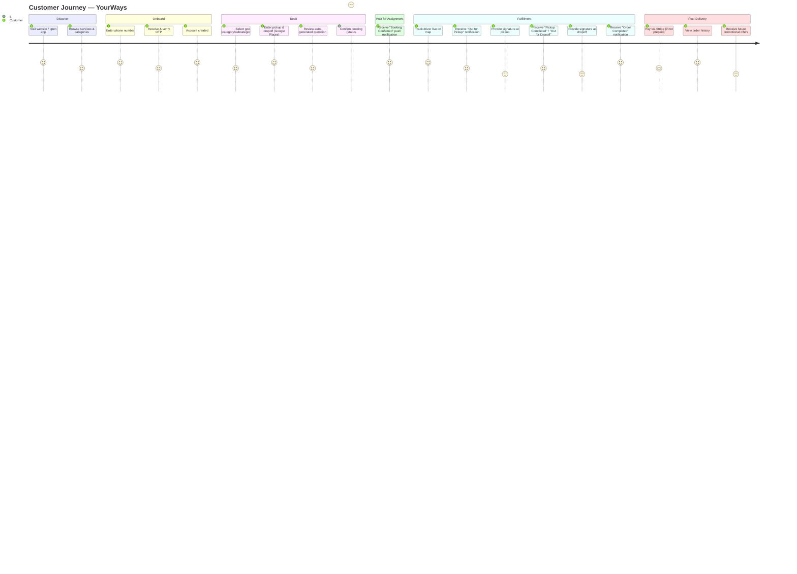

### 2.3 Driver Journey 📄 SRS (synthesized from §6.4, §9)

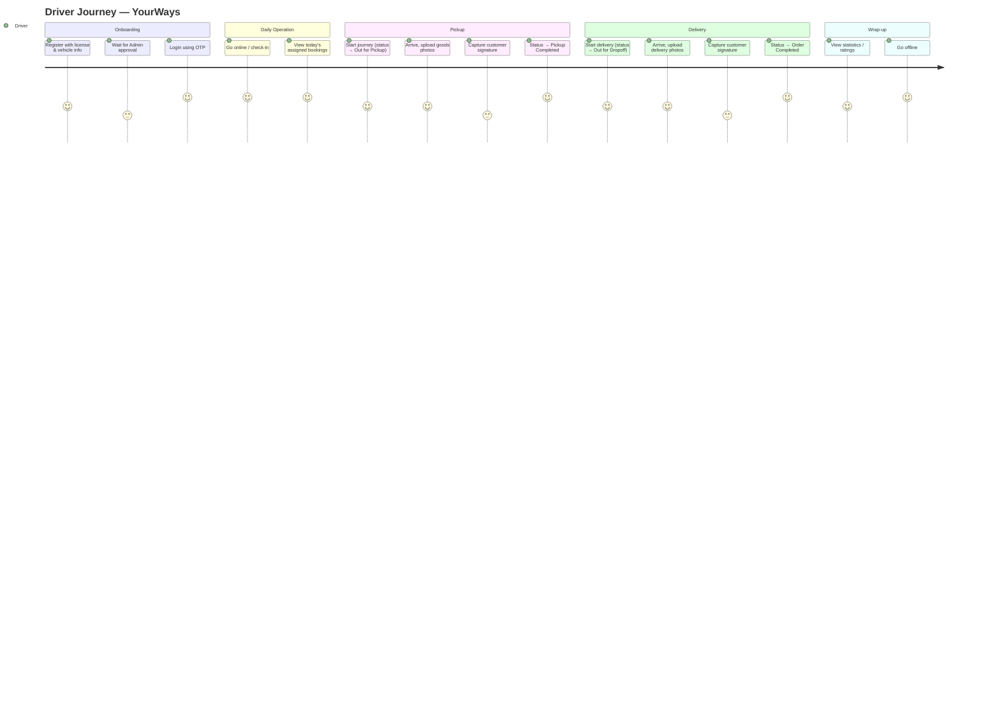

### 2.4 Admin Journey 📄 SRS (synthesized from §6.3, §11)

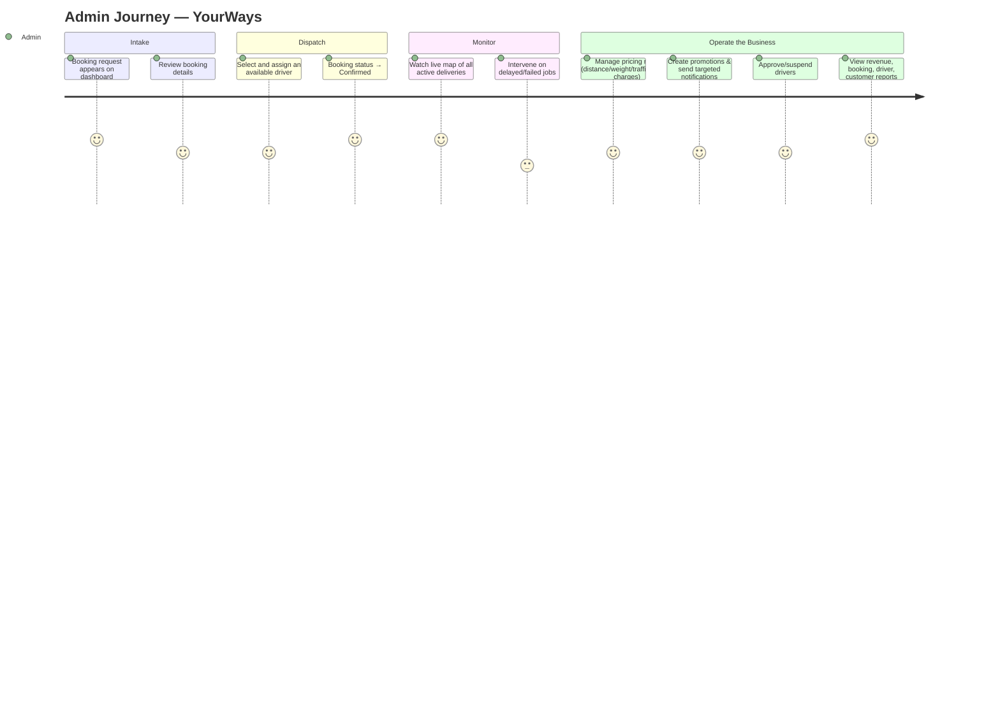

### 2.5 Website Purpose 📄 SRS

The website (SRS §3.3, §10) is **not just a booking tool** — it is explicitly a **marketing/acquisition surface**: "The website will also be SEO optimized using Jasper for better search engine visibility." Its job is to:

1. Rank in search engines for "man and van," "furniture removal," "piano delivery," etc. (public marketing pages: Home, About, Services).
2. Convert visitors into registered customers (OTP login/register).
3. Provide full booking + tracking + payment parity with the mobile app for desktop users.

### 2.6 Mobile Applications Purpose 📄 SRS

Two **separate, role-specific native/hybrid apps** — not one app with role-switching:

- **Customer App**: booking, quotation, tracking, payment, history, notifications.
- **Driver App**: operational tool for job execution — assigned orders, status updates, photo/signature capture.

💡 *Why separate apps, inferred:* Drivers need camera-heavy, GPS-heavy, "always-on" background permissions unsuitable for a casual customer app; separating apps also lets each be optimized/store-listed independently and reduces attack surface (a compromised customer account can't see driver operational data).

### 2.7 Platform Interactions (Cross-Surface Data Flow)

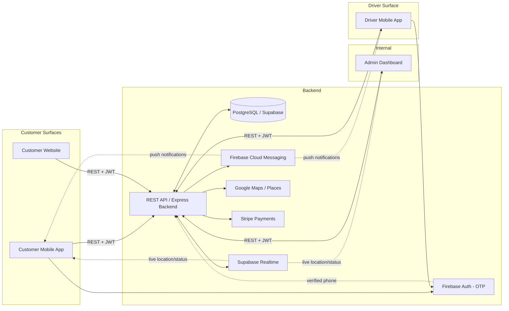

---

## 3. Complete Platform Architecture

### 3.1 High-Level System Architecture

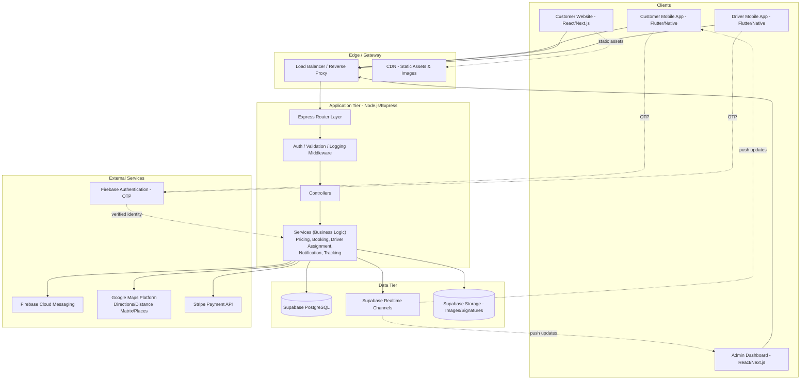

### 3.2 Component Responsibilities

| Component | Responsibility | Status |
|---|---|---|
| **Customer Mobile App** | Booking, quotation display, tracking UI, payments, notification inbox | 📄 SRS |
| **Driver Mobile App** | Job list, status updates, camera/signature capture, location broadcast | 📄 SRS |
| **Customer Website** | Marketing + booking + tracking parity, SEO | 📄 SRS |
| **Admin Dashboard** | Operations console: dispatch, pricing, promotions, reporting | 📄 SRS |
| **Backend (Express API)** | Single source of truth for all business logic; the *only* component allowed to talk to the database directly | 🔧 IMPLEMENTED (`app.js`, `routes/`, `controllers/`, `services/`) |
| **Database (Supabase/Postgres)** | Durable relational storage, row-level security boundary | 🔧 IMPLEMENTED (`sql/001_create_tables.sql`) |
| **Realtime Layer (Supabase Realtime)** | Publishes DB change events (bookings/orders/driver location) to subscribed clients over WebSockets | 📄 SRS §13 |
| **Storage** | Object storage for pickup/delivery photos & signature images | 💡 INFERRED delivery mechanism for 📄 SRS §6.4 "upload images"/"capture signatures" |
| **Authentication** | Firebase Auth for OTP-based phone verification (customers & drivers); email/password + JWT for Admin | 📄 SRS (OTP) + 🔧 IMPLEMENTED (JWT — see Section 17 for the current gap) |
| **Notifications** | Firebase Cloud Messaging (FCM) for push notifications | 📄 SRS §6.5 |
| **Payment Gateway** | Stripe for card payments, refunds, and transaction records | 📄 SRS §14 |
| **External Services** | Google Maps/Places (routing, autocomplete, live map), Firebase (Auth+FCM), Stripe | 📄 SRS |

### 3.3 Current Implementation Snapshot 🔧 IMPLEMENTED

The existing codebase already realizes a meaningful slice of this architecture as a monolithic Express app:

```
LogisticSys/
├── app.js                  # Express app: CORS, JSON body parsing, Morgan logging, Swagger /docs, route mounting
├── main.js                 # Process entrypoint: loads .env, starts HTTP server
├── config/
│   ├── database.js         # Supabase client init (service-role key)
│   └── swagger.js          # OpenAPI/Swagger definition for interactive docs
├── middleware/
│   └── auth.js             # JWT verification; role gate for user | driver | admin
├── routes/                 # user_router, driver_router, order_router, booking_router, service_router, admin_router
├── controllers/            # Thin HTTP layer: parse request → call service → format response
├── services/                # booking_service, order_service, driver_service, user_service, pricing_service, admin_service
├── models/                 # Supabase table access + camelCase <-> snake_case mapping
├── utils/                  # logger, responseHandler, orderFormatter, caseMapper, supabaseHelper
├── data/service_templates.js  # Static category/item catalog (subset of SRS §5)
├── sql/                    # 001_create_tables.sql, 002_create_admins.sql
└── postman/                # Postman collection for manual API testing
```

**Architectural pattern already in use:** classic **layered MVC-ish architecture** (Router → Controller → Service → Model → DB), which is a solid, conventional Node.js pattern. 💡 **INFERRED recommendation:** as complexity grows (promotions, payments, realtime), this should evolve toward a **modular monolith** with clear bounded contexts (see Section 22.1), and eventually service extraction if load demands it (see Section 11.11 scalability notes).

### 3.4 Deployment Topology (Current + Target) 💡 INFERRED

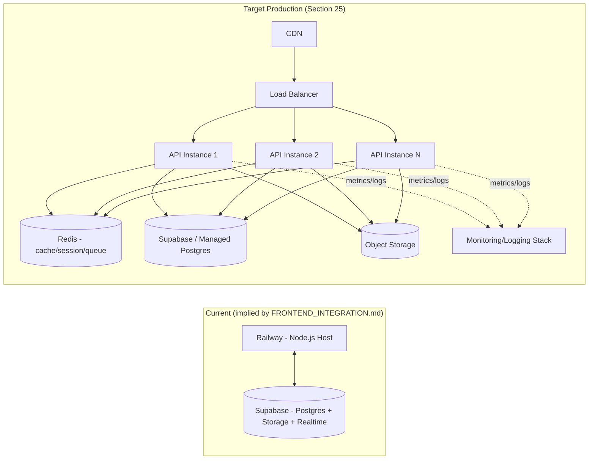

---

## 4. User Roles

### 4.1 Customer / User 📄 SRS §4.1 + 🔧 IMPLEMENTED

**Permissions:**
- Register/login (via phone; OTP per SRS, phone-lookup + JWT in current implementation)
- Create, edit, and delete **draft** bookings (only while in `draft` status — 🔧 enforced in `booking_service.js`)
- Request quotations
- Submit bookings, convert to orders
- Track own active orders (live map)
- View own order history
- Cancel own orders (with reason)
- Make payments
- Receive notifications
- Edit own profile

**Responsibilities (as a platform actor):**
- Provide accurate item/location data (impacts pricing accuracy and vehicle assignment)
- Accept Terms & Conditions before submission (`acceptTerms: true` required — 🔧 IMPLEMENTED)
- Be present (or delegate) for signature capture at pickup/dropoff

**Data Boundary:** A customer must only ever read/write **their own** bookings/orders. 🔧 IMPLEMENTED via `userId` scoping in routes like `GET /api/orders/user/:userId`. ⚠️ **GAP**: routes should also verify the `:userId` path param matches `req.user.id` from the JWT (an authorization check, not just an authentication check) — see Section 17.3.

### 4.2 Driver 📄 SRS §4.2 + 🔧 IMPLEMENTED

**Permissions:**
- Register (creates account in `pending approval` state)
- Login **only after admin approval** (🔧 `is_approved_by_admin` flag enforced at login)
- View assigned bookings/orders
- Update own online/offline availability
- Broadcast live GPS location
- Update booking/order status (constrained to valid forward transitions — see Section 8)
- Upload pickup/dropoff photos
- Capture customer signatures
- View own statistics (completed orders, rating)
- Update own profile

**Responsibilities:**
- Keep location updated during active jobs (required for customer tracking to function)
- Cannot self-assign jobs — dispatch is admin-controlled (📄 SRS — Admin "assigns driver;" no self-serve job board is described)
- Must capture proof-of-service (photo + signature) at both pickup and dropoff — a **business rule**, not optional, because it's baked into the state machine (cannot reach `Pickup Completed` without it — see Section 8.3 for whether this is currently enforced or is a gap).

**Data Boundary:** A driver must only see orders where `driver_id = self`. ⚠️ **GAP** (see Section 21): current `GET /api/drivers/:id/orders` should verify the caller's JWT driver identity equals `:id`.

### 4.3 Admin 📄 SRS §4.3 + 🔧 IMPLEMENTED

**Permissions:**
- Register (bootstrap: first admin needs no token; subsequent admins require an existing admin's token — 🔧 IMPLEMENTED, a sensible bootstrap pattern)
- Login via email/password
- View dashboard (aggregate stats)
- Manage users (view, view history)
- Manage drivers (add is implicit via approval flow; approve, suspend, reactivate)
- View/edit all bookings
- View/edit all orders (assign driver, change status, adjust pricing, schedule pickup, cancel)
- Manage pricing rules (distance/weight/traffic/service charge multipliers)
- Manage promotions and discounts
- Send promotional notifications
- View all reports (revenue, bookings, drivers, customers)

**Responsibilities:**
- Timely triage of new bookings (an SLA — see Section 21 for missing escalation tooling)
- Fair, policy-driven driver assignment (nearest-available, workload-balanced — see Section 11.9 Driver Assignment Service)
- Data steward for pricing correctness (errors here directly cost revenue or lose customers)

### 4.4 Permission Matrix (Consolidated)

| Capability | Customer | Driver | Admin |
|---|:---:|:---:|:---:|
| Register/Login | ✅ (self) | ✅ (self, needs approval) | ✅ (bootstrap/invite) |
| Create booking | ✅ | ❌ | ✅ (on behalf of customer — 💡 inferred support tool) |
| View own bookings/orders | ✅ | ✅ (assigned only) | ✅ (all) |
| View others' bookings/orders | ❌ | ❌ | ✅ |
| Update booking status | ❌ (only cancel) | ✅ (assigned, forward-only) | ✅ (any transition, override) |
| Assign driver | ❌ | ❌ | ✅ |
| Approve/suspend driver | ❌ | ❌ | ✅ |
| Manage pricing rules | ❌ | ❌ | ✅ |
| Manage promotions | ❌ | ❌ | ✅ |
| Upload proof photos/signature | ❌ | ✅ | ❌ |
| Process payment | ✅ (pay) | ❌ | ✅ (refund) |
| View reports/analytics | ❌ | 🔶 own stats only | ✅ |
| Manage other admins | ❌ | ❌ | 🔶 Super Admin only (see 4.5) |

### 4.5 Possible Future Roles 💡 INFERRED

*Why these are needed:* the current three-role model does not scale operationally once the company has >1 internal employee or >1 support tier. These are standard roles in comparable platforms (Uber Freight, AnyVan, Shiply):

| Future Role | Purpose | Why Needed |
|---|---|---|
| **Super Admin** | Owns admin account management, global settings, financial exports | Prevents every admin from being able to create unlimited other admins (privilege escalation risk today — see Security §17) |
| **Dispatcher** | Restricted admin: can view/assign bookings & drivers only, no pricing/financial access | Separation of duties; a dispatcher shouldn't be able to change pricing rules |
| **Support Agent** | Read access to bookings/orders, can issue refunds up to a limit, can message customers/drivers | Customer service needs visibility without full admin power |
| **Finance/Accounting** | Read-only access to payments, revenue reports, payout reconciliation, tax export | Needed for bookkeeping without operational access |
| **Business/Corporate Account** | A customer sub-type representing a company with multiple authorized bookers and centralized billing | B2B logistics customers (retailers, offices) commonly need multi-user accounts under one contract |
| **Fleet Partner / Sub-contractor Admin** | Manages a pool of drivers under their own sub-account (if YourWays federates with logistics partners) | Scalability path if YourWays doesn't want to vet every individual driver |
| **Warehouse/Hub Operator** | Manages consolidation points if the platform later adds hub-and-spoke logistics | Natural evolution beyond simple pickup→dropoff |

---
## 5. Complete Feature Breakdown

Each feature below follows: **Purpose → Inputs → Outputs → Dependencies → Business Rules → Edge Cases**.

### 5.1 Booking (Draft Quotation Request)

| Aspect | Detail |
|---|---|
| **Purpose** | Let a customer describe what needs moving and where, producing a persisted "draft" they can edit before committing. 📄 SRS §6.2 |
| **Inputs** | Category/subcategory/item selections + qty + modifiers (weight, dimensions); pickup postcode/address; dropoff postcode/address; move date + flexibility; property type & floor level (both ends); lift access (both ends); parking access; manpower level; packing service level; dismantling flag; insurance value; job notes; contact info; terms acceptance. 🔧 IMPLEMENTED (`booking_service.js`, `sql/001_create_tables.sql` `bookings` table) |
| **Outputs** | A `booking` record with `status = draft`, an editable item list, and (after pricing) a `calculated_price` + `price_breakdown`. |
| **Dependencies** | Service Catalog (Section 6) for valid category/item names; Pricing Engine (Section 11.3) for cost; Google Places for address validation/autocomplete (📄 SRS). |
| **Business Rules** | 1) A booking must have ≥1 item before it can be submitted. 2) Only `draft` bookings are editable/deletable (🔧 IMPLEMENTED — enforced in `booking_service.js` update/delete). 3) `acceptTerms` must be `true` to submit. 4) Multiple items of multiple categories are allowed in one booking (📄 SRS: "The system allows multiple item selections"). |
| **Edge Cases** | Empty item list on submit → validation error (Section 18). Postcode with no resolvable location → quotation must fall back gracefully (💡 current `pricing_service.js` already has a heuristic fallback returning a default 10-mile distance when postcodes don't parse). Customer abandons booking mid-flow → draft persists indefinitely (⚠️ GAP: no TTL/cleanup job — see Section 21). Customer edits items after a price was calculated → price must be invalidated/recalculated (⚠️ GAP: verify `price_breakdown` is cleared or flagged stale on item mutation). |

### 5.2 Quotation (Pricing Engine Output)

| Aspect | Detail |
|---|---|
| **Purpose** | Automatically compute an estimated cost and delivery time so the customer can make a booking decision without human quoting. 📄 SRS §6.2 Step 3 |
| **Inputs** | Distance (derived from pickup/dropoff), item weights/quantities, manpower level, floor/lift/parking access, packing service, dismantling flag, insurance value, (📄 SRS also lists **traffic conditions** — see Gap below). |
| **Outputs** | `estimatedCost` (total, VAT-inclusive), `estimatedDeliveryHours`, itemized `priceBreakdown` (base price, manpower cost, items cost, floor charge, packing cost, dismantling cost, insurance cost, parking charge, volume discount, VAT, subtotal, total). 🔧 IMPLEMENTED (`pricing_service.js`) |
| **Dependencies** | Google Distance Matrix API (📄 SRS says "Distance" and "Traffic conditions" feed the quote — 🔧 currently implemented via a **postcode-prefix heuristic**, not a real routing API — see Gap). |
| **Business Rules** | VAT applied at 20% (🔧 UK-rate hardcoded). Volume discount tiers: ≥5 items → -£10, ≥10 items → -£25 (🔧 IMPLEMENTED). Floor charge waived if lift access is available or ground floor (🔧 IMPLEMENTED). |
| **Edge Cases** | Zero items → items cost = 0 but base price still applies (a booking should not be quotable with 0 items — should be blocked upstream). Negative/garbage weight input → must be validated (Section 18). Extremely long distance (cross-country) → pricing model must not silently break (current linear model does not cap price, only caps distance at 150 miles). |
| ⚠️ **GAP** | 📄 SRS explicitly requires **"Traffic conditions"** as a pricing input and **Google Maps/Places** as the location intelligence provider; the current implementation uses a **synthetic postcode-diff heuristic** instead of a real Google Distance Matrix / Directions API call. This is a placeholder that must be replaced before production (flagged again in Sections 11.3, 12.3, and 21). |

### 5.3 Tracking (Live Order Visibility)

| Aspect | Detail |
|---|---|
| **Purpose** | Let customers and admins see, in real time, where the driver is and what stage the order is at. 📄 SRS §6.6 |
| **Inputs** | Driver's periodic GPS coordinates (`latitude`, `longitude`); order status changes. |
| **Outputs** | Live map pin (driver position), route/ETA, status timeline (Pending → ... → Completed). |
| **Dependencies** | Google Maps SDK/API (rendering); Supabase Realtime or FCM (propagation); Driver app's location permission. |
| **Business Rules** | Only the customer who owns the order (and Admin) may view its live tracking (authorization boundary). Tracking should only be "live" while order is in an active state (`outForPickup`…`outForDropOff`); historical orders show a static route/summary instead. |
| **Edge Cases** | Driver's GPS disabled → tracking unavailable (Section 20). Driver app killed by OS in background → stale location (💡 needs a "last seen" staleness threshold + UI fallback). Network disconnect mid-tracking → client must reconnect/resubscribe to realtime channel. |

### 5.4 Payments

| Aspect | Detail |
|---|---|
| **Purpose** | Securely collect payment for completed/confirmed bookings and keep an auditable transaction trail. 📄 SRS §14 |
| **Inputs** | Card details (via Stripe Elements/SDK — never touches YourWays servers directly), amount, currency, order reference. |
| **Outputs** | Payment confirmation, receipt, transaction record (`payments` table — 📄 SRS §12 lists `payments` as a core DB table, ⚠️ not yet present in the current schema). |
| **Dependencies** | Stripe API/SDK; Order/Booking total price. |
| **Business Rules** | 💡 Payment timing must be decided: pre-authorize at booking confirmation vs. charge at completion vs. deposit + balance (SRS does not specify — **inferred decision needed**, recommendation in Section 22). Refunds must be tied 1:1 to a payment record and a cancellation/dispute reason. |
| **Edge Cases** | Card declined → booking should not silently proceed; customer must be prompted to retry with another method (Section 19/20). Webhook delivery failure from Stripe → reconciliation job needed (💡 inferred, Section 11 Payment Service). Double-charge risk on retry → idempotency keys required (💡 inferred, Section 17). |

### 5.5 Notifications

| Aspect | Detail |
|---|---|
| **Purpose** | Keep customers and drivers informed of status changes without requiring them to poll the app. 📄 SRS §6.5 |
| **Inputs** | Event triggers: booking confirmed, driver assigned, pickup started, pickup completed, delivery started, order completed (📄 SRS's exact list), plus 💡 inferred events (payment received, driver arriving soon, promotion). |
| **Outputs** | Push notification (FCM) to device; 💡 inferred: in-app notification center list + read/unread state, and optionally email/SMS fallback. |
| **Dependencies** | Firebase Cloud Messaging; device push tokens registered per user/driver. |
| **Business Rules** | Each of the 6 SRS-listed lifecycle events must fire exactly once per order (no duplicate/missing pushes). Promotional notifications (Smart Promotion, §6.7) are geofenced and audience-filtered — must respect opt-out preferences (💡 inferred — required for compliance, see Section 17/21). |
| **Edge Cases** | Device token expired/uninstalled app → FCM send fails silently, must be logged and token pruned (💡 inferred retry/cleanup logic, Section 11.6). User denies notification permission → in-app fallback needed. Notification storm (many status changes in short time) → 💡 inferred rate-limiting/batching. |

### 5.6 Promotions (Smart Promotion Feature)

| Aspect | Detail |
|---|---|
| **Purpose** | Convert idle driver capacity into new bookings by notifying past customers in a city the driver has just entered. 📄 SRS §6.7 — a genuinely distinctive feature. |
| **Inputs** | Driver's current GPS-derived city; history of customers who previously booked in/near that city; discount parameters set by Admin. |
| **Outputs** | Targeted push notification, e.g. *"A driver is available in your area today. Book now and get special discount."* (verbatim SRS example) |
| **Dependencies** | Driver location tracking (5.3); Customer booking history; Reverse-geocoding (Google Maps) to resolve GPS → city name; Admin-configured discount/promo codes. |
| **Business Rules** | Trigger condition: system detects a driver has entered a city ⇒ query customers with prior bookings *in that city* ⇒ send notification with an offer. 💡 Inferred refinements needed: (a) cadence limiting — don't spam the same customer every time any driver passes through, (b) driver must be *available* (not already on a job) for the offer to be honorable, (c) discount codes need expiry and single-use tracking. |
| **Edge Cases** | Driver passes through a city with zero booking history → no-op, no notification (must not error). Same driver re-enters the same city multiple times a day → deduplicate notification sends (💡 inferred cooldown period, e.g. 1 per city per driver per 24h). Customer already has an active booking → 💡 inferred: should probably be excluded/deprioritized from win-back campaign. |

### 5.7 Analytics & Reports (Admin)

| Aspect | Detail |
|---|---|
| **Purpose** | Give management visibility into business health. 📄 SRS §11 (Dashboard) + §11 (Reports & Analytics) |
| **Inputs** | Aggregated booking/order/payment/driver data over selectable time ranges. |
| **Outputs** | Dashboard KPIs: total bookings, revenue, active deliveries, driver statistics (📄 SRS). Reports: revenue reports, booking reports, driver reports, customer reports (📄 SRS). |
| **Dependencies** | All core tables (bookings, orders, payments, drivers, users); 💡 inferred: a reporting/read-replica or materialized views to avoid slowing production DB with heavy aggregate queries. |
| **Business Rules** | Reports must be scoped to date ranges and (💡 inferred) exportable (CSV/PDF) for offline/accounting use. Revenue figures must reconcile with the Payments ledger (not just "total price of completed orders," which ignores refunds/cancellations). |
| **Edge Cases** | Report requested for a period with zero data → must return an empty/zeroed structure, not an error. Very large date ranges → 💡 inferred pagination/async report generation for large exports. |

### 5.8 Driver Assignment

| Aspect | Detail |
|---|---|
| **Purpose** | Match a submitted booking/order to a capable, available driver. 📄 SRS §6.3 ("Admin assigns driver") |
| **Inputs** | Order's location/vehicle/manpower requirements; pool of approved, online, available drivers. |
| **Outputs** | `order.driver_id` set; order status transitions `pending → confirmed`; driver notified. |
| **Dependencies** | Driver approval/online status (5.9); Order requirements from category catalog (Section 6 — e.g. "Industrial Machinery" needs a flatbed + multiple movers). |
| **Business Rules** | 📄 SRS models this as a **manual admin action**, not an automatic algorithm. 💡 INFERRED: production systems at scale need an **assignment recommendation engine** (nearest available driver with matching vehicle type) to keep manual assignment fast — detailed in Section 11.9. A driver must be `is_approved_by_admin = true` and ideally `is_online = true` to be assignable. |
| **Edge Cases** | No driver available/approved → booking stays `pending` indefinitely (⚠️ GAP: no SLA alert — Section 21). Assigned driver goes offline/cancels after assignment → **re-assignment workflow** needed (⚠️ GAP, detailed in Section 8.6 and 20). Driver assigned to two overlapping jobs → 💡 inferred conflict check needed. |

### 5.9 Driver Availability & Profile

| Aspect | Detail |
|---|---|
| **Purpose** | Let drivers control when they're available for dispatch, and let the system/customers see driver identity & vehicle info. 📄 SRS (driver home screen: "Check-in slider," "Driver availability status") |
| **Inputs** | Online/offline toggle; live location; profile fields (name, phone, license, vehicle type/number). |
| **Outputs** | `is_online`, `last_online_at`, `current_latitude/longitude`, `location_updated_at` (🔧 IMPLEMENTED in `drivers` table). |
| **Dependencies** | Admin approval gate; GPS permission on device. |
| **Business Rules** | A driver cannot go online until admin-approved (🔧 IMPLEMENTED). A suspended driver cannot go online or receive assignments (🔧 `driver_status` enum includes `suspended`). |
| **Edge Cases** | Driver forgets to go offline after finishing → 💡 inferred auto-offline after N hours of inactivity/no location updates. |

### 5.10 History (Order/Booking History)

| Aspect | Detail |
|---|---|
| **Purpose** | Let customers review past bookings/orders; let drivers review completed jobs; let admin audit everything. 📄 SRS ("View order history" — customer; Orders Screen "Previous orders") |
| **Inputs** | User/driver ID, optional filters (date range, status). |
| **Outputs** | Paginated list of past bookings/orders with summary fields, drilling into full Order Detail. |
| **Dependencies** | `orders`/`bookings` tables; 💡 inferred pagination for scalability. |
| **Business Rules** | History is immutable — completed/cancelled orders should never be edited, only viewed (support corrections happen via new records/credit notes, not mutation). |
| **Edge Cases** | Very long history (power users, years of use) → 💡 inferred requires pagination/infinite scroll, cannot return unbounded lists. |

### 5.11 Profile Management

| Aspect | Detail |
|---|---|
| **Purpose** | Let users/drivers/admins view and edit their own account details. 📄 SRS (Profile Screen: "User information," "Total bookings," "Edit profile," "Logout") |
| **Inputs** | Name, email, address, DOB, (driver: license/vehicle info). |
| **Outputs** | Updated profile record. |
| **Dependencies** | Auth middleware (only the account owner, or admin, may edit). |
| **Business Rules** | Phone number is the login identity — 💡 inferred it should require re-verification (new OTP) if changed, to prevent account takeover. Email/phone uniqueness enforced at DB level (🔧 IMPLEMENTED — `UNIQUE` constraints on `users.email`, `users.phone`). |
| **Edge Cases** | Changing phone to one already registered → unique constraint violation must map to a friendly `409 Conflict` error (Section 19). |

### 5.12 Category/Item Catalog Browsing

| Aspect | Detail |
|---|---|
| **Purpose** | Let customers explore available services and structured items before/while booking. 📄 SRS §5, Services Screen |
| **Inputs** | None (public, read-only) or a `serviceId` filter. |
| **Outputs** | Nested category → subcategory → item tree with per-item modifiers (dimensions, weight). 🔧 IMPLEMENTED (`GET /api/services/templates`). |
| **Dependencies** | Static/DB-backed catalog (Section 6). |
| **Business Rules** | Catalog must stay in sync with what pricing/vehicle-assignment logic understands — an item shown to the customer but unrecognized by pricing is a critical bug class. |
| **Edge Cases** | Custom item (freeform name/dimensions/weight) must still be priced sensibly (📄 SRS "Custom Item" category — pricing engine must handle items without a known catalog weight). |

---

## 6. Business Service Catalog

📄 The SRS (§5) states: *"The platform supports structured category-based item selection to simplify quotation generation, logistics planning, manpower allocation, and vehicle assignment."* Every single category, subcategory, and item below is transcribed **verbatim and completely** from the SRS — nothing skipped.

### 6.0 Catalog Structure Overview

The SRS defines the catalog as **two parallel top-level trees that overlap heavily** (a normalization issue analyzed in 6.12):

1. **Tree A — "Room/Space" grouping**: `Home` (containing `Bedroom`, `Living Room`, `Dining Room`, `Kitchen`, `Bathroom`), `Garden / Lawn`, `Boxes & Packaging`, `Office`, `Piano Delivery`, `Vehicle`, `Industrial (Machinery)`, `Man Power Only`, `Specialist & Antique`, `Man and Van`.
2. **Tree B — "Furniture" catalog**: A second top-level `Furniture` category re-listing `Home Furniture` (Sofa, Bed, Wardrobe, Dining Table, Coffee Table, TV Stand, Bookcase, Cabinet), `Office Furniture`, and `Outdoor Furniture` — largely **duplicating** items already present in Tree A.
3. Then `Custom Item` and `Additional Service Options` sit outside both trees as cross-cutting features.

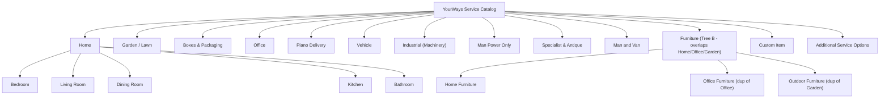

### 6.1 Full Category → Subcategory → Item Hierarchy (Complete, Verbatim)

#### 6.1.1 HOME

| Subcategory | Items |
|---|---|
| **Bedroom → Beds & Mattresses** | Single Bed & Mattress, Double Bed & Mattress, Kingsize Bed & Mattress, Super Kingsize Bed & Mattress, Single Bed Frame, Double Bed Frame, Kingsize Bed Frame, Bunk Bed, Cot, Single Mattress, Double Mattress, Kingsize Mattress |
| **Bedroom → Wardrobes & Storage** | Single Wardrobe, Double Wardrobe, Triple Wardrobe, Sliding Door Wardrobe, Flat Packed Wardrobe, Chest Of Drawers, Bedside Table, Shelf, Ottoman |
| **Bedroom → Bedroom Furniture** | Dressing Table, Side Table, TV |
| **Living Room → Sofas & Seating** | Two Seater Sofa, Three Seater Sofa, Four Seater Sofa, Five Seater Sofa, Six Seater Sofa, Seven Seater Sofa, L Shaped Sofa, Corner Sofa, Two Seater Reclining Sofa, Three Seater Reclining Sofa, Two Seater Sofa Bed, Three Seater Sofa Bed, Corner Sofa Bed, Armchair, Sofa Chair, Rocking Chair |
| **Living Room → Tables & Storage** | Coffee Table, TV Stand, Bookcase, Shelf |
| **Living Room → Electronics & Decor** | Small Television/TV (<30"), Medium Television/TV (30"–40"), Large Television/TV (>40"), Artwork, Rug, Carpet, Floor Lamp, Foot Stool, Chandelier, Picture Frame |
| **Dining Room → Dining Furniture** | 4 Seater Dining Table, 6 Seater Dining Table, 4 Seater Dining Table & Chairs, 6 Seater Dining Table & Chairs, Dining Chair |
| **Dining Room → Storage & Decor** | Side Cabinet, Display Cabinet, Large Mirror, Small Mirror |
| **Kitchen → Appliances** | Fridge, Fridge Freezer, American Fridge, Freezer, Washing Machine, Tumble Dryer, Dishwasher, Microwave Oven, Cooker, Air Fryer |
| **Kitchen → Kitchen Furniture** | Kitchen Table, Chair, Stool, Bin |
| **Kitchen → Utility Items** | Ironing Board, Cloth Horse, Water Cooler |
| **Bathroom → Bathroom Furniture & Accessories** | Bathroom Cabinet, Bath Tub, Large Mirror, Small Mirror, Rug |

#### 6.1.2 GARDEN / LAWN

| Subcategory | Items |
|---|---|
| **Outdoor Furniture** | Garden Chair, Garden Table, Garden Set (5 Seater), Garden Set (6 Seater), Garden Set (7 Seater) |
| **Outdoor Storage** | Storage Box Small, Storage Box Medium, Storage Box Large |

#### 6.1.3 BOXES & PACKAGING

| Subcategory | Items |
|---|---|
| **Boxes** | Small Box (≈40×30×30cm), Medium Box (≈45×45×35cm), Large Box (≈50×50×50cm), Wardrobe Box, Crate |
| **Bags & Personal Items** | Small Bag, Large Bag, Suitcase, Box Of Clothes |
| **Miscellaneous** | Bicycle |

#### 6.1.4 OFFICE

| Subcategory | Items |
|---|---|
| **Office Furniture → Desks & Tables** | Office Desk, Pedestal Desk, Corner Desk, Corner Desk With Pedestal, Standing Desk, Standing Desk - Electric, Board Room Table, Coffee Table |
| **Office Furniture → Chairs** | Office Chair, Desk Chair, Stacking Chair, Folding Chair |
| **Office Furniture → Storage** | Small Filing Cabinet, Large Filing Cabinet, Pedestal, Storage Cabinet, Cupboard, Locker, Bookcase |
| **Office Equipment** | Computer, Computer Monitor, Printer, Photocopier, TV, Drawing Board, Projector, Projector Screen, Mini Fridge, Paper Shredder, Display Board |
| **Office Kitchen** | Kitchen Table, Chair, Stool, Water Cooler |
| **Office Packaging → Boxes** | Small Box, Medium Box, Large Box, Crate |

#### 6.1.5 PIANO DELIVERY

| Subcategory | Items |
|---|---|
| **Piano Types** | Upright Piano, Baby Grand Piano, Grand Piano, Digital Piano, Keyboard Piano, Studio Piano, Concert Piano |
| **Piano Accessories** | Piano Bench, Piano Cover, Piano Pedals, Music Stand |

#### 6.1.6 VEHICLE

| Subcategory | Items |
|---|---|
| **Cars** | Hatchback Car, Sedan Car, SUV, Pickup Truck, Van, Luxury Car, Sports Car, Classic Car, Non-Running Vehicle |
| **Motorcycles & Bikes** | Motorcycle, Scooter, Dirt Bike, Quad Bike, Electric Bike |
| **Vehicle Parts** | Car Engine, Gearbox, Car Door, Car Bonnet, Tires/Wheels, Exhaust System, Bumper, Motorcycle Parts |
| **Commercial Vehicles** | Mini Truck, Cargo Van, Trailer, Forklift |

#### 6.1.7 INDUSTRIAL (MACHINERY)

| Subcategory | Items |
|---|---|
| **Industrial Equipment** | Generator, Air Compressor, Welding Machine, Industrial Printer, Hydraulic Machine, CNC Machine, Lathe Machine, Milling Machine, Packaging Machine, Conveyor System |
| **Construction Machinery** | Cement Mixer, Mini Excavator, Forklift, Scissor Lift, Pallet Jack, Industrial Shelving |
| **Warehouse Equipment** | Storage Rack, Heavy Duty Cabinet, Warehouse Trolley, Industrial Workbench |

#### 6.1.8 MAN POWER ONLY

| Subcategory | Items |
|---|---|
| **Loading & Moving Assistance** | Loading Assistance, Unloading Assistance, Furniture Rearrangement, Packing Assistance, Unpacking Assistance, Assembly Assistance, Disassembly Assistance |

#### 6.1.9 SPECIALIST & ANTIQUE

| Subcategory | Items |
|---|---|
| **Antique Furniture** | Antique Wardrobe, Antique Cabinet, Antique Table, Antique Chair, Antique Desk, Antique Bed Frame, Antique Mirror, Antique Clock, Antique Trunk |
| **Fine Art & Collectibles** | Painting/Canvas Art, Sculpture, Framed Artwork, Glass Artwork, Statue, Collectible Item, Museum Piece, Vintage Decor |
| **Fragile & Luxury Items** | Glass Table, Marble Table, Large Mirror, Chandelier, Crystal Item, Ceramic Item, Display Cabinet, Luxury Furniture, Designer Furniture |
| **Specialist Musical Items** | Grandfather Clock, Harp, Drum Kit, Guitar Collection |

#### 6.1.10 MAN AND VAN

| Subcategory | Items |
|---|---|
| **Small Moves** | Single Item Delivery, Student Move, Apartment Move, Studio Flat Move |
| **Delivery Services** | Same Day Delivery, Furniture Delivery, Store Pickup & Delivery, Marketplace Delivery, Local Delivery, Long Distance Delivery |
| **Van Support Services** | Driver Only, Driver With Helper, Two Movers & Van, Three Movers & Van |

#### 6.1.11 FURNITURE (Tree B — see 6.12 for overlap analysis)

| Subcategory | Items |
|---|---|
| **Home Furniture → Sofa** | (same 16 sofa items as Living Room → Sofas & Seating, listed identically) |
| **Home Furniture → Bed** | Single Bed, Double Bed, Kingsize Bed, Super Kingsize Bed, Bunk Bed, Sofa Bed, Single Bed Frame, Double Bed Frame, Kingsize Bed Frame, Cot, Single Mattress, Double Mattress, Kingsize Mattress |
| **Home Furniture → Wardrobe** | Single Wardrobe, Double Wardrobe, Triple Wardrobe, Sliding Door Wardrobe, Flat Packed Wardrobe, **Walk In Wardrobe** (new item not in Bedroom list), Chest Of Drawers, Bedside Table, Shelf |
| **Home Furniture → Dining Table** | 2 Seater Dining Table, 4 Seater Dining Table, 6 Seater Dining Table, **8 Seater Dining Table** (new), 4 Seater Dining Table & Chairs, 6 Seater Dining Table & Chairs, Dining Chair, **Dining Bench** (new) |
| **Home Furniture → Coffee Table** | Small Coffee Table, Medium Coffee Table, Large Coffee Table, Glass Coffee Table, Marble Coffee Table, Nesting Coffee Table |
| **Home Furniture → TV Stand** | Small TV Stand, Medium TV Stand, Large TV Stand, Wall Mounted TV Unit, Entertainment Unit |
| **Home Furniture → Bookcase** | Small Bookcase, Medium Bookcase, Large Bookcase, Open Shelf Bookcase, Closed Door Bookcase |
| **Home Furniture → Cabinet** | Side Cabinet, Display Cabinet, Storage Cabinet, Glass Cabinet, Shoe Cabinet, Corner Cabinet |
| **Office Furniture → Office Desk** | Standard Office Desk, Pedestal Desk, Corner Desk, Corner Desk With Pedestal, Standing Desk, Electric Standing Desk, Executive Desk, Reception Desk |
| **Office Furniture → Office Chair** | Standard Office Chair, Executive Office Chair, Mesh Chair, Ergonomic Chair, Gaming Chair, Visitor Chair, Stacking Chair, Folding Chair |
| **Office Furniture → Filing Cabinet** | Small Filing Cabinet, Large Filing Cabinet, 2 Drawer Filing Cabinet, 4 Drawer Filing Cabinet, Mobile Filing Cabinet |
| **Office Furniture → Board Room Table** | Small Meeting Table, Medium Board Room Table, Large Board Room Table, Conference Table |
| **Office Furniture → Storage Cabinet** | Office Storage Cabinet, Locker, Cupboard, Pedestal Storage, Archive Cabinet, Document Cabinet |
| **Outdoor Furniture → Garden Chair** | Plastic Garden Chair, Wooden Garden Chair, Metal Garden Chair, Folding Garden Chair, Reclining Garden Chair |
| **Outdoor Furniture → Garden Table** | Small Garden Table, Medium Garden Table, Large Garden Table, Glass Garden Table, Folding Garden Table |
| **Outdoor Furniture → Garden Set** | 2 Seater Garden Set, 4 Seater Garden Set, 5 Seater Garden Set, 6 Seater Garden Set, 7 Seater Garden Set, Rattan Garden Set, Corner Garden Set |
| **Outdoor Furniture → Outdoor Storage Box** | Small Outdoor Storage Box, Medium Outdoor Storage Box, Large Outdoor Storage Box, Waterproof Storage Box, Deck Storage Box |

#### 6.1.12 CUSTOM ITEM

| Subcategory | Fields Captured | Examples (SRS) |
|---|---|---|
| **Create Your Own Item** | Item Name, Length, Width, Height (Estimated Dimensions), Estimated Weight, Quantity | Model Train Collection, Custom Sculpture, Exhibition Stand, Gym Equipment |

#### 6.1.13 ADDITIONAL SERVICE OPTIONS (Handling Options — cross-cutting, applies to any item/booking)

Fragile Item, High Value Item, Requires Insurance, Requires Protective Wrapping, Requires Wooden Crating, Requires Assembly, Requires Disassembly, Requires Multiple Movers, Stair Access Required, Lift Access Available, White Glove Delivery, Climate Controlled Delivery.

---

### 6.2 Per-Category Deep-Dive Analysis

#### HOME (parent grouping)

| Field | Detail |
|---|---|
| **Purpose** | Umbrella for full-property residential moves; drives the "Home Move" service type. |
| **Subcategories** | Bedroom, Living Room, Dining Room, Kitchen, Bathroom |
| **Business Usage** | Primary use case for whole-house/flat relocations — the highest-volume, most standardized job type. |
| **Quotation Impact** | Aggregate item weight/volume across all rooms drives base pricing + manpower recommendation; larger homes (more items) trigger volume discounts (🔧 IMPLEMENTED: ≥5 items -£10, ≥10 items -£25). |
| **Vehicle Requirements** | Small van (studio/1-bed) → Luton/box van (3+ bed) — 💡 inferred tiering based on item count/volume. |
| **Driver Requirements** | Standard driving license; manpower team scales with furniture count/floor access. |
| **Insurance Requirements** | Standard goods-in-transit insurance; high-value electronics (TVs) may need itemized coverage. |
| **Handling Requirements** | Wardrobes/beds often require disassembly; appliances need protection from tipping (fridges especially). |
| **Pricing Impact** | Floor level + lift access multipliers apply per SRS pricing inputs; packing service tier adds cost. |
| **Special Conditions** | Multi-room moves should ideally allow the customer to tag which room each item came from for driver loading-order optimization (💡 inferred UX enhancement). |

#### BEDROOM

| Field | Detail |
|---|---|
| **Purpose** | Beds, mattresses, wardrobes, and bedroom furniture — typically the bulkiest, heaviest items in a home move. |
| **Items** | 24 distinct items across Beds & Mattresses, Wardrobes & Storage, Bedroom Furniture (full list in 6.1.1). |
| **Business Usage** | Near-universal in every home move; also independently bookable (e.g., "just deliver my new mattress"). |
| **Quotation Impact** | Beds/wardrobes are high-weight/high-volume → significant driver of base item cost. |
| **Vehicle Requirements** | Kingsize+/Super Kingsize beds and Triple Wardrobes require a van with a long load bay (💡 inferred: cannot fit in a hatchback/small car). |
| **Driver Requirements** | 2-person minimum for wardrobes/kingsize beds (💡 inferred safe manual handling). |
| **Insurance Requirements** | Mattress/upholstery items are stain/tear-prone — standard cover typically sufficient; no special mandate in SRS. |
| **Handling Requirements** | Flat-packed and sliding-door wardrobes often need disassembly (`Requires Disassembly` handling flag); bunk beds/cots need careful hardware bagging. |
| **Pricing Impact** | Feeds `itemsCost` via weight-based formula (🔧 `pricing_service.calculateItemsCost`). |
| **Special Conditions** | None explicit; 💡 inferred: mattress hygiene bagging option could be a future add-on. |

#### LIVING ROOM

| Field | Detail |
|---|---|
| **Purpose** | Sofas, seating, entertainment/decor items. |
| **Items** | 30 items across Sofas & Seating, Tables & Storage, Electronics & Decor. |
| **Business Usage** | Second-most common category in home moves; also common for "single item delivery" (Man and Van) — e.g., buying a sofa online and needing delivery. |
| **Quotation Impact** | Large sofas (5–7 seater, corner, L-shaped) are high-volume → drive vehicle size selection more than weight. |
| **Vehicle Requirements** | Corner/L-shaped/6-7 seater sofas typically require a Luton van; may not fit through standard doorways (💡 inferred: "will it fit" pre-check is a common real-world need, flagged in Section 21). |
| **Driver Requirements** | 2+ movers for large sofas; TVs >40" need careful, often single-person-but-careful handling with corner protection. |
| **Insurance Requirements** | TVs/artwork/chandeliers are fragile/high-value → `Requires Insurance`, `Fragile Item` flags relevant. |
| **Handling Requirements** | Reclining sofas/sofa beds have mechanical parts that can be damaged if tilted wrong; rugs/carpets need rolling not folding. |
| **Pricing Impact** | Same weight/quantity formula; fragile flags should (💡 inferred, currently not modeled in `pricing_service.js`) add a handling surcharge. |
| **Special Conditions** | Glass/mirrored items (large mirror) → `Requires Protective Wrapping` recommended. |

#### DINING ROOM

| Field | Detail |
|---|---|
| **Purpose** | Dining tables, chairs, display/storage furniture. |
| **Items** | 9 items across Dining Furniture, Storage & Decor. |
| **Business Usage** | Common secondary category in home moves; large dining tables sometimes booked standalone (e.g., house downsizing). |
| **Quotation Impact** | 6-seater table+chair sets add both weight and item-count (each chair counts individually) → increases manpower need. |
| **Vehicle Requirements** | Standard van; large tables may need diagonal loading space. |
| **Driver Requirements** | 2-person lift for solid wood dining tables. |
| **Insurance Requirements** | Large/small mirrors are fragile — `Requires Insurance`/`Fragile Item` relevant. |
| **Handling Requirements** | Glass-top tables need `Requires Protective Wrapping`; some tables need leg disassembly. |
| **Pricing Impact** | Standard weight-based; chair sets increase item count for manpower tier recommendation. |
| **Special Conditions** | Display cabinets often have glass doors/shelves — high breakage risk, should trigger a handling warning in UI (💡 inferred). |

#### KITCHEN

| Field | Detail |
|---|---|
| **Purpose** | Major appliances and kitchen furniture/utility items. |
| **Items** | 17 items across Appliances, Kitchen Furniture, Utility Items. |
| **Business Usage** | Appliances are the single heaviest, most damage-sensitive category — fridges, washing machines. |
| **Quotation Impact** | Appliances (esp. American Fridge, Washing Machine) are very heavy → dominate weight-based pricing formula; often needs its own manpower/vehicle allocation. |
| **Vehicle Requirements** | Van with ramp/trolley access recommended for heavy appliances. |
| **Driver Requirements** | 2-person team + appliance trolley; washing machines need transit bolts reinstalled ideally (💡 inferred domain knowledge — common real-world requirement, not in SRS but critical to avoid damage claims). |
| **Insurance Requirements** | Appliances are high-value → `Requires Insurance`/`High Value Item` strongly recommended, arguably should be system-suggested. |
| **Handling Requirements** | Must remain upright during transit (fridges/freezers — compressor oil settling); `Requires Multiple Movers` typical. |
| **Pricing Impact** | Highest per-unit weight in the whole catalog → biggest lever in the pricing engine. |
| **Special Conditions** | 💡 Inferred: appliances should have a "must stand upright for N hours before use" delivery note surfaced to the customer — a customer-experience/liability protection, not in SRS. |

#### BATHROOM

| Field | Detail |
|---|---|
| **Purpose** | Bathroom fixtures/furniture that are moveable (not plumbed-in items). |
| **Items** | 5 items: Bathroom Cabinet, Bath Tub, Large Mirror, Small Mirror, Rug. |
| **Business Usage** | Least common category — usually only relevant in renovation-related moves. |
| **Quotation Impact** | Bath tubs are bulky/awkward (irregular shape) → 💡 inferred: should carry a manual "special handling" surcharge similar to antiques. |
| **Vehicle Requirements** | Standard van; tub shape may require diagonal or dedicated space. |
| **Driver Requirements** | 2-person lift for tubs/cabinets. |
| **Insurance Requirements** | Mirrors are fragile → `Fragile Item`/`Requires Insurance`. |
| **Handling Requirements** | `Requires Protective Wrapping` for mirrors/tubs (scratch-prone surfaces). |
| **Pricing Impact** | Standard weight-based; low volume category overall. |
| **Special Conditions** | None additional. |

#### GARDEN / LAWN

| Field | Detail |
|---|---|
| **Purpose** | Outdoor furniture and outdoor storage relocation. |
| **Subcategories** | Outdoor Furniture (Garden Chair, Garden Table, Garden Sets 5/6/7-seater), Outdoor Storage (Small/Medium/Large Storage Box). |
| **Business Usage** | Seasonal demand spike (spring/summer moves, end-of-summer storage). |
| **Quotation Impact** | Garden sets (6-7 seater) are large/bulky, similar to sofas in volume impact. |
| **Vehicle Requirements** | Open/flatbed or large van; weather protection needed if items aren't waterproof. |
| **Driver Requirements** | 2-person team for large sets. |
| **Insurance Requirements** | Low — outdoor furniture is generally low-value; rattan sets may warrant `Requires Protective Wrapping`. |
| **Handling Requirements** | Cushions/parasols (if included) should be bagged separately (💡 inferred, not in SRS explicitly). |
| **Pricing Impact** | Standard weight/volume formula; low insurance premium. |
| **Special Conditions** | Weather-dependent handling (rain protection) — 💡 inferred operational note for drivers. |

#### BOXES & PACKAGING

| Field | Detail |
|---|---|
| **Purpose** | Generic packaging containers and small personal items — the "long tail" of any move. |
| **Subcategories** | Boxes (Small/Medium/Large/Wardrobe/Crate — **with explicit dimensions in SRS**, uniquely among all categories), Bags & Personal Items, Miscellaneous (Bicycle). |
| **Business Usage** | Present in nearly every booking as a supplementary line item; also the basis for "how many boxes do I need" self-service estimators common in the industry (💡 inferred future feature, Section 21). |
| **Quotation Impact** | Individually low weight/cost but high quantity — quantity-per-item multiplier matters most here. |
| **Vehicle Requirements** | None special — fills remaining van space. |
| **Driver Requirements** | Single mover sufficient per box; bicycles need careful stacking (pedals/chains can scratch other items). |
| **Insurance Requirements** | Box Of Clothes/Suitcase — low value typically, unless customer flags `High Value Item`. |
| **Handling Requirements** | Wardrobe Box is technically a hanging-garment transport box — should map to a distinct handling icon (keep upright). |
| **Pricing Impact** | Low per-unit cost, but the `itemCount` used for volume-discount tiers and manpower-team recommendation includes boxes — 💡 inferred that box count should perhaps be weighted less than furniture count in tier calculations (a current potential pricing distortion, see Section 21). |
| **Special Conditions** | Only category in the SRS with **explicit approximate dimensions supplied for the customer's benefit** — this is effectively catalog metadata that should be preserved in the DB item table (`typical_dimensions_cm` field, Section 10). |

#### OFFICE

| Field | Detail |
|---|---|
| **Purpose** | Office relocations — furniture + equipment + kitchen + packaging, a fully self-contained "mini home move" for commercial premises. |
| **Subcategories** | Office Furniture (Desks & Tables, Chairs, Storage), Office Equipment, Office Kitchen, Office Packaging (Boxes). |
| **Business Usage** | B2B use case — often larger, higher-value, and more schedule-sensitive (businesses need out-of-hours/weekend moves to avoid downtime) than residential moves. |
| **Quotation Impact** | Electric standing desks, board room tables, and IT equipment (computers, photocopiers) command higher per-unit value → insurance-relevant. |
| **Vehicle Requirements** | Often multiple van trips or a single large Luton van depending on office size; 💡 inferred: office moves may need **multiple vehicles dispatched together** — a scenario the current 1-order-1-driver model doesn't natively support (flagged in Section 21). |
| **Driver Requirements** | IT equipment (computers, photocopiers, projectors) needs careful anti-static/no-tilt handling — 💡 inferred domain best practice. |
| **Insurance Requirements** | Photocopiers/computers/projectors are high-value → `Requires Insurance` strongly recommended. |
| **Handling Requirements** | Filing cabinets often need to stay locked/contents secured (confidential documents) — 💡 inferred compliance-sensitive note beyond SRS. |
| **Pricing Impact** | Standard weight-based, but B2B jobs often justify a different rate card (💡 inferred: distinct "Office" pricing profile vs. residential — Section 22). |
| **Special Conditions** | This category **duplicates** items also listed under top-level "Furniture → Office Furniture" (see 6.12). |

#### PIANO DELIVERY

| Field | Detail |
|---|---|
| **Purpose** | A specialist service for one of the heaviest, most damage-prone, and highest-skill-requirement item types in home moving. |
| **Subcategories** | Piano Types (7 types), Piano Accessories (4 items). |
| **Business Usage** | Standalone premium service — customers specifically search for "piano movers" as a distinct need from general moving. |
| **Quotation Impact** | Should command a significant premium over generic furniture pricing — Grand/Baby Grand pianos can weigh 300–500kg. ⚠️ **GAP**: current `pricing_service.js` has no piano-specific pricing logic; it would fall through generic weight-based item cost, materially under-pricing the job. |
| **Vehicle Requirements** | Specialist piano board/ramp equipment required; van must have full-height rear access (upright pianos are ~1.5m tall). |
| **Driver Requirements** | Specialist-trained piano movers, minimum 2–3 person crew — a licensing/skill differentiation that should gate driver eligibility (💡 inferred: drivers should have a `specialistSkills` tag, e.g. `piano_certified`). |
| **Insurance Requirements** | Mandatory high-value insurance — pianos are frequently worth £1,000–£50,000+. |
| **Handling Requirements** | `Requires Multiple Movers`, `Requires Wooden Crating` for long-distance/high-value pianos, stair/step assessment mandatory pre-booking. |
| **Pricing Impact** | Should be its own pricing tier/multiplier, not generic weight formula (⚠️ GAP, Section 21). |
| **Special Conditions** | Grand/Baby Grand pianos need legs/lid removed (disassembly) and re-tuning is often needed post-move (customer expectation to set, not a YourWays liability, but worth a disclaimer — 💡 inferred). |

#### VEHICLE TRANSPORT

| Field | Detail |
|---|---|
| **Purpose** | Transporting cars, motorcycles, vehicle parts, and commercial vehicles — a fundamentally different service from "goods moving" (this is *vehicle logistics*, needing car transporters, not vans). |
| **Subcategories** | Cars (9), Motorcycles & Bikes (5), Vehicle Parts (8), Commercial Vehicles (4, including a second "Forklift" entry — see 6.12 duplicate analysis). |
| **Business Usage** | Car dealership relocations, private vehicle sales/purchases requiring delivery, non-running/classic car transport. |
| **Quotation Impact** | Fundamentally different cost model — priced by vehicle class + running/non-running status + distance, **not** by weight/quantity like furniture. ⚠️ **GAP**: current pricing engine treats all items identically; vehicle transport needs its own quotation path. |
| **Vehicle Requirements** | Car transporter/trailer/flatbed tow truck — **YourWays' own van fleet cannot fulfill this category** as currently modeled; requires a distinct vehicle type in the driver/vehicle model. |
| **Driver Requirements** | Requires a driver with a trailer-towing qualification or a car-transporter-rated license — a legal/compliance requirement in most jurisdictions. |
| **Insurance Requirements** | Motor trade / vehicle-in-transit insurance — categorically different (and usually more expensive) than goods-in-transit insurance. |
| **Handling Requirements** | Non-running vehicles need winching equipment; vehicle parts (engines, gearboxes) are heavy + often leak fluids (containment needed). |
| **Pricing Impact** | Should be priced per mile + vehicle class, essentially a separate product line. |
| **Special Conditions** | This category alone justifies a **"vehicle type" dimension on the Driver/Vehicle model** distinct from van size (Section 10, Section 21). |

#### INDUSTRIAL (MACHINERY)

| Field | Detail |
|---|---|
| **Purpose** | B2B/industrial equipment relocation — factories, warehouses, construction sites. |
| **Subcategories** | Industrial Equipment (10 items), Construction Machinery (6, including a duplicate "Forklift"), Warehouse Equipment (4). |
| **Business Usage** | High-value, low-frequency, highly specialized jobs — likely quoted manually/semi-automatically given complexity. |
| **Quotation Impact** | Weight/size varies enormously (a generator vs. a CNC machine vs. a mini excavator) — 💡 inferred: this category needs **per-item custom quoting** or a "request a custom quote" flow rather than the standard automated engine, since generic weight-based pricing cannot safely price a mini excavator. |
| **Vehicle Requirements** | Flatbed truck, low-loader, or crane-assisted vehicle depending on item — far beyond a standard van fleet. |
| **Driver Requirements** | HGV license, machinery-rigging experience, potentially third-party crane operator subcontracting. |
| **Insurance Requirements** | Mandatory, high-limit goods-in-transit + liability insurance — industrial equipment damage claims can be enormous. |
| **Handling Requirements** | `Requires Wooden Crating`, `Requires Multiple Movers`, likely rigging/lifting equipment (chains, forklifts) beyond simple manual handling. |
| **Pricing Impact** | Should trigger a **"quote on request"** workflow rather than instant pricing (💡 inferred product decision, Section 22). |
| **Special Conditions** | Site risk assessment likely needed pre-booking (access roads, ground stability for excavators) — 💡 inferred operational requirement outside SRS scope but standard in industrial logistics. |

#### MAN POWER ONLY

| Field | Detail |
|---|---|
| **Purpose** | Labor-only service — no vehicle/transport, just physical assistance (loading, packing, assembly). |
| **Subcategories** | Loading & Moving Assistance (7 items: Loading/Unloading Assistance, Furniture Rearrangement, Packing/Unpacking Assistance, Assembly/Disassembly Assistance). |
| **Business Usage** | For customers who've rented their own van/have movers already, or need in-home furniture rearrangement/assembly (e.g., flat-pack furniture building) without transport. |
| **Quotation Impact** | Should be priced by **time/hourly rate + headcount**, not distance/weight — a structurally different pricing model (no pickup→dropoff route in the traditional sense; it's a single-location job). ⚠️ **GAP**: current booking model assumes a two-location (pickup/delivery) shape, which doesn't fit this service cleanly. |
| **Vehicle Requirements** | None — this is the one category with **no vehicle requirement at all** (📄 SRS implicit, since it's "Man Power Only"). |
| **Driver Requirements** | Renamed conceptually to "Labor Provider" for this category — physical fitness, assembly/DIY skill for furniture. |
| **Insurance Requirements** | Public liability insurance (in case of accidental property damage during assembly/rearrangement) rather than goods-in-transit insurance. |
| **Handling Requirements** | Tool provision (screwdrivers, Allen keys) for assembly/disassembly — 💡 inferred operational requirement. |
| **Pricing Impact** | Needs an hourly-rate pricing model as an alternative quotation path (Section 22 recommendation). |
| **Special Conditions** | Booking form for this category should **not require a dropoff location** (💡 inferred UX/data-model implication — see Section 21 missing validation). |

#### SPECIALIST & ANTIQUE

| Field | Detail |
|---|---|
| **Purpose** | High-value, fragile, irreplaceable items needing white-glove treatment. |
| **Subcategories** | Antique Furniture (9), Fine Art & Collectibles (8), Fragile & Luxury Items (9), Specialist Musical Items (4). |
| **Business Usage** | Premium/niche service line — customers are typically insurance-conscious and expect concierge-level communication. |
| **Quotation Impact** | Should command the **highest per-item pricing multiplier** in the catalog — irreplaceable/high-value items justify premium rates and mandatory insurance. ⚠️ **GAP**: no such multiplier exists in `pricing_service.js` today. |
| **Vehicle Requirements** | Climate-controlled van recommended (`Climate Controlled Delivery` handling option directly supports this); air-ride suspension ideal for fragile items. |
| **Driver Requirements** | Specialist-trained/vetted drivers — potentially background-checked given high theft/damage liability. |
| **Insurance Requirements** | Mandatory `Requires Insurance` — arguably should be **system-enforced**, not optional, for this entire category. |
| **Handling Requirements** | `Requires Wooden Crating`, `Requires Protective Wrapping`, `White Glove Delivery` are practically mandatory defaults here. |
| **Pricing Impact** | 💡 Inferred: needs a category-level pricing multiplier (e.g., 1.5×–3× base rate) reflecting risk and care level. |
| **Special Conditions** | 💡 Inferred: should require photographic condition documentation **before and after** transport (not just at pickup/dropoff generically) to protect both customer and platform from disputes over pre-existing damage — an enhancement beyond the generic photo capture in SRS §6.4. |

#### MAN AND VAN

| Field | Detail |
|---|---|
| **Purpose** | The flexible, lightweight "one van + one or more people" service tier — YourWays' bread-and-butter, high-frequency, low-complexity job type. |
| **Subcategories** | Small Moves (4), Delivery Services (6), Van Support Services (4 — effectively **manpower tiers as bookable "items,"** a modeling choice worth flagging). |
| **Business Usage** | Highest-frequency category — single item deliveries, student moves, marketplace purchase collection (e.g., Facebook Marketplace/eBay item pickup — implied by "Marketplace Delivery"). |
| **Quotation Impact** | "Van Support Services" items (Driver Only / Driver With Helper / Two Movers & Van / Three Movers & Van) **are conceptually the same field as `manpowerRequired`** used elsewhere in the booking form — a clear **normalization issue** (see 6.12): manpower level should not simultaneously be a bookable "item" here and a separate booking field elsewhere. |
| **Vehicle Requirements** | Standard van; long-distance delivery may require route-planning for multi-drop efficiency. |
| **Driver Requirements** | Matches `manpowerRequired` field on the booking (1–4+ person teams). |
| **Insurance Requirements** | Standard; marketplace deliveries of used goods are typically lower-value. |
| **Handling Requirements** | Same-day delivery has tighter SLA — should influence driver-assignment urgency (💡 inferred priority flag). |
| **Pricing Impact** | Long Distance Delivery should weight the distance component of pricing more heavily; Same Day Delivery could justify a rush surcharge (💡 inferred, not in SRS). |
| **Special Conditions** | This is the natural default `serviceId` for "everything else" bookings not covered by a more specific category. |

#### FURNITURE (Tree B)

| Field | Detail |
|---|---|
| **Purpose** | As transcribed in SRS, a second, more granular furniture catalog covering Home/Office/Outdoor furniture with more item variants (materials, sizes) than Tree A. |
| **Subcategories** | Home Furniture (Sofa, Bed, Wardrobe, Dining Table, Coffee Table, TV Stand, Bookcase, Cabinet), Office Furniture (Desk, Chair, Filing Cabinet, Board Room Table, Storage Cabinet), Outdoor Furniture (Garden Chair, Garden Table, Garden Set, Outdoor Storage Box). |
| **Business Usage** | 💡 Inferred interpretation: this tree likely represents a **later, more detailed catalog revision** intended to replace/supersede the room-based items in Tree A with material/size variants (e.g., "Glass Coffee Table" vs. generic "Coffee Table"), suggesting the SRS itself evolved iteratively and both trees were left in the document. |
| **Quotation Impact** | Material call-outs (Glass, Marble) should map to `Fragile Item` handling flags automatically (💡 inferred smart-default). |
| **Vehicle Requirements / Driver Requirements / Insurance / Handling** | Identical to the corresponding Tree A category (Bedroom/Living Room for Home Furniture, Office for Office Furniture, Garden/Lawn for Outdoor Furniture) — this is precisely why 6.12 recommends **merging** the trees. |
| **Pricing Impact** | Same weight/quantity model; more granular items allow more accurate weight defaults per variant (a genuine benefit of Tree B's specificity). |
| **Special Conditions** | See 6.12 — this category should be **normalized into** Tree A rather than kept parallel. |

#### OUTDOOR FURNITURE (as a Furniture-Tree subcategory)

Already covered under **Garden / Lawn → Outdoor Furniture** (6.1.2) and **Furniture → Outdoor Furniture** (6.1.11) — see 6.12 for the duplicate-resolution recommendation. Functionally: outdoor-rated materials (rattan, plastic, metal, waterproof), lower fragility than indoor furniture, weather-dependent handling.

#### CUSTOM ITEMS

| Field | Detail |
|---|---|
| **Purpose** | Escape hatch for anything not in the structured catalog — customer self-describes item name, dimensions (L×W×H), weight, and quantity. 📄 SRS examples: Model Train Collection, Custom Sculpture, Exhibition Stand, Gym Equipment. |
| **Business Usage** | Long-tail/unusual items; also a signal for catalog gaps (💡 inferred: admin should periodically review custom item submissions to identify new items worth adding to the structured catalog). |
| **Quotation Impact** | Directly uses customer-supplied weight/dimensions in the pricing formula (🔧 `modifiers['Estimated Weight (kg)']` already flows into `calculateItemsCost`). |
| **Vehicle Requirements** | Unknown/variable — 💡 inferred the system should compute an approximate volume (L×W×H) and use it, alongside weight, to recommend vehicle size, since customer-declared weight alone (as currently implemented) ignores bulky-but-light items (e.g., an Exhibition Stand). |
| **Driver Requirements** | Variable — driver should be able to flag "this doesn't match the description" on arrival (💡 inferred dispute/adjustment mechanism, Section 20). |
| **Insurance Requirements** | Customer-declared value should drive insurance requirement/premium (currently `insuranceValue` exists at the booking level, not per-item — 💡 inferred per-item granularity would be more accurate). |
| **Handling Requirements** | Unknown by definition — should default to a cautious "treat as fragile until inspected" policy. |
| **Pricing Impact** | Risk of under-declaration (customer lowballs weight/dimensions to reduce price) — 💡 inferred need for **on-site re-verification** with a price adjustment mechanism if actual item differs materially (Section 20 edge case). |
| **Special Conditions** | Should require a photo upload **at booking time** (not just at pickup) so drivers can assess feasibility in advance — 💡 inferred, not in SRS. |

### 6.3 Additional Service Options (Handling Add-Ons) — Deep Dive

These are **not items** — they are boolean/enum flags that can be attached to a booking or to individual items, and they materially change vehicle, driver, insurance, and pricing requirements:

| Option | Vehicle Impact | Driver Impact | Insurance Impact | Pricing Impact |
|---|---|---|---|---|
| Fragile Item | Padded/secured load area | Careful handling training | Recommends insurance | 💡 Should add a handling surcharge (not currently modeled) |
| High Value Item | Secure/lockable vehicle preferred | Trusted/vetted driver preferred | Mandatory insurance recommendation | 💡 Should scale insurance premium with declared value |
| Requires Insurance | — | — | Activates coverage; needs `insuranceValue` | 🔧 IMPLEMENTED: `insuranceCost = insuranceValue * 0.02` |
| Requires Protective Wrapping | Extra materials storage | Extra time on-site | Reduces claim likelihood | 💡 Should add a materials/labor surcharge |
| Requires Wooden Crating | Larger vehicle footprint | Specialist crating skill/tools | Reduces claim likelihood substantially | 💡 Should add a crating fee |
| Requires Assembly | — | Tools + skill required | — | 🔧 Partially implemented (`dismantlingRequired` flag ≈ £40; assembly is the inverse operation and is not currently separately modeled) |
| Requires Disassembly | — | Tools + skill required | — | 🔧 IMPLEMENTED as `dismantlingRequired` → +£40 flat fee |
| Requires Multiple Movers | — | Forces minimum manpower tier | — | Should force `manpowerRequired` ≥ "2 Man Team" (💡 inferred cross-field validation) |
| Stair Access Required | — | More time/effort, possible surcharge | — | 💡 Should map to a floor-charge-like surcharge (distinct from the existing floor/lift charge, since "stairs" ≠ "floor level" precisely) |
| Lift Access Available | — | — | — | 🔧 IMPLEMENTED — waives floor charge when true |
| White Glove Delivery | Enclosed/climate-suitable vehicle | Premium service driver, unpacking/placement included | — | 💡 Should add a premium-service surcharge |
| Climate Controlled Delivery | Refrigerated/climate van required | — | Reduces damage risk for sensitive items | 💡 Should add a climate-control vehicle surcharge |

### 6.4 Duplicate Categories & Overlapping Items — Findings

| # | Finding | Detail | Recommendation |
|---|---|---|---|
| 1 | **"Furniture" (Tree B) duplicates "Home" (Tree A)** | Sofa, Bed, Wardrobe, Dining Table, Coffee Table, TV Stand, Bookcase items appear near-identically in both `Home > Bedroom/Living Room/Dining Room` and `Furniture > Home Furniture`. | Merge into a single **Furniture** master category with room tags (`room: bedroom`, `room: livingRoom`, etc.) as metadata rather than separate category trees (see 6.5). |
| 2 | **"Office Furniture" duplicated** | Appears both under top-level `Office` and under `Furniture > Office Furniture`, with slightly different item name granularity (e.g., "Office Desk" vs. "Standard Office Desk"). | Consolidate into one `Office Furniture` subcategory; treat the more granular Tree B item names as the canonical/superset list. |
| 3 | **"Outdoor Furniture" duplicated** | Appears both under `Garden / Lawn` and under `Furniture > Outdoor Furniture`, again with Tree B being more granular (adds material variants). | Same resolution — Tree B item granularity wins, nested under `Garden / Lawn`. |
| 4 | **"Coffee Table" duplicated within a single tree** | Appears under `Living Room > Tables & Storage` **and** `Office Furniture > Desks & Tables` **and** `Furniture > Home Furniture > Coffee Table` — three separate listings of the same real-world item. | Model "Coffee Table" as **one item** in a normalized `items` table with a many-to-many `item_categories` join table, so it can legitimately appear under multiple categories without triplicated data entry (Section 10). |
| 5 | **"Bookcase" duplicated** | Appears under `Living Room > Tables & Storage`, `Office Furniture > Storage`, and `Furniture > Home Furniture > Bookcase`. | Same join-table resolution as #4. |
| 6 | **"Forklift" duplicated within Vehicle and Industrial categories** | `Vehicle > Commercial Vehicles > Forklift` and `Industrial (Machinery) > Construction Machinery > Forklift`. | A forklift is legitimately both a "commercial vehicle" and "construction machinery" — again, resolve via many-to-many category tagging, not duplication. |
| 7 | **"Large Mirror" / "Small Mirror" duplicated 3×** | Appears in `Dining Room > Storage & Decor`, `Bathroom > Bathroom Furniture & Accessories`, and `Specialist & Antique > Fragile & Luxury Items` (Large Mirror only). | Same resolution; a mirror's *fragility handling* is constant regardless of which room it's tagged under. |
| 8 | **"Kitchen Table / Chair / Stool / Water Cooler" duplicated** | Appears under both `Kitchen > Kitchen Furniture`/`Utility Items` and `Office > Office Kitchen`. | These are genuinely the same item type used in two contexts; normalize as shared items, tag with category. |
| 9 | **"Boxes" (Small/Medium/Large/Crate) duplicated** | Appears under `Boxes & Packaging > Boxes` and `Office > Office Packaging > Boxes`. | Same resolution. |
| 10 | **"Van Support Services" overlaps the `manpowerRequired` booking field** | `Man and Van > Van Support Services` items (Driver Only, Driver With Helper, Two/Three Movers & Van) duplicate the semantics of the booking-level `manpowerRequired` enum (`1 Man`, `2 Man Team`, `3 Man Team`, `4+ Man Team`). | These should **not** be separate "items" — they should set the `manpowerRequired` field directly when the `man_and_van` service is selected, avoiding a data-integrity conflict between "what item was selected" and "what manpower field was set." |
| 11 | **Sizing/quantity is inconsistently modeled** | Some items encode size in the name ("Two Seater Sofa," "6 Seater Dining Table"), while others use a generic name + a `quantity` field, and others (Boxes) use a name + explicit dimensions comment. | Standardize: item **name** should describe the *type*, and structured **attributes** (seats, dimensions, weight) should be separate columns/JSON fields — not baked into free-text names. This dramatically simplifies pricing logic (no name-string-parsing needed) — see Section 10.4. |

### 6.5 Recommended Normalized Database Organization

💡 **INFERRED** (fully justified by findings above) — replace the two parallel, duplicated trees with a proper relational catalog:

```mermaid
erDiagram
    SERVICE_TYPES ||--o{ CATEGORIES : has
    CATEGORIES ||--o{ SUBCATEGORIES : has
    SUBCATEGORIES ||--o{ ITEM_CATEGORY_LINKS : has
    ITEMS ||--o{ ITEM_CATEGORY_LINKS : "linked via"
    ITEMS ||--o{ ITEM_MODIFIERS : has
    ITEMS ||--o{ ITEM_HANDLING_DEFAULTS : has

    SERVICE_TYPES {
        uuid id PK
        text service_key "home_move, man_and_van, vehicle, piano, office, manpower_only, industrial, specialist_antique, garden, boxes_packaging"
        text name
        text description
        boolean requires_dropoff_location
        boolean supports_instant_quote
    }
    CATEGORIES {
        uuid id PK
        uuid service_type_id FK
        text name
        int sort_order
    }
    SUBCATEGORIES {
        uuid id PK
        uuid category_id FK
        text name
        int sort_order
    }
    ITEMS {
        uuid id PK
        text name UNIQUE
        numeric default_weight_kg
        numeric default_length_cm
        numeric default_width_cm
        numeric default_height_cm
        text default_material
        boolean is_fragile_default
        boolean requires_insurance_default
        numeric pricing_multiplier "e.g. 1.0 normal, 2.5 antique/piano"
    }
    ITEM_CATEGORY_LINKS {
        uuid item_id FK
        uuid subcategory_id FK
    }
    ITEM_MODIFIERS {
        uuid id PK
        uuid item_id FK
        text label
        text type "text|number|boolean|select"
        jsonb options
        boolean required
    }
    ITEM_HANDLING_DEFAULTS {
        uuid item_id FK
        text handling_option "Fragile Item, Requires Insurance, etc."
    }
```

**Why this is better (normalization rationale):**
1. **Single source of truth per item** — "Coffee Table" is one row, linked to as many subcategories as legitimately apply (fixes findings #4–9).
2. **Admin-manageable catalog** — today the catalog is hardcoded in `data/service_templates.js` (🔧 IMPLEMENTED as static JS); a normalized DB table lets Admin add/edit/retire items without a code deployment (📄 SRS implies an evolving catalog but never gives Admin catalog-management UI — flagged as a missing feature in Section 21).
3. **Pricing multipliers become data, not code** — solves the Piano/Antique/Industrial under-pricing gap (6.2 findings) by attaching a `pricing_multiplier` to the item itself instead of hardcoding logic per category in `pricing_service.js`.
4. **Default handling flags reduce customer error** — e.g., selecting "Grand Piano" auto-suggests `Requires Insurance` + `Requires Multiple Movers`, rather than relying on the customer to remember to tick boxes.

---

## 7. Complete Workflow Analysis

### 7.1 Customer Registration / OTP Verification 📄 SRS §6.1

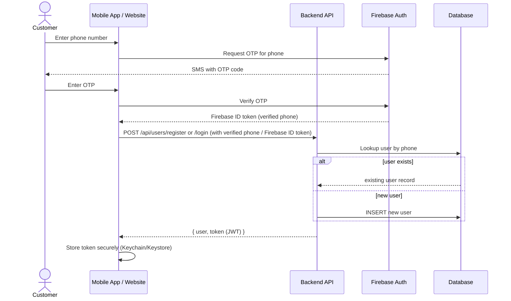

⚠️ **GAP vs. current implementation:** 🔧 `FRONTEND_INTEGRATION.md` explicitly states *"OTP / Firebase — Not implemented yet. Current auth is: Users/Drivers → phone lookup + JWT."* The above sequence is the 📄 SRS-specified target; the **current backend skips the Firebase OTP verification step entirely** and trusts the client-submitted phone number outright — a critical security gap analyzed in Section 17.1 and Section 21.

### 7.2 Cargo Booking Flow (End-to-End) 📄 SRS §6.2

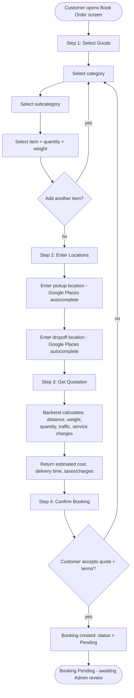

### 7.3 Admin Workflow (Booking Review & Driver Assignment) 📄 SRS §6.3

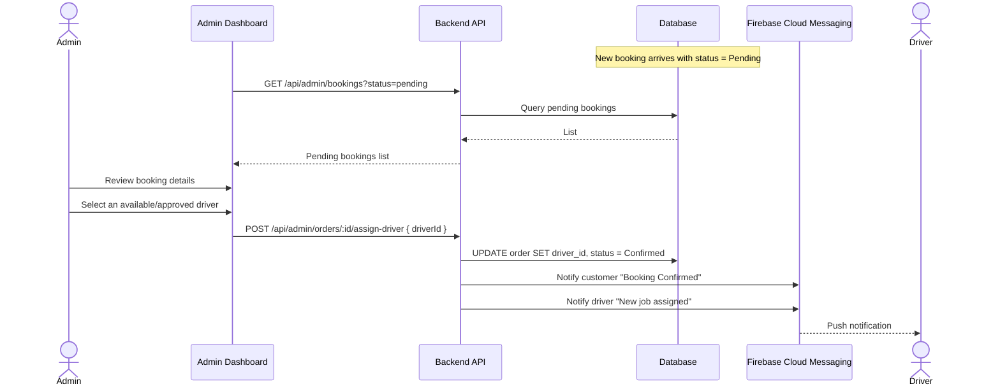

### 7.4 Driver Workflow (Pickup → Delivery → Completion) 📄 SRS §6.4

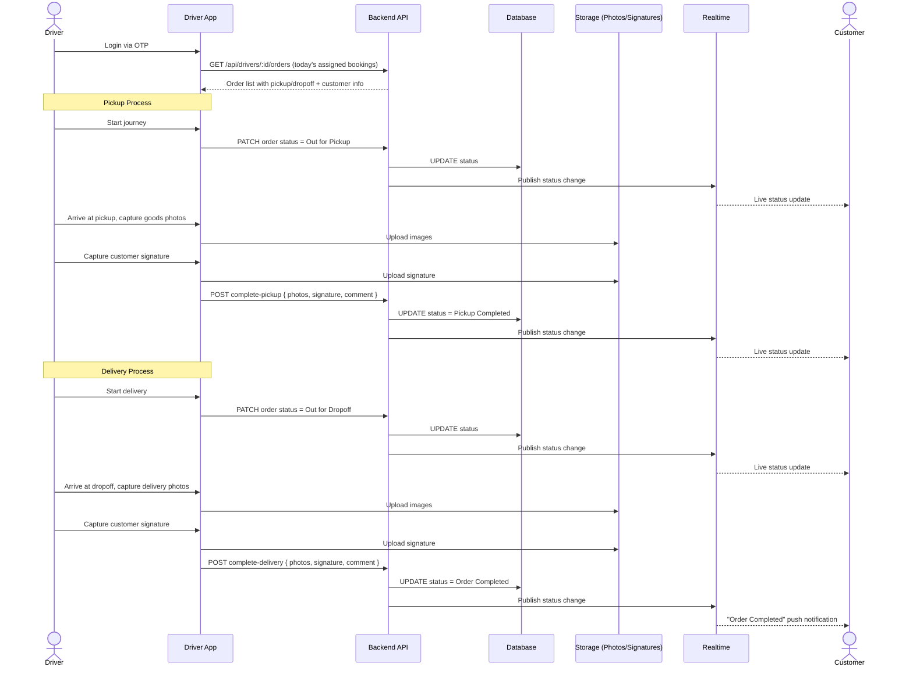

### 7.5 Notifications Workflow 📄 SRS §6.5

| Trigger Event | Recipient | Channel | Message Example (💡 inferred wording) |
|---|---|---|---|
| Booking confirmation | Customer | Push (FCM) | "Your booking #ORD-... has been confirmed." |
| Driver assignment | Customer | Push (FCM) | "A driver has been assigned to your order." |
| Driver assignment | Driver | Push (FCM) | "You have a new job: pickup at ..." |
| Pickup started | Customer | Push (FCM) | "Your driver is on the way for pickup." |
| Pickup completed | Customer | Push (FCM) | "Your items have been picked up." |
| Delivery started | Customer | Push (FCM) | "Your driver is on the way to deliver your items." |
| Order completed | Customer | Push (FCM) | "Your order has been delivered. Thank you!" |
| 💡 Promotional (Smart Promotion) | Past customers in driver's current city | Push (FCM) | "A driver is available in your area today. Book now and get special discount." (verbatim SRS example) |
| 💡 Payment received/failed | Customer | Push + in-app | Inferred — necessary given Stripe integration |
| 💡 Driver assignment failed / SLA breach | Admin | In-app/dashboard alert | Inferred — required operational safety net (Section 21) |

### 7.6 Live Tracking Workflow 📄 SRS §6.6

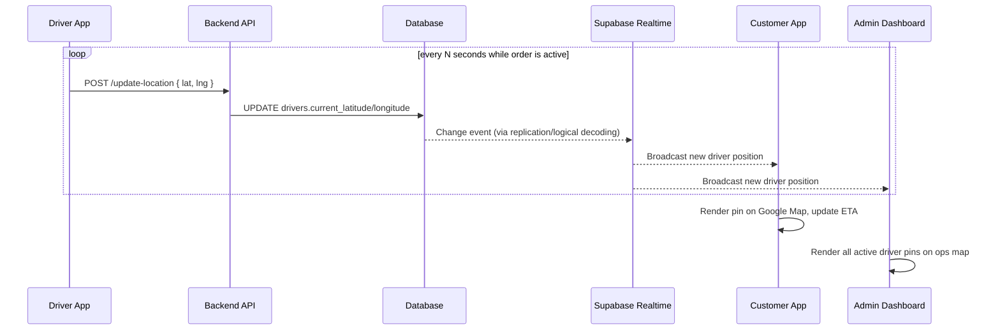

### 7.7 Smart Promotion Workflow 📄 SRS §6.7

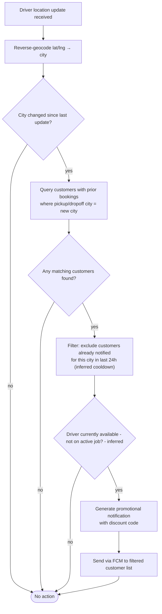

📄 SRS verbatim trigger logic: *"When a driver enters another city: System detects city location → Previous customers in that city are identified → Promotional notifications are sent."* The cooldown/availability filters above are 💡 **INFERRED** refinements — *why:* without them, this feature would either spam customers (poor retention) or advertise a driver who is mid-job and not actually available (broken promise, customer trust damage).

### 7.8 Payments Workflow 💡 INFERRED (SRS §14 states Stripe integration but not the exact flow)

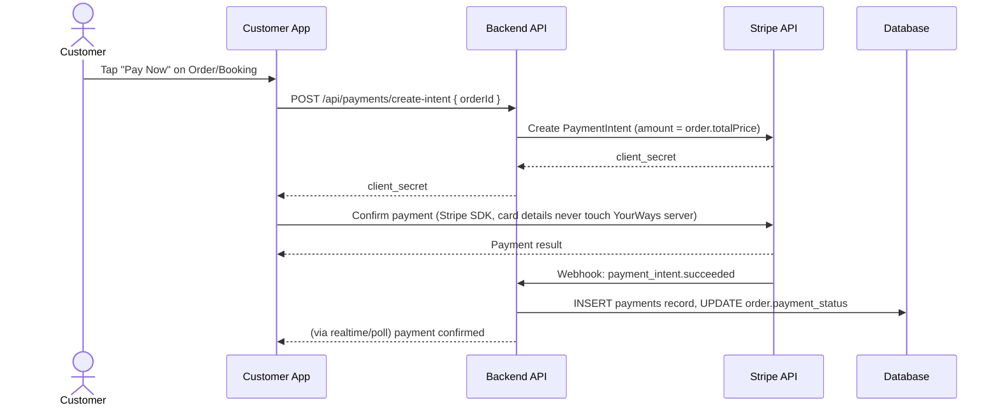

*Why inferred:* SRS only states "The system will integrate Stripe for: Secure online payments, Payment confirmations, Transaction records" — it does not specify PaymentIntent flow, webhook handling, or timing (pre-auth vs. post-completion). The flow above follows Stripe's own recommended integration pattern and industry best practice (webhook-driven confirmation, not just client-side "success" trust, which is insecure — see Section 17.5).

### 7.9 Realtime Updates Workflow (Cross-Cutting) 📄 SRS §13

All of the sequences above (7.3, 7.4, 7.6) share a common backbone: **every DB write to `orders`, `bookings`, or `drivers` location fields should be mirrored to subscribed clients via Supabase Realtime**, in addition to (not instead of) an explicit push notification for lifecycle-significant events. Realtime handles *continuous* state (map position, live status) while FCM handles *discrete, attention-worthy* events (a push the user should see even if the app is closed).

---

## 8. Booking Status State Machine

### 8.1 SRS-Defined States 📄 SRS §7

> "Pending → Confirmed → Out for Pickup → Pickup Completed → Out for Dropoff → Order Completed"

### 8.2 Current Implementation States 🔧 IMPLEMENTED

The codebase actually maintains **two separate state machines** — one for `bookings` (the pre-commitment quotation object) and one for `orders` (the fulfillment object) — which is a sound architectural separation not made explicit in the SRS:

| Machine | States (🔧 `sql/001_create_tables.sql`) |
|---|---|
| **Booking status** (`booking_status` enum) | `draft` → `submitted` → `converted_to_order` |
| **Order status** (`order_status` enum) | `pending` → `confirmed` → `pickupScheduled` (optional) → `outForPickup` → `pickupCompleted` → `outForDropOff` → `completed`; plus `cancelled` (terminal, from any non-final state) |

💡 **INFERRED rationale for the two-machine split** *(why this is good engineering beyond what SRS specified)*: A booking is a customer-authored **quotation draft** that can be freely edited/deleted. An order is an **operational commitment** once a driver/business is engaged — it should never be silently deleted, only cancelled with an audit trail. Conflating them (as the flat SRS diagram implies) would make it impossible to let customers freely edit a draft while also guaranteeing an immutable audit history for confirmed jobs.

### 8.3 Order Status State Diagram

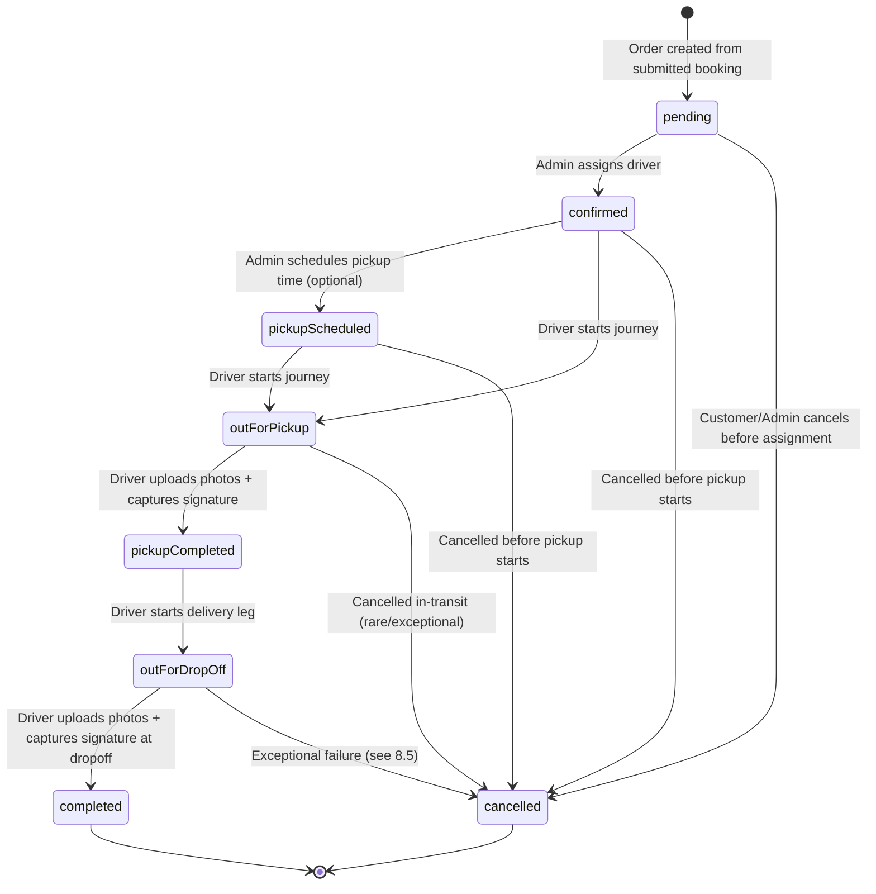

### 8.4 Allowed vs. Invalid Transitions

| From | To | Allowed? | Actor | Business Rule |
|---|---|:---:|---|---|
| `pending` | `confirmed` | ✅ | Admin | Requires a driver assignment |
| `pending` | `cancelled` | ✅ | Customer or Admin | No driver committed yet — no penalty |
| `pending` | `outForPickup` | ❌ | — | Cannot skip driver assignment |
| `confirmed` | `pickupScheduled` | ✅ | Admin | Optional intermediate step |
| `confirmed` / `pickupScheduled` | `outForPickup` | ✅ | Driver | Driver-initiated; requires driver to be the assigned driver |
| `confirmed` | `cancelled` | ✅ | Customer or Admin | May incur cancellation fee depending on notice period (💡 inferred policy, Section 8.6) |
| `outForPickup` | `pickupCompleted` | ✅ | Driver | Requires photo + signature capture (📄 SRS business rule) |
| `outForPickup` | `confirmed` (revert) | ❌ | — | No backward transitions permitted — state machine is forward-only |
| `pickupCompleted` | `outForDropOff` | ✅ | Driver | Driver-initiated |
| `pickupCompleted` | `completed` | ❌ | — | Cannot skip the delivery leg — goods must physically be transported and confirmed delivered |
| `outForDropOff` | `completed` | ✅ | Driver | Requires photo + signature capture |
| `completed` | *(any)* | ❌ | — | Terminal state — immutable history |
| `cancelled` | *(any)* | ❌ | — | Terminal state |
| *(any active state)* | `cancelled` | ✅ (exceptional) | Admin (override) | Should require a mandatory `cancellationReason` (🔧 IMPLEMENTED as a field on cancel endpoint) |

⚠️ **GAP**: The 📄 SRS's stated business rule that pickup/dropoff photo + signature are required *before* the status can advance to `pickupCompleted`/`completed` is a **workflow-level rule that must be server-side enforced**, not just a UI suggestion. It is unclear from the current codebase whether `PATCH /orders/:id/status` validates that photos/signature exist before accepting a transition to those specific target statuses — this should be explicitly validated in `order_service.js` (flagged for verification in Section 21).

### 8.5 Failure Scenarios

| Scenario | State Impact | Recommended Handling |
|---|---|---|
| Driver never starts pickup (no-show) | Stuck in `confirmed`/`pickupScheduled` | 💡 Inferred SLA timer → auto-alert Admin after N hours past scheduled pickup time; Admin can reassign or cancel |
| Driver captures photo but customer refuses to sign | Cannot legitimately reach `pickupCompleted` | 💡 Inferred: allow a driver-attested "customer refused signature" override with mandatory comment, still transitions forward but flags the order for review |
| Item damaged in transit, discovered at dropoff | Order still reaches `completed`, but a claim is opened | 💡 Inferred: separate `disputes`/`claims` table (Section 10, 21), does not block the state machine |
| Customer not present at dropoff | Cannot capture signature | 💡 Inferred: "Failed Delivery Attempt" sub-state or flag, with reschedule workflow (Section 20) |
| Network failure mid-status-update on driver app | Update not persisted; driver app should retry | 💡 Inferred: idempotent status endpoints + client-side retry queue |

### 8.6 Cancellation Scenarios & Policy 💡 INFERRED (SRS does not define a cancellation policy in detail beyond `cancel` existing as an action)

| Cancelled By | When | Policy (💡 inferred, industry-standard) |
|---|---|---|
| Customer | Before driver assigned (`pending`) | Free cancellation, no charge |
| Customer | After assignment, well before pickup (`confirmed`, e.g. >24h notice) | Free or minimal admin fee |
| Customer | After assignment, short notice (<24h) or driver en route (`outForPickup`) | Cancellation fee (e.g., a flat fee or % of quote) to compensate driver time/fuel |
| Customer | After pickup (`pickupCompleted`/`outForDropOff`) | Not cancellable via self-service — requires Admin/support intervention (goods are already in transit; this becomes a "return to sender" logistics problem, not a simple cancellation) |
| Driver | Before starting job | Admin must be notified immediately to reassign; no customer-facing penalty |
| Admin | Any time (override) | Always allowed, requires reason, should trigger refund workflow if payment was taken |

### 8.7 Refund Scenarios 💡 INFERRED (SRS mentions Stripe "payment confirmations" but not refund logic)

| Trigger | Refund Behavior |
|---|---|
| Customer cancels before any service rendered | Full refund (minus any stated cancellation fee) |
| Admin cancels due to operational failure (no driver available) | Full refund, no fee — the platform's failure, not the customer's |
| Goods damaged in transit (claim upheld) | Partial or full refund/compensation per insurance/claim resolution — separate from the booking cancellation flow entirely |
| Payment failed but order proceeded (edge case, should not happen with correct guarding) | N/A — order should never be confirmed without successful payment capture (or should be flagged for manual collection) |

---

## 9. API Design

### 9.1 Conventions (🔧 IMPLEMENTED, applies to every endpoint below)

**Base URL:** `{BASE_URL}/api/*` · **Docs:** `GET /docs` (Swagger UI, `config/swagger.js`)

**Standard success envelope:**
```json
{ "success": true, "message": "Human readable message", "data": { } }
```

**Standard error envelope:**
```json
{ "success": false, "message": "What failed", "error": "Details" }
```

**Auth header:** `Authorization: Bearer <JWT>` · Tokens expire in **7 days** (🔧 IMPLEMENTED) · JWT payload includes `role: user|driver|admin` and the account `id`.

**Status code conventions (💡 inferred standardization — current code should converge on these consistently):**

| Code | Meaning | When |
|---|---|---|
| 200 | OK | Successful GET/PUT/PATCH/DELETE |
| 201 | Created | Successful POST that creates a resource |
| 400 | Bad Request | Validation failure |
| 401 | Unauthorized | Missing/invalid/expired JWT |
| 403 | Forbidden | Valid JWT, insufficient role/ownership |
| 404 | Not Found | Resource doesn't exist |
| 409 | Conflict | Uniqueness violation (duplicate phone/email), invalid state transition |
| 422 | Unprocessable Entity | Semantically invalid request (e.g., submitting a booking with 0 items) |
| 429 | Too Many Requests | Rate limit exceeded (💡 inferred, not yet implemented) |
| 500 | Internal Server Error | Unexpected failure |

### 9.2 Module: Authentication & Users (`/api/users`)

| Endpoint | Method | Auth | Purpose |
|---|---|---|---|
| `/api/users/register` | POST | Public | Create customer account |
| `/api/users/login` | POST | Public | Login by phone (📄 SRS target: phone + OTP; 🔧 current: phone lookup only) |
| `/api/users/profile` | GET | Bearer `user` | Get own profile |
| `/api/users/verify-token` | POST | Bearer `user` | Validate a stored token is still valid |
| `/api/users/:id` 💡 | PUT | Bearer `user` (self) | Update own profile |
| `/api/auth/otp/request` 💡 INFERRED | POST | Public | Trigger Firebase OTP SMS to a phone number |
| `/api/auth/otp/verify` 💡 INFERRED | POST | Public | Verify OTP code, exchange for backend JWT |

**`POST /api/users/register`**

Request:
```json
{ "name": "Ali Khan", "email": "ali@example.com", "phone": "+447700900123", "address": "London", "dob": "1995-01-15" }
```
Response `201`:
```json
{ "success": true, "message": "Registered", "data": { "user": { "id": "uuid", "name": "Ali Khan", "phone": "+447700900123" }, "token": "eyJ..." } }
```
**Validation:** `name` required (2-100 chars); `email` valid RFC 5322 format, unique; `phone` E.164 format, unique; `dob` valid past date (💡 inferred, not necessarily enforced today).
**Errors:** `409` phone/email already registered · `400` missing/invalid fields.

**💡 INFERRED — `POST /api/auth/otp/request` / `POST /api/auth/otp/verify`**

*Why inferred:* This is the literal 📄 SRS requirement ("OTP is sent using Firebase Authentication") that is **not yet implemented** (confirmed gap per `FRONTEND_INTEGRATION.md`). In production, the recommended pattern is: the **client SDK talks to Firebase directly** for OTP send/verify (Firebase handles SMS delivery), then the **client sends the resulting Firebase ID token to the backend**, which verifies it server-side via the Firebase Admin SDK and mints its own YourWays JWT. So technically the backend only needs one endpoint:

```
POST /api/auth/firebase-exchange
Body: { "firebaseIdToken": "...", "role": "user" | "driver" }
Response: { "user": {...}, "token": "<YourWays JWT>", "isNewAccount": true }
```
**Validation:** `firebaseIdToken` must verify against Firebase Admin SDK; phone number extracted from the verified token (never trust a client-submitted phone number directly). **Errors:** `401` invalid/expired Firebase token.

### 9.3 Module: Drivers (`/api/drivers`)

| Endpoint | Method | Auth | Purpose |
|---|---|---|---|
| `/api/drivers/register` | POST | Public | Register driver (starts unapproved) |
| `/api/drivers/login` | POST | Public | Login by phone (blocked until admin-approved) |
| `/api/drivers/:id` | GET | Public 🔶 | Driver profile (⚠️ should require auth — public exposure of driver PII is a gap, Section 17) |
| `/api/drivers/:id` | PUT | Bearer `driver`\|`user` | Update profile |
| `/api/drivers/:id/go-online` | POST | Bearer `driver` | Mark available |
| `/api/drivers/:id/go-offline` | POST | Bearer `driver` | Mark unavailable |
| `/api/drivers/:id/update-location` | POST | Bearer `driver` | Broadcast GPS `{ latitude, longitude }` |
| `/api/drivers/:id/orders` | GET | Bearer `driver` | All assigned orders |
| `/api/drivers/:id/orders/active` | GET | Bearer `driver` | Active-only assigned orders |
| `/api/drivers/:id/orders/:orderId/status` | PATCH | Bearer `driver` | Forward-only status transition |
| `/api/drivers/:id/orders/:orderId/complete-pickup` | POST | Bearer `driver` | Photos + signature + comment + additionalItems |
| `/api/drivers/:id/orders/:orderId/complete-delivery` | POST | Bearer `driver` | Photos + signature + comment |
| `/api/drivers/:id/statistics` | GET | Bearer `driver` | Completed orders, rating |
| `/api/drivers/:id/documents` 💡 INFERRED | POST/GET | Bearer `driver` | Upload/view license, insurance, vehicle registration documents for compliance |
| `/api/drivers/:id/ratings` 💡 INFERRED | GET | Bearer `driver`\|`admin` | List of per-order customer ratings/comments |

**`POST /api/drivers/:id/update-location`**

Request: `{ "latitude": 51.5074, "longitude": -0.1278 }`
**Validation:** latitude ∈ [-90,90], longitude ∈ [-180,180]; caller's JWT `id` must equal `:id` (⚠️ GAP if not enforced today).
**Errors:** `400` out-of-range coordinates · `403` if driver tries to update another driver's location.

**`POST /api/drivers/:id/orders/:orderId/complete-pickup`**

Request:
```json
{ "photos": ["https://storage/.../img1.jpg"], "signature": "https://storage/.../sig.png", "comment": "All items loaded", "additionalItems": [] }
```
**Validation:** `photos` array required, min 1 item (💡 inferred — SRS implies mandatory proof capture); `signature` required (URL or base64); order must currently be in `outForPickup` status (state-machine guard) and `driver_id` must equal caller.
**Errors:** `409` invalid state transition · `400` missing photos/signature · `403` not the assigned driver.

### 9.4 Module: Bookings (`/api/bookings`)

| Endpoint | Method | Auth | Purpose |
|---|---|---|---|
| `/api/bookings/create` | POST | Bearer `user` | Create draft booking |
| `/api/bookings/:id` | GET | Optional | Get one booking |
| `/api/bookings/user/:userId` | GET | Bearer `user` | List my bookings |
| `/api/bookings/:id` | PUT | Bearer `user` | Update (draft only) |
| `/api/bookings/:id` | DELETE | Bearer `user` | Delete (draft only) |
| `/api/bookings/:id/items` | POST | Bearer `user` | Add item |
| `/api/bookings/:id/items/:itemId` | DELETE | Bearer `user` | Remove item |
| `/api/bookings/:id/items/:itemId/quantity` | PATCH | Bearer `user` | Update quantity `{ "quantity": 3 }` |
| `/api/bookings/:id/calculate-price` | POST | Bearer `user` | Run pricing engine, persist quote |
| `/api/bookings/:id/submit` | POST | Bearer `user` | Finalize draft → `submitted` |

**Full request/response contract for `POST /api/bookings/create`** — see the worked example already documented in `FRONTEND_INTEGRATION.md` §6.3; reproduced here for completeness with validation annotations:

| Field | Type | Required | Validation |
|---|---|---|---|
| `userId` | UUID | ✅ | Must match caller's JWT id |
| `collectionPostcode` / `deliveryPostcode` | string | ✅ | Non-empty; 💡 inferred: should validate against UK postcode regex or Google Places place_id |
| `moveDate` | ISO-8601 datetime | 💡 recommended | Must not be in the past |
| `dateFlexibility` | enum | ✅ | One of `Exact Date Only`, `Within 3 Days`, `Within a Week`, `Flexible` |
| `collectionPropertyType` / `deliveryPropertyType` | enum | ✅ | One of `House`, `Flat`, `Studio`, `Storage Unit`, `Office`, `Flatshare` |
| `collectionFloorLevel` / `deliveryFloorLevel` | enum | ✅ | One of `Ground Floor`, `1st Floor`, `2nd Floor`, `3rd Floor+`, `Basement` |
| `collectionLiftAccess` / `deliveryLiftAccess` | boolean | ✅ | — |
| `parkingAccess` | enum | ✅ | One of the 5 parking enum values (Section 18) |
| `manpowerRequired` | enum | ✅ | One of the 4 manpower tiers |
| `dismantlingRequired` | boolean | ✅ | — |
| `packingService` | enum | ✅ | One of the 4 packing tiers |
| `insuranceValue` | number | ❌ | ≥ 0 |
| `jobNotes` | string | ❌ | Max length (💡 inferred 1000 chars) |
| `fullName`, `email`, `mobileNumber` | string | ✅ | Standard format validation (Section 18) |
| `acceptTerms` | boolean | ✅ (must be `true` to submit, though may be `false` while still drafting) | — |
| `items` | array | ✅, min 1 to submit | Each: `itemId`, `category`, `itemName`, `quantity` (≥1), `modifiers` (object) |

**Errors:** `400` validation failure (enum mismatch, missing required field) · `404` `userId` not found · `403` `userId` doesn't match caller.

### 9.5 Module: Orders / Tracking (`/api/orders`)

| Endpoint | Method | Auth | Purpose |
|---|---|---|---|
| `/api/bookings/:id/submit` | POST | Bearer `user` | **Updated:** now submits the booking AND converts it into a `pending` order in the same call — returns `{ booking, order }` |
| `/api/orders/create-from-booking` | POST | Bearer `user` | ⚠️ Retry/fallback only (not part of the normal flow) — recovers a booking stuck at `submitted` if the order-creation half of `submit` failed |
| `/api/orders/create` | POST | Bearer `user` | Direct order creation (bypassing booking draft) |
| `/api/orders/user/:userId` | GET | Bearer `user` | Order history |
| `/api/orders/active` | GET | Optional (`?userId=`) | Active orders |
| `/api/orders/code/:orderId` | GET | Optional | Lookup by human code `ORD-...` |
| `/api/orders/:id` | GET | Optional | Lookup by UUID |
| `/api/orders/:id/status` | PATCH | Bearer `user`\|`driver` | Update status (guarded by state machine, Section 8) |
| `/api/orders/:id/cancel` | POST | Bearer `user` | Cancel with reason |
| `/api/orders/:id/tracking` 💡 INFERRED | GET | Optional | Live driver position + ETA + status timeline, purpose-built for the map screen (currently likely derived client-side by joining order + driver location separately) |
| `/api/orders/:id/rate` 💡 INFERRED | POST | Bearer `user` | Post-completion rating/review of the driver |

⚠️ **GAP:** `GET /api/orders/:id` and `/code/:orderId` being **"Optional" auth** means any caller who knows/guesses an order ID or code can view full order details (customer PII, addresses). This should be tightened to Bearer-required with an ownership check (Section 17.3) — public-optional auth is appropriate for *tracking display embedded in shareable delivery-status links* only if the ID is an unguessable, single-purpose tracking token, not the primary order identifier.

### 9.6 Module: Services / Categories / Items (`/api/services`)

| Endpoint | Method | Auth | Purpose |
|---|---|---|---|
| `/api/services/templates` | GET | Public | All service catalogs (category tree) |
| `/api/services/templates/:serviceId` | GET | Public | One service's catalog |
| `/api/services/quote` | POST | Public | Instant price preview without saving a booking |
| `/api/admin/categories` 💡 INFERRED | GET/POST/PUT/DELETE | Bearer `admin` | CRUD for the normalized catalog (Section 6.5) — currently the catalog is hardcoded in `data/service_templates.js`, meaning **catalog changes require a code deploy**, a significant operational gap for a business that will want to add/retire items regularly |
| `/api/admin/items` 💡 INFERRED | GET/POST/PUT/DELETE | Bearer `admin` | CRUD for individual items, including `pricing_multiplier`, default weight/dimensions, handling defaults |

### 9.7 Module: Admin (`/api/admin`)

| Endpoint | Method | Auth | Purpose |
|---|---|---|---|
| `/api/admin/register` | POST | Public (bootstrap) / Bearer `admin` (subsequent) | Create admin account |
| `/api/admin/login` | POST | Public | Email+password login |
| `/api/admin/profile` | GET | Bearer `admin` | Current admin info |
| `/api/admin/dashboard` | GET | Bearer `admin` | KPI aggregate: total bookings, revenue, active deliveries, driver stats |
| `/api/admin/users` | GET | Bearer `admin` | List all customers |
| `/api/admin/drivers` | GET | Bearer `admin` | List all drivers |
| `/api/admin/drivers/:id/approve` | PUT | Bearer `admin` | Allow driver login |
| `/api/admin/drivers/:id/suspend` | PUT | Bearer `admin` | Block driver login/assignment |
| `/api/admin/drivers/:id/activate` | PUT | Bearer `admin` | Reactivate a suspended driver |
| `/api/admin/bookings` | GET | Bearer `admin` | `?status=&userId=` filters |
| `/api/admin/bookings/:id` | GET | Bearer `admin` | One booking |
| `/api/admin/orders` | GET | Bearer `admin` | `?status=&userId=&driverId=` filters |
| `/api/admin/orders/:id` | GET | Bearer `admin` | One order |
| `/api/admin/orders/:id/assign-driver` | POST | Bearer `admin` | `{ driverId }` → `pending`→`confirmed` |
| `/api/admin/orders/:id/status` | PATCH | Bearer `admin` | Manual override transition |
| `/api/admin/orders/:id/pricing` | PATCH | Bearer `admin` | Adjust `totalPrice`/`quotedPrice` |
| `/api/admin/orders/:id/schedule-pickup` | POST | Bearer `admin` | `{ pickupDateTime }` |
| `/api/admin/orders/:id/cancel` | POST | Bearer `admin` | `{ cancellationReason }` |
| `/api/admin/pricing-rules` 💡 INFERRED | GET/PUT | Bearer `admin` | Manage distance/weight/traffic/service-charge multipliers as **data**, not hardcoded constants (directly addresses SRS "Pricing Management") |
| `/api/admin/promotions` 💡 INFERRED | GET/POST/PUT/DELETE | Bearer `admin` | CRUD discount codes/campaigns (SRS "Promotions Management") |
| `/api/admin/promotions/:id/send` 💡 INFERRED | POST | Bearer `admin` | Manually trigger a promotional broadcast |
| `/api/admin/reports/revenue` 💡 INFERRED | GET | Bearer `admin` | `?from=&to=` revenue report |
| `/api/admin/reports/bookings` 💡 INFERRED | GET | Bearer `admin` | Booking volume/conversion report |
| `/api/admin/reports/drivers` 💡 INFERRED | GET | Bearer `admin` | Driver performance report |
| `/api/admin/reports/customers` 💡 INFERRED | GET | Bearer `admin` | Customer LTV/retention report |
| `/api/admin/admins` 💡 INFERRED | GET/PUT/DELETE | Bearer `admin` (Super Admin only, Section 4.5) | Manage other admin accounts — currently any admin can create unlimited other admins (privilege escalation risk, Section 17) |

### 9.8 Module: Payments 💡 INFERRED (not yet implemented; required by SRS §14)

| Endpoint | Method | Auth | Purpose |
|---|---|---|---|
| `/api/payments/create-intent` | POST | Bearer `user` | Create a Stripe PaymentIntent for an order/booking |
| `/api/payments/:orderId` | GET | Bearer `user`\|`admin` | Payment status/history for an order |
| `/api/payments/webhook` | POST | Stripe signature verification (not JWT) | Receive Stripe webhook events (`payment_intent.succeeded`, `.payment_failed`, `charge.refunded`) |
| `/api/admin/payments/:id/refund` | POST | Bearer `admin` | Issue full/partial refund |
| `/api/admin/payments` | GET | Bearer `admin` | All transactions, filterable |

**`POST /api/payments/create-intent`**
Request: `{ "orderId": "uuid" }` → Response: `{ "clientSecret": "pi_..._secret_...", "amount": 12345, "currency": "gbp" }`
**Validation:** order must belong to caller; order must not already be fully paid.
**Errors:** `409` already paid · `404` order not found.

**`POST /api/payments/webhook`**
**Security:** Must verify the `Stripe-Signature` header against the webhook signing secret — **never trust an unauthenticated POST claiming payment success** (Section 17.5). Must be idempotent (Stripe retries webhooks; duplicate events must not double-credit a payment record).

### 9.9 Module: Notifications 💡 INFERRED (delivery mechanism is FCM per SRS §6.5, but an in-app management API is required)

| Endpoint | Method | Auth | Purpose |
|---|---|---|---|
| `/api/notifications/register-device` | POST | Bearer `user`\|`driver` | Register FCM device token |
| `/api/notifications/unregister-device` | POST | Bearer `user`\|`driver` | Remove device token (logout) |
| `/api/notifications` | GET | Bearer `user`\|`driver` | List in-app notification history |
| `/api/notifications/:id/read` | PATCH | Bearer `user`\|`driver` | Mark as read |
| `/api/notifications/preferences` | GET/PUT | Bearer `user`\|`driver` | Opt-in/out of promotional vs. transactional notifications (compliance, Section 17) |

### 9.10 Module: Uploads & Signatures 💡 INFERRED (SRS mandates photo/signature capture but never specifies the upload mechanism)

| Endpoint | Method | Auth | Purpose |
|---|---|---|---|
| `/api/uploads/presign` | POST | Bearer `driver` | Get a pre-signed upload URL for direct-to-storage upload (avoids proxying large binary through the API server) |
| `/api/uploads/image` | POST (multipart) | Bearer `driver` | Fallback: direct server-side upload if presigned flow isn't used |
| `/api/signatures` | POST | Bearer `driver` | Submit a signature (base64 PNG or presigned URL reference) tied to an order + stage (`pickup`/`dropoff`) |

**Validation:** file type restricted to `image/jpeg`, `image/png`, `image/webp`; max size (💡 inferred 10MB); signature payload must decode to a valid image and not be blank/empty (a common real-world driver-app bug is capturing an empty signature pad).

### 9.11 Module: Reports & Analytics (see also 9.7 admin reports)

| Endpoint | Method | Auth | Purpose |
|---|---|---|---|
| `/api/admin/analytics/overview` 💡 | GET | Bearer `admin` | Same-shape as dashboard but with custom date range |
| `/api/admin/analytics/export` 💡 | GET | Bearer `admin` | `?type=revenue&format=csv` — async export for large ranges |

### 9.12 Full API Inventory Table (Consolidated Reference)

| Module | Endpoints (count) | Status |
|---|---|---|
| Authentication/Users | 4 implemented + 3 inferred | 🔧 partial / 💡 OTP gap |
| Drivers | 12 implemented + 2 inferred | 🔧 mostly complete |
| Bookings | 9 implemented | 🔧 complete |
| Orders/Tracking | 8 implemented + 2 inferred | 🔧 mostly complete |
| Services/Categories | 3 implemented + 2 inferred | 🔧 partial (no admin CRUD) |
| Admin (core) | 18 implemented + 9 inferred | 🔧 partial |
| Payments | 0 implemented + 5 inferred | ⚠️ full gap |
| Notifications | 0 implemented + 5 inferred | ⚠️ full gap |
| Uploads/Signatures | 0 implemented + 3 inferred | ⚠️ full gap |
| Reports/Analytics | 0 implemented + 2 inferred | ⚠️ full gap (beyond basic dashboard) |

---

## 10. Database Design

### 10.1 SRS-Specified Tables 📄 SRS §12

> "Main database tables include: users, drivers, bookings, booking_items, quotations, payments, tracking_logs, notifications, uploaded_images, signatures, promotions"

### 10.2 Currently Implemented Tables 🔧 IMPLEMENTED (`sql/001_create_tables.sql`, `sql/002_create_admins.sql`)

| Table | Exists? | Notes |
|---|:---:|---|
| `users` | ✅ | Matches SRS |
| `drivers` | ✅ | Matches SRS, extended with online/location/rating fields |
| `admins` | ✅ | Not in SRS's table list but obviously required (Admin role) |
| `bookings` | ✅ | SRS's "quotations" concept is **merged into** `bookings` (`calculated_price`, `price_breakdown` columns) rather than being a separate table |
| `orders` | ✅ | Not explicitly named in SRS list, but required to separate the fulfillment record from the quotation draft (Section 8.2 rationale); items, photos, and signatures are stored as **JSONB columns on `orders`** rather than the SRS's separate `booking_items`, `uploaded_images`, `signatures` tables |
| `booking_items` | ❌ (embedded as JSONB `items` column on `bookings`/`orders`) | See 10.4 normalization discussion |
| `quotations` | ❌ (embedded as columns on `bookings`) | See 10.4 |
| `payments` | ❌ | ⚠️ GAP — required for Stripe integration (Section 9.8, 21) |
| `tracking_logs` | ❌ | ⚠️ GAP — only *current* driver position is stored (`drivers.current_latitude/longitude`), with no historical trail (Section 21) |
| `notifications` | ❌ | ⚠️ GAP — no in-app notification history persisted (Section 21) |
| `uploaded_images` | ❌ (embedded as JSONB `pickup_photos`/`delivery_photos` on `orders`) | See 10.4 |
| `signatures` | ❌ (embedded as TEXT `pickup_signature`/`delivery_signature` on `orders`) | See 10.4 |
| `promotions` | ❌ | ⚠️ GAP — Smart Promotion feature (SRS §6.7) has no persistence layer yet (Section 21) |

### 10.3 Entity-Relationship Diagram — Current State 🔧 IMPLEMENTED

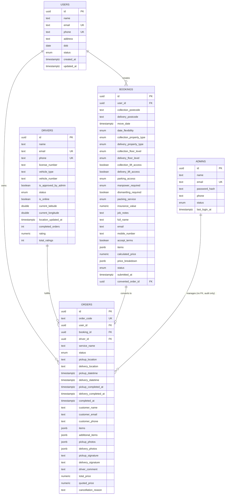

### 10.4 Normalization Analysis

| Design Choice | Current Approach | Assessment |
|---|---|---|
| **Booking/order items** | JSONB array column | 🔶 **Pragmatic but denormalized.** Fast to develop, fine at low-to-moderate scale. **Trade-off:** cannot efficiently query "all bookings containing a Piano" or join items to a catalog `items` table for pricing-multiplier lookups without JSON operators. 💡 Recommendation: extract to a proper `booking_items`/`order_items` child table (matches SRS's own table list!) once reporting/catalog-driven pricing (Section 6.5) is implemented. |
| **Photos/signatures** | JSONB array / TEXT columns on `orders` | 🔶 Same trade-off — fine for MVP, but SRS explicitly lists `uploaded_images` and `signatures` as **first-class tables**, implying the original author anticipated needing to query/audit them independently (e.g., "show all photos flagged for QA review" is hard with embedded JSON). 💡 Recommendation: normalize once a moderation/QA feature is needed. |
| **Quotation** | Columns embedded in `bookings` (`calculated_price`, `price_breakdown`) | ✅ **Good decision** — a quotation is 1:1 with a booking and always recalculated, so a separate `quotations` table would just add a join for no benefit *unless* you want to keep a **history of every quote recalculation** (e.g., if the customer changes items 3 times, should all 3 quotes be retained for analytics on price sensitivity?) — 💡 inferred: worth a `quotation_history` audit table (Section 21). |
| **Payments** | Not implemented | ⚠️ Must be a first-class table — a payment has its own lifecycle (authorized → captured → refunded) independent of order status. |
| **Promotions** | Not implemented | ⚠️ Must be a first-class table with campaign metadata, targeting rules, redemption tracking. |
| **Enums vs. lookup tables** | Postgres native `ENUM` types (`booking_status`, `order_status`, `property_type`, etc.) | 🔶 Fine for values that rarely change (status machines) but 💡 inferred risky for the **catalog-adjacent enums** (`manpower_required`, `packing_service`, `parking_access`) since alterring a Postgres ENUM requires a migration; if Admin needs to add a new tier (e.g., "5 Man Team"), a lookup table would be more flexible than an ENUM. Recommendation: keep ENUMs for true state machines (order/booking status), convert business-config enums to lookup tables. |

### 10.5 Production-Ready Schema Additions (💡 INFERRED, additive to the existing `sql/001_create_tables.sql` and `002_create_admins.sql`)

```sql
-- ============================================================
-- 003_create_catalog.sql — Normalized service catalog (Section 6.5)
-- ============================================================
CREATE TABLE IF NOT EXISTS service_types (
  id                       UUID PRIMARY KEY DEFAULT gen_random_uuid(),
  service_key              TEXT NOT NULL UNIQUE,   -- 'home_move', 'man_and_van', 'vehicle', ...
  name                     TEXT NOT NULL,
  description              TEXT,
  requires_dropoff_location BOOLEAN NOT NULL DEFAULT TRUE,
  supports_instant_quote  BOOLEAN NOT NULL DEFAULT TRUE,
  sort_order               INT NOT NULL DEFAULT 0,
  is_active                BOOLEAN NOT NULL DEFAULT TRUE,
  created_at               TIMESTAMPTZ NOT NULL DEFAULT NOW(),
  updated_at               TIMESTAMPTZ NOT NULL DEFAULT NOW()
);

CREATE TABLE IF NOT EXISTS categories (
  id               UUID PRIMARY KEY DEFAULT gen_random_uuid(),
  service_type_id  UUID NOT NULL REFERENCES service_types(id) ON DELETE CASCADE,
  name             TEXT NOT NULL,
  sort_order       INT NOT NULL DEFAULT 0,
  UNIQUE (service_type_id, name)
);

CREATE TABLE IF NOT EXISTS subcategories (
  id           UUID PRIMARY KEY DEFAULT gen_random_uuid(),
  category_id  UUID NOT NULL REFERENCES categories(id) ON DELETE CASCADE,
  name         TEXT NOT NULL,
  sort_order   INT NOT NULL DEFAULT 0,
  UNIQUE (category_id, name)
);

CREATE TABLE IF NOT EXISTS items (
  id                          UUID PRIMARY KEY DEFAULT gen_random_uuid(),
  name                        TEXT NOT NULL UNIQUE,
  default_weight_kg           NUMERIC(8,2),
  default_length_cm           NUMERIC(8,2),
  default_width_cm            NUMERIC(8,2),
  default_height_cm           NUMERIC(8,2),
  is_fragile_default          BOOLEAN NOT NULL DEFAULT FALSE,
  requires_insurance_default  BOOLEAN NOT NULL DEFAULT FALSE,
  pricing_multiplier          NUMERIC(4,2) NOT NULL DEFAULT 1.00,
  is_custom_allowed           BOOLEAN NOT NULL DEFAULT FALSE, -- true only for "Create Your Own Item"
  created_at                  TIMESTAMPTZ NOT NULL DEFAULT NOW(),
  updated_at                  TIMESTAMPTZ NOT NULL DEFAULT NOW()
);

CREATE TABLE IF NOT EXISTS item_category_links (
  item_id          UUID NOT NULL REFERENCES items(id) ON DELETE CASCADE,
  subcategory_id   UUID NOT NULL REFERENCES subcategories(id) ON DELETE CASCADE,
  PRIMARY KEY (item_id, subcategory_id)
);

CREATE TABLE IF NOT EXISTS item_modifiers (
  id        UUID PRIMARY KEY DEFAULT gen_random_uuid(),
  item_id   UUID NOT NULL REFERENCES items(id) ON DELETE CASCADE,
  label     TEXT NOT NULL,
  type      TEXT NOT NULL CHECK (type IN ('text','number','boolean','select')),
  options   JSONB,
  required  BOOLEAN NOT NULL DEFAULT FALSE
);

-- ============================================================
-- 004_create_booking_items.sql — Normalize embedded JSONB items (10.4)
-- ============================================================
CREATE TABLE IF NOT EXISTS booking_items (
  id           UUID PRIMARY KEY DEFAULT gen_random_uuid(),
  booking_id   UUID NOT NULL REFERENCES bookings(id) ON DELETE CASCADE,
  item_id      UUID REFERENCES items(id),         -- NULL for custom items
  item_name    TEXT NOT NULL,                      -- denormalized snapshot (name at time of booking)
  category     TEXT NOT NULL,
  quantity     INT NOT NULL CHECK (quantity > 0),
  modifiers    JSONB NOT NULL DEFAULT '{}'::jsonb,
  unit_price   NUMERIC(12,2),
  created_at   TIMESTAMPTZ NOT NULL DEFAULT NOW()
);
CREATE INDEX IF NOT EXISTS idx_booking_items_booking_id ON booking_items (booking_id);

CREATE TABLE IF NOT EXISTS order_items (
  id            UUID PRIMARY KEY DEFAULT gen_random_uuid(),
  order_id      UUID NOT NULL REFERENCES orders(id) ON DELETE CASCADE,
  item_id       UUID REFERENCES items(id),
  item_name     TEXT NOT NULL,
  category      TEXT NOT NULL,
  quantity      INT NOT NULL CHECK (quantity > 0),
  modifiers     JSONB NOT NULL DEFAULT '{}'::jsonb,
  is_additional BOOLEAN NOT NULL DEFAULT FALSE,     -- true = added by driver on-site
  created_at    TIMESTAMPTZ NOT NULL DEFAULT NOW()
);
CREATE INDEX IF NOT EXISTS idx_order_items_order_id ON order_items (order_id);

-- ============================================================
-- 005_create_uploads.sql — uploaded_images + signatures (SRS §12)
-- ============================================================
CREATE TABLE IF NOT EXISTS uploaded_images (
  id          UUID PRIMARY KEY DEFAULT gen_random_uuid(),
  order_id    UUID NOT NULL REFERENCES orders(id) ON DELETE CASCADE,
  driver_id   UUID NOT NULL REFERENCES drivers(id),
  stage       TEXT NOT NULL CHECK (stage IN ('pickup','dropoff')),
  url         TEXT NOT NULL,
  caption     TEXT,
  created_at  TIMESTAMPTZ NOT NULL DEFAULT NOW()
);
CREATE INDEX IF NOT EXISTS idx_uploaded_images_order_id ON uploaded_images (order_id);

CREATE TABLE IF NOT EXISTS signatures (
  id           UUID PRIMARY KEY DEFAULT gen_random_uuid(),
  order_id     UUID NOT NULL REFERENCES orders(id) ON DELETE CASCADE,
  stage        TEXT NOT NULL CHECK (stage IN ('pickup','dropoff')),
  signed_by    TEXT NOT NULL,          -- name typed/confirmed by customer
  signature_url TEXT NOT NULL,
  ip_address   TEXT,
  created_at   TIMESTAMPTZ NOT NULL DEFAULT NOW()
);
CREATE INDEX IF NOT EXISTS idx_signatures_order_id ON signatures (order_id);

-- ============================================================
-- 006_create_payments.sql (Section 9.8, 21)
-- ============================================================
DO $$ BEGIN
  CREATE TYPE payment_status AS ENUM ('pending','authorized','captured','failed','refunded','partially_refunded');
EXCEPTION WHEN duplicate_object THEN NULL; END $$;

CREATE TABLE IF NOT EXISTS payments (
  id                   UUID PRIMARY KEY DEFAULT gen_random_uuid(),
  order_id             UUID NOT NULL REFERENCES orders(id),
  user_id              UUID NOT NULL REFERENCES users(id),
  stripe_payment_intent_id TEXT UNIQUE,
  amount               NUMERIC(12,2) NOT NULL,
  currency             TEXT NOT NULL DEFAULT 'gbp',
  status               payment_status NOT NULL DEFAULT 'pending',
  refunded_amount      NUMERIC(12,2) NOT NULL DEFAULT 0,
  failure_reason       TEXT,
  created_at           TIMESTAMPTZ NOT NULL DEFAULT NOW(),
  updated_at           TIMESTAMPTZ NOT NULL DEFAULT NOW()
);
CREATE INDEX IF NOT EXISTS idx_payments_order_id ON payments (order_id);
CREATE INDEX IF NOT EXISTS idx_payments_user_id ON payments (user_id);
CREATE INDEX IF NOT EXISTS idx_payments_status ON payments (status);

-- ============================================================
-- 007_create_tracking_logs.sql — historical breadcrumb trail (SRS §12, Section 21)
-- ============================================================
CREATE TABLE IF NOT EXISTS tracking_logs (
  id          BIGSERIAL PRIMARY KEY,
  order_id    UUID NOT NULL REFERENCES orders(id) ON DELETE CASCADE,
  driver_id   UUID NOT NULL REFERENCES drivers(id),
  latitude    DOUBLE PRECISION NOT NULL,
  longitude   DOUBLE PRECISION NOT NULL,
  recorded_at TIMESTAMPTZ NOT NULL DEFAULT NOW()
);
CREATE INDEX IF NOT EXISTS idx_tracking_logs_order_id_time ON tracking_logs (order_id, recorded_at DESC);
-- 💡 Recommendation: partition this table by month or use a TTL/archival job — breadcrumb data grows unbounded.

-- ============================================================
-- 008_create_notifications.sql (SRS §12, §6.5)
-- ============================================================
CREATE TABLE IF NOT EXISTS notifications (
  id           UUID PRIMARY KEY DEFAULT gen_random_uuid(),
  recipient_type TEXT NOT NULL CHECK (recipient_type IN ('user','driver','admin')),
  recipient_id UUID NOT NULL,
  title        TEXT NOT NULL,
  body         TEXT NOT NULL,
  type         TEXT NOT NULL, -- 'booking_confirmed','driver_assigned','pickup_started', ... 'promotion'
  related_order_id UUID REFERENCES orders(id),
  is_read      BOOLEAN NOT NULL DEFAULT FALSE,
  sent_via_push BOOLEAN NOT NULL DEFAULT FALSE,
  created_at   TIMESTAMPTZ NOT NULL DEFAULT NOW()
);
CREATE INDEX IF NOT EXISTS idx_notifications_recipient ON notifications (recipient_type, recipient_id, created_at DESC);

CREATE TABLE IF NOT EXISTS device_tokens (
  id             UUID PRIMARY KEY DEFAULT gen_random_uuid(),
  owner_type     TEXT NOT NULL CHECK (owner_type IN ('user','driver')),
  owner_id       UUID NOT NULL,
  fcm_token      TEXT NOT NULL UNIQUE,
  platform       TEXT CHECK (platform IN ('ios','android','web')),
  last_seen_at   TIMESTAMPTZ NOT NULL DEFAULT NOW(),
  created_at     TIMESTAMPTZ NOT NULL DEFAULT NOW()
);
CREATE INDEX IF NOT EXISTS idx_device_tokens_owner ON device_tokens (owner_type, owner_id);

-- ============================================================
-- 009_create_promotions.sql (SRS §6.7, §11, §12)
-- ============================================================
CREATE TABLE IF NOT EXISTS promotions (
  id                UUID PRIMARY KEY DEFAULT gen_random_uuid(),
  code              TEXT UNIQUE,          -- nullable: some promos are just informational pushes, not discount codes
  title             TEXT NOT NULL,
  description       TEXT,
  discount_type     TEXT CHECK (discount_type IN ('percentage','fixed_amount')),
  discount_value    NUMERIC(8,2),
  target_city       TEXT,                 -- for Smart Promotion geofenced campaigns
  starts_at         TIMESTAMPTZ,
  ends_at           TIMESTAMPTZ,
  max_redemptions   INT,
  redemption_count  INT NOT NULL DEFAULT 0,
  created_by_admin_id UUID REFERENCES admins(id),
  is_active         BOOLEAN NOT NULL DEFAULT TRUE,
  created_at        TIMESTAMPTZ NOT NULL DEFAULT NOW()
);

CREATE TABLE IF NOT EXISTS promotion_sends (
  id            UUID PRIMARY KEY DEFAULT gen_random_uuid(),
  promotion_id  UUID NOT NULL REFERENCES promotions(id) ON DELETE CASCADE,
  user_id       UUID NOT NULL REFERENCES users(id),
  driver_id     UUID REFERENCES drivers(id),  -- which driver's city-entry triggered this (Smart Promotion)
  sent_at       TIMESTAMPTZ NOT NULL DEFAULT NOW(),
  redeemed_at   TIMESTAMPTZ,
  UNIQUE (promotion_id, user_id)  -- prevents duplicate sends of the same campaign to the same customer
);
CREATE INDEX IF NOT EXISTS idx_promotion_sends_user ON promotion_sends (user_id);

-- ============================================================
-- 010_create_ratings_disputes.sql (Sections 5.8, 8.5, 20 — inferred completeness)
-- ============================================================
CREATE TABLE IF NOT EXISTS ratings (
  id          UUID PRIMARY KEY DEFAULT gen_random_uuid(),
  order_id    UUID NOT NULL UNIQUE REFERENCES orders(id),
  user_id     UUID NOT NULL REFERENCES users(id),
  driver_id   UUID NOT NULL REFERENCES drivers(id),
  rating      INT NOT NULL CHECK (rating BETWEEN 1 AND 5),
  comment     TEXT,
  created_at  TIMESTAMPTZ NOT NULL DEFAULT NOW()
);
CREATE INDEX IF NOT EXISTS idx_ratings_driver ON ratings (driver_id);

CREATE TABLE IF NOT EXISTS disputes (
  id           UUID PRIMARY KEY DEFAULT gen_random_uuid(),
  order_id     UUID NOT NULL REFERENCES orders(id),
  raised_by    TEXT NOT NULL CHECK (raised_by IN ('user','driver','admin')),
  reason       TEXT NOT NULL,
  status       TEXT NOT NULL DEFAULT 'open' CHECK (status IN ('open','investigating','resolved','rejected')),
  resolution   TEXT,
  resolved_by_admin_id UUID REFERENCES admins(id),
  created_at   TIMESTAMPTZ NOT NULL DEFAULT NOW(),
  resolved_at  TIMESTAMPTZ
);

-- ============================================================
-- 011_create_audit_log.sql (Section 17.9 — audit logging)
-- ============================================================
CREATE TABLE IF NOT EXISTS audit_logs (
  id           BIGSERIAL PRIMARY KEY,
  actor_type   TEXT NOT NULL CHECK (actor_type IN ('user','driver','admin','system')),
  actor_id     UUID,
  action       TEXT NOT NULL,             -- 'order.status_changed', 'admin.driver_approved', etc.
  entity_type  TEXT NOT NULL,
  entity_id    UUID,
  before_state JSONB,
  after_state  JSONB,
  ip_address   TEXT,
  created_at   TIMESTAMPTZ NOT NULL DEFAULT NOW()
);
CREATE INDEX IF NOT EXISTS idx_audit_logs_entity ON audit_logs (entity_type, entity_id, created_at DESC);
```

### 10.6 Full ER Diagram — Target Production Schema

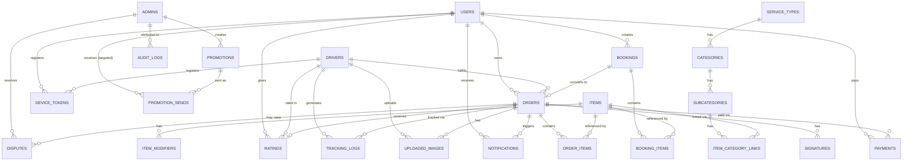

### 10.7 Indexing Strategy Summary

| Table | Index | Purpose |
|---|---|---|
| `users` | `phone`, `status` | Fast login lookup, filtering active/inactive |
| `drivers` | `phone`, `is_online`, `is_approved_by_admin` | Login, availability queries for assignment |
| `bookings` | `user_id`, `status`, composite `(user_id, status, created_at DESC)` | "My bookings" list queries |
| `orders` | `user_id`, `driver_id`, `status`, `booking_id`, composite `(user_id, status, created_at DESC)`, `(driver_id, status)` | Customer history, driver job list, admin filters |
| `tracking_logs` | `(order_id, recorded_at DESC)` | Fetch latest breadcrumb / render route history |
| `notifications` | `(recipient_type, recipient_id, created_at DESC)` | In-app notification feed pagination |
| `payments` | `order_id`, `user_id`, `status` | Reconciliation, customer payment history |
| `promotion_sends` | `user_id`, unique `(promotion_id, user_id)` | Prevent duplicate sends, per-user campaign history |

---

## 11. Backend Services

Each backend service below follows: **Purpose → Responsibilities → Dependencies → DB Usage → External APIs → Business Rules → Failure Handling → Logging → Security → Future Scalability.**

### 11.1 Authentication Service

| Aspect | Detail |
|---|---|
| **Purpose** | Verify identity and issue session tokens for all three roles. |
| **Responsibilities** | Phone OTP verification (customers/drivers) via Firebase; email/password verification (admin) via bcrypt; JWT issuance/verification; role-based middleware gate. |
| **Dependencies** | Firebase Admin SDK (💡 to be added — currently missing), `jsonwebtoken`, `bcrypt`. |
| **DB Usage** | Reads/writes `users`, `drivers`, `admins`. |
| **External APIs** | Firebase Authentication (📄 SRS). |
| **Business Rules** | Drivers cannot log in until `is_approved_by_admin = true`. First admin registration requires no token (bootstrap); subsequent admin creation requires an existing admin's token (🔧 IMPLEMENTED). |
| **Failure Handling** | Invalid/expired OTP → `400`; expired JWT → `401` prompting re-login; Firebase service outage → 💡 inferred graceful degradation message, not a raw 500. |
| **Logging** | 🔧 Already redacts `email`/`password` fields in request logs (`app.js` middleware) — good practice, extend to also redact tokens/OTP codes. |
| **Security** | JWT secret must be a strong random value from environment (⚠️ current fallback `'your-secret-key-change-this-in-production'` in `middleware/auth.js` is a **critical security gap** if `JWT_SECRET` env var is ever unset in production — Section 17.1). Passwords must be bcrypt-hashed with adequate cost factor (≥10 rounds). |
| **Future Scalability** | Support social login, multi-factor for admin, session revocation list (JWT is stateless — needs a blocklist for "log out everywhere" support). |

### 11.2 Booking Service

| Aspect | Detail |
|---|---|
| **Purpose** | Manage the lifecycle of draft booking quotations. 🔧 `services/booking_service.js` |
| **Responsibilities** | CRUD on drafts; item add/remove/quantity-update; orchestrate pricing calculation; validate submission readiness (items present, terms accepted). |
| **Dependencies** | Pricing Service (11.3), User existence check. |
| **DB Usage** | `bookings` table (reads/writes), future `booking_items`. |
| **External APIs** | None directly (delegates address validation to Google Places via the client or a dedicated service). |
| **Business Rules** | Only `draft` status bookings are mutable; submission transitions to `submitted` and stamps `submitted_at`. |
| **Failure Handling** | Attempting to edit a non-draft booking → `409 Conflict`. |
| **Logging** | Should log every state transition with booking ID for audit trail. |
| **Security** | Must verify `booking.user_id === req.auth.id` on every mutating operation (⚠️ verify this is enforced, Section 17.3). |
| **Future Scalability** | Support saved/templated bookings ("book this again"), multi-currency. |

### 11.3 Quotation Service / Pricing Engine

| Aspect | Detail |
|---|---|
| **Purpose** | Deterministically compute price and ETA from booking parameters. 🔧 `services/pricing_service.js` |
| **Responsibilities** | Distance estimation, manpower/floor/parking/packing/dismantling/insurance cost calculation, volume discount, VAT, total. |
| **Dependencies** | 🔧 Currently self-contained (postcode-prefix heuristic); 💡 should depend on **Google Maps Service** (11.7) for real distance/traffic. |
| **DB Usage** | Reads booking data; writes `calculated_price`/`price_breakdown` back to `bookings`. |
| **External APIs** | ⚠️ **GAP**: SRS explicitly requires distance + **traffic conditions** as pricing inputs via what is implied to be Google Maps — current implementation uses a synthetic postcode-character-diff formula (`pricing_service.js` `estimateDistanceMiles`) which is **not real-world accurate** and does not account for traffic at all. This must be replaced with Google Distance Matrix API (returns both distance and traffic-aware duration) before production launch. |
| **Business Rules** | VAT 20% (UK); volume discount ≥5 items -£10, ≥10 items -£25; floor charge waived with lift/ground floor; category-specific multipliers **not yet implemented** (Section 6 gap for Piano/Antique/Industrial). |
| **Failure Handling** | Unresolvable postcode → fallback distance (10 miles) rather than erroring — reasonable for MVP, but 💡 should log a warning and consider blocking with a "please confirm address" prompt in production. |
| **Logging** | 🔧 Already logs route, breakdown, and total (`logger.info` calls throughout `pricing_service.js`) — good for debugging pricing disputes. |
| **Security** | Server-side only computation (never trust a client-submitted price) — 🔧 correctly implemented as a backend service, not client-calculated. |
| **Future Scalability** | Move hardcoded rate constants (£45/£90/£135/£180 manpower tiers, £15/£30/£50 floor charges, etc.) into the `pricing_rules` admin-configurable table (Section 21) instead of code constants — enables A/B pricing and regional rate cards without a deploy. |

### 11.4 Tracking Service

| Aspect | Detail |
|---|---|
| **Purpose** | Ingest driver location updates and expose current/historical position for tracking UI. |
| **Responsibilities** | Accept `POST update-location`, persist current position, (💡 inferred) append to `tracking_logs` history, publish to Realtime channel. |
| **Dependencies** | Realtime Service (11.10), Driver Service. |
| **DB Usage** | `drivers.current_latitude/longitude` (current); 💡 `tracking_logs` (history, not yet implemented). |
| **External APIs** | None directly; consumed by client-side Google Maps rendering. |
| **Business Rules** | Only the assigned driver of an *active* order should have their location surfaced to that order's customer (authorization boundary — must not leak all drivers' locations to all customers). |
| **Failure Handling** | Stale location (no update in N minutes during an active job) → 💡 inferred should flag "tracking temporarily unavailable" rather than showing a frozen/misleading pin. |
| **Logging** | High-frequency writes — should use a lightweight/batched logging strategy to avoid log spam. |
| **Security** | Rate-limit location update frequency to prevent abuse/DoS via excessive writes (💡 inferred). |
| **Future Scalability** | Move to a geospatial index (PostGIS) if proximity queries (e.g., "nearest available driver") become a first-class feature (Section 11.9). |

### 11.5 Notification Service

| Aspect | Detail |
|---|---|
| **Purpose** | Deliver the 6 SRS-mandated lifecycle push notifications plus promotional sends. |
| **Responsibilities** | Listen for status-change events, format message, dispatch via FCM, persist `notifications` record, prune dead device tokens. |
| **Dependencies** | Firebase Cloud Messaging SDK, Order/Booking Service event hooks. |
| **DB Usage** | 💡 `notifications`, `device_tokens` tables (not yet implemented). |
| **External APIs** | Firebase Cloud Messaging (📄 SRS). |
| **Business Rules** | Each lifecycle event fires exactly once (idempotency — must guard against double-firing on retried status updates). Respect user notification preferences for promotional (non-transactional) messages. |
| **Failure Handling** | FCM send failure (invalid/expired token) → mark token inactive, do not retry indefinitely; 💡 inferred exponential backoff for transient FCM errors. |
| **Logging** | Log every notification attempt with delivery outcome for support debugging ("customer says they didn't get notified"). |
| **Security** | Device tokens are sensitive (can be used to spam a specific device) — store securely, never expose via any API response. |
| **Future Scalability** | Add email/SMS fallback channel for critical notifications if push fails; templating system for multi-language support. |

### 11.6 Promotion Service (Smart Promotion Engine)

| Aspect | Detail |
|---|---|
| **Purpose** | Implement the SRS §6.7 Smart Promotion feature end-to-end. |
| **Responsibilities** | Detect driver city changes (reverse-geocode), query historical customers by city, apply cooldown/availability filters, generate and send promotional notifications, track redemptions. |
| **Dependencies** | Tracking Service (driver location), Google Geocoding API (reverse geocode), Notification Service, Admin-configured Promotion rules. |
| **DB Usage** | 💡 `promotions`, `promotion_sends` tables (not yet implemented); reads `orders`/`bookings` for customer-city history. |
| **External APIs** | Google Geocoding API (lat/lng → city name). |
| **Business Rules** | Per 7.7: trigger only on city *change* (not every location ping); exclude customers already sent this campaign; 💡 inferred: exclude customers with an active in-progress order. |
| **Failure Handling** | Geocoding API failure → skip this cycle, don't block the location-update request itself (must be non-blocking/async). |
| **Logging** | Log every promotion trigger evaluation (even no-ops) at debug level for tuning the algorithm over time. |
| **Security** | Must respect opt-out/notification preferences (GDPR/marketing-consent compliance, Section 17.10). |
| **Future Scalability** | Expand targeting beyond "same city" to "along the route" or "similar item history" (ML-driven recommendation) — a natural evolution. |

### 11.7 Payment Service

| Aspect | Detail |
|---|---|
| **Purpose** | Securely process customer payments and maintain a financial audit trail. 📄 SRS §14 |
| **Responsibilities** | Create Stripe PaymentIntents, handle webhooks, record `payments`, process refunds, reconcile with order/booking totals. |
| **Dependencies** | Stripe SDK, Order Service. |
| **DB Usage** | 💡 `payments` table (not yet implemented). |
| **External APIs** | Stripe API (PaymentIntents, Refunds, Webhooks). |
| **Business Rules** | Never trust client-reported payment success — only a verified webhook (or server-side PaymentIntent status check) confirms payment. Refund amount must never exceed original payment amount. |
| **Failure Handling** | Card decline → surface Stripe's decline reason to the customer in friendly language; webhook processing failure → must be retried/replayed (Stripe retries automatically, but the endpoint must be idempotent using the Stripe event ID). |
| **Logging** | Log payment state transitions (never log full card numbers — Stripe tokenizes this so raw PANs should never even reach this backend, a PCI-DSS scope reduction best practice). |
| **Security** | Webhook signature verification mandatory (Section 9.8); PCI compliance achieved by using Stripe Elements/SDK client-side so card data never transits YourWays servers. |
| **Future Scalability** | Support multiple payment methods (Apple Pay/Google Pay via Stripe), split payments (deposit + balance), driver payout automation (Stripe Connect) if drivers are independent contractors. |

### 11.8 Google Maps Service

| Aspect | Detail |
|---|---|
| **Purpose** | Provide address autocomplete, geocoding, distance/traffic-aware routing, and map rendering support. 📄 SRS (Google Places API, Google Maps live tracking) |
| **Responsibilities** | Wrap Google Places Autocomplete API, Distance Matrix API, Directions API, Geocoding/Reverse-Geocoding API behind a single backend service so API keys never reach the client directly (💡 inferred best practice — restrict key exposure) and to enable server-side caching. |
| **Dependencies** | Google Maps Platform API key with Places, Distance Matrix, Directions, Geocoding APIs enabled. |
| **DB Usage** | 💡 Optional cache table for geocoded addresses/distance results to reduce API cost. |
| **External APIs** | Google Maps Platform (multiple sub-APIs). |
| **Business Rules** | All pricing-relevant distance/traffic calculations **must** route through this service (replacing the current heuristic — Section 11.3 gap). |
| **Failure Handling** | API quota exceeded/outage → fallback to the existing heuristic distance estimate with a logged warning, never hard-fail a quotation request. |
| **Logging** | Log API call volume/cost for budget monitoring (Google Maps billing is usage-based and can spike unexpectedly). |
| **Security** | API key must be server-side only for Distance Matrix/Directions/Geocoding (billable, abusable); a separate, domain/app-restricted key may be used client-side for Autocomplete/Map rendering only. |
| **Future Scalability** | Cache common route distances (e.g., same-postcode-pair repeat quotes) to reduce API cost at scale. |

### 11.9 Driver Assignment Service

| Aspect | Detail |
|---|---|
| **Purpose** | Match orders to drivers — manually admin-driven per SRS, with 💡 inferred recommendation tooling for scale. |
| **Responsibilities** | Filter drivers by approval + online status + (💡 inferred) vehicle-type/skill match to order category (e.g., piano-certified, HGV-licensed for industrial); rank by proximity/workload; present ranked suggestions to Admin; execute the assignment transaction (set `driver_id`, transition status). |
| **Dependencies** | Driver Service, Tracking Service (for proximity), Order Service. |
| **DB Usage** | Reads `drivers` (status/location/skills), writes `orders.driver_id`. |
| **External APIs** | Google Distance Matrix (ETA-based ranking) — 💡 inferred enhancement. |
| **Business Rules** | 📄 SRS models this as **manual** ("Admin assigns driver") — 💡 inferred that at scale, a **recommendation engine** (not full automation, to preserve human judgment for edge cases like industrial machinery) becomes necessary; a "nearest available + capable" default suggestion dramatically speeds up dispatch. |
| **Failure Handling** | No suitable driver found → surface a clear "no drivers available for this category/area" state to Admin rather than a silent empty list. |
| **Logging** | Log every assignment decision (who assigned, why, alternatives considered) for operational post-mortems on late/failed deliveries. |
| **Security** | Only Admin role can execute assignment (🔧 IMPLEMENTED via `requireAuth('admin')`). |
| **Future Scalability** | Full auto-dispatch algorithm (like ride-hailing) once volume justifies it; driver opt-in "job board" model for gig-style scaling. |

### 11.10 Realtime Service

| Aspect | Detail |
|---|---|
| **Purpose** | Push database changes to subscribed clients without polling. 📄 SRS §13 |
| **Responsibilities** | Expose Supabase Realtime channels for `orders` (status changes), `drivers` (location), scoped per-user/per-order subscriptions. |
| **Dependencies** | Supabase Realtime (Postgres logical replication → WebSocket broadcast). |
| **DB Usage** | Listens to `orders`, `drivers` table changes; **Row Level Security (RLS) policies must scope what each client can subscribe to** (currently RLS is enabled but has *no public policies*, meaning only the backend's service-role key can read/write — the frontend does **not** connect to Supabase Realtime directly today per `FRONTEND_INTEGRATION.md` §8: "Frontend never talks to Supabase directly"). |
| **External APIs** | None (Supabase-native). |
| **Business Rules** | A customer's realtime subscription must be scoped to only their own orders; an admin's may span all. |
| **Failure Handling** | WebSocket disconnect → client must implement reconnect-with-backoff and re-fetch current state on reconnect (don't assume no missed events). |
| **Logging** | Log subscription counts/channel health for capacity planning. |
| **Security** | ⚠️ **Architecture decision point**: if the frontend is ever given direct Supabase Realtime access (bypassing the Express API for live updates, which is the more "Supabase-native" pattern), RLS policies **must** be written per-table before that happens — the current "no public policies" stance is safe specifically because direct client access is not yet used. |
| **Future Scalability** | If realtime load grows, consider a dedicated WebSocket gateway (e.g., Socket.IO/Pusher/Ably) in front of the Express layer instead of relying solely on Supabase Realtime, for more control over presence/backpressure. |

### 11.11 Storage Service

| Aspect | Detail |
|---|---|
| **Purpose** | Durable storage for pickup/delivery photos and signature images. 📄 SRS §6.4 |
| **Responsibilities** | Accept uploads (ideally via presigned URLs, Section 9.10), store in Supabase Storage buckets, return public/signed URLs for display. |
| **Dependencies** | Supabase Storage (or S3-compatible alternative). |
| **DB Usage** | URLs referenced from `uploaded_images`/`signatures`/`orders` columns. |
| **External APIs** | Supabase Storage API. |
| **Business Rules** | Images tied to a specific order + stage (pickup/dropoff) + driver; should be immutable once uploaded (no silent replacement, to preserve evidentiary value in disputes). |
| **Failure Handling** | Upload failure mid-flow (e.g., driver has poor signal at a rural pickup) → client must retry/queue uploads locally until connectivity resumes (💡 inferred offline-first requirement, Section 13.5). |
| **Logging** | Log upload success/failure per order for support diagnostics. |
| **Security** | Bucket access should be private with signed URLs for viewing (not publicly world-readable) since photos may reveal customer home interiors/valuables — a real privacy consideration. |
| **Future Scalability** | Add image compression/thumbnailing on upload to reduce storage cost and speed up admin dashboard rendering of photo grids. |

### 11.12 Reporting Service

| Aspect | Detail |
|---|---|
| **Purpose** | Generate the Admin-facing reports (revenue, bookings, drivers, customers). 📄 SRS §11 |
| **Responsibilities** | Aggregate queries across orders/payments/drivers/users, support date-range filtering, export to CSV/PDF. |
| **Dependencies** | Analytics Service (11.13) for underlying metric computation. |
| **DB Usage** | Read-heavy aggregate queries across most tables — 💡 inferred should use read replicas or materialized views at scale to avoid impacting transactional performance. |
| **External APIs** | None. |
| **Business Rules** | Revenue reports must reconcile against `payments` (captured amounts minus refunds), not just `orders.total_price` (which ignores actual collection status). |
| **Failure Handling** | Large export requests → async job + notification-when-ready pattern rather than a blocking HTTP request (💡 inferred, avoids timeouts). |
| **Logging** | Log report generation requests (who ran what report, when) for internal audit. |
| **Security** | Admin-only; 💡 inferred field-level restriction so Finance-role (Section 4.5) sees payment detail while Dispatcher-role does not. |
| **Future Scalability** | Move to a dedicated analytics warehouse (e.g., BigQuery/Redshift via CDC pipeline) once report complexity/data volume outgrows direct Postgres aggregation. |

### 11.13 Analytics Service

| Aspect | Detail |
|---|---|
| **Purpose** | Power the Admin Dashboard's real-time KPIs (total bookings, revenue, active deliveries, driver stats). 📄 SRS §11 |
| **Responsibilities** | Compute and cache dashboard metrics; expose them via `GET /api/admin/dashboard`. 🔧 IMPLEMENTED (basic version in `admin_service.js`). |
| **Dependencies** | Reporting Service shares underlying query logic. |
| **DB Usage** | Aggregate `COUNT`/`SUM` queries across `orders`, `bookings`, `drivers`. |
| **External APIs** | None. |
| **Business Rules** | "Active deliveries" should count orders in `outForPickup`/`outForDropOff` (and arguably `confirmed`/`pickupScheduled`) — the exact definition should be documented and consistent across dashboard and reports. |
| **Failure Handling** | Should degrade gracefully (show cached/stale data with a timestamp) rather than fail the whole dashboard if one metric query is slow/errors. |
| **Logging** | Log slow queries for performance monitoring. |
| **Security** | Admin-only. |
| **Future Scalability** | Cache dashboard metrics with a short TTL (e.g., 30–60s) via Redis to avoid recomputing on every page load/refresh — significant cost/performance win as admin usage grows. |

---

## 12. External Integrations

### 12.1 Firebase Authentication 📄 SRS

| Aspect | Detail |
|---|---|
| **Purpose** | Phone-number OTP verification for Customers and Drivers, removing the need for YourWays to build/maintain SMS infrastructure. |
| **How it works** | Client SDK (Flutter/Web) calls Firebase's `signInWithPhoneNumber`; Firebase sends an SMS OTP; client submits the code back to Firebase; Firebase returns a signed ID token proving phone ownership. |
| **Data Flow** | Client ↔ Firebase directly for the OTP round-trip (backend is *not* in this loop) → Client sends the resulting Firebase ID token to YourWays backend → Backend verifies the token via Firebase Admin SDK (`admin.auth().verifyIdToken()`) → Backend extracts the verified phone number → Backend looks up/creates the local `users`/`drivers` record → Backend issues its own JWT. |
| **API Usage** | Firebase Auth REST/SDK (client-side), Firebase Admin SDK (server-side verification). |
| **Failure Scenarios** | Invalid/expired OTP (Firebase returns an error — surfaced to the user to retry); Firebase quota/outage (rare, but should have a fallback support path, e.g., manual verification by support); ID token expired between client verification and backend exchange (should be handled by prompting re-auth). |
| **Retry Logic** | Client should allow OTP resend after a cooldown (Firebase enforces its own rate limits); backend should not retry token verification (a failed verification is definitive, not transient). |
| **Security** | Server must **always** re-verify the Firebase ID token server-side — never trust a client-submitted phone number without this verification (⚠️ this is precisely the current gap — Section 17.1). |
| **Best Practices** | Enable Firebase App Check to prevent OTP abuse from non-genuine app instances; set SMS quota alerts to catch abuse/fraud early; consider reCAPTCHA fallback for web OTP flows. |

### 12.2 Firebase Cloud Messaging (FCM) 📄 SRS §6.5

| Aspect | Detail |
|---|---|
| **Purpose** | Push notification delivery to customer and driver mobile apps for all lifecycle events. |
| **How it works** | Each app instance registers a device token with FCM on install/login; backend sends messages targeted at specific tokens (or topics) via the FCM Admin SDK/HTTP v1 API. |
| **Data Flow** | App → FCM SDK → device token → App sends token to Backend (`register-device`, Section 9.9) → Backend stores token → On a lifecycle event, Backend calls FCM Admin SDK with `{ token, notification: { title, body }, data: {...} }` → FCM delivers to device (even if app is backgrounded/closed). |
| **API Usage** | Firebase Admin SDK `messaging().send()` / `sendMulticast()`. |
| **Failure Scenarios** | Token invalid/unregistered (app uninstalled) → FCM returns an error code (`messaging/registration-token-not-registered`) → backend should delete that token; payload too large; message throttled by FCM (rare). |
| **Retry Logic** | Exponential backoff for transient FCM errors (5xx); no retry for permanent errors (invalid token — delete instead). |
| **Security** | Server key/service account credentials must be stored as encrypted secrets, never committed to source control. |
| **Best Practices** | Use `data`-only messages for silent background sync (e.g., trigger a realtime refresh) plus `notification` payloads for user-visible alerts; batch sends via `sendMulticast` for promotional campaigns to reduce API calls. |

### 12.3 Google Maps & Google Places 📄 SRS

| Aspect | Detail |
|---|---|
| **Purpose** | Address autocomplete (booking form), live map rendering (tracking), distance/traffic-aware pricing input. |
| **How it works** | **Places Autocomplete API**: as the customer types a pickup/dropoff address, suggestions are fetched. **Distance Matrix / Directions API**: given two addresses, returns distance and traffic-aware duration. **Maps SDK**: renders the live map with driver marker and route polyline. **Geocoding/Reverse Geocoding**: converts addresses ↔ coordinates (used by Smart Promotion to resolve driver GPS → city). |
| **Data Flow** | Client → Google Places Autocomplete (can be called directly client-side with a restricted API key, or proxied through backend for cost control) → selected address/place_id sent to Backend → Backend calls Distance Matrix API with pickup/dropoff → distance + duration returned → fed into Pricing Engine (Section 11.3). |
| **API Usage** | Places Autocomplete, Places Details, Distance Matrix, Directions, Geocoding, Maps JavaScript/SDK (client rendering). |
| **Failure Scenarios** | API key quota exceeded (billing cap hit); address not found/ambiguous; service outage. |
| **Retry Logic** | Standard exponential backoff for 5xx; do not retry 4xx (bad request — fix input instead). |
| **Security** | Client-side keys (Autocomplete, Map rendering) must be **restricted by HTTP referrer/app bundle ID** in Google Cloud Console; server-side keys (Distance Matrix, Geocoding) must be **restricted by IP** and never exposed to clients. |
| **Best Practices** | Cache geocoding results for repeated addresses; set a daily budget/quota alert in Google Cloud Console to avoid runaway billing; debounce autocomplete requests client-side (don't fire on every keystroke). |
| ⚠️ **GAP** | Currently the backend uses a **synthetic postcode-heuristic** instead of real Google Distance Matrix calls (Section 11.3) — this is the single highest-priority integration gap before production launch, since it directly affects every customer-facing price quote. |

### 12.4 Stripe 📄 SRS §14

| Aspect | Detail |
|---|---|
| **Purpose** | PCI-compliant card payment processing, refunds, transaction records. |
| **How it works** | Client uses Stripe Elements/Mobile SDK to collect card details (never touching YourWays servers) and tokenizes them; Backend creates a PaymentIntent server-side with the order amount; client confirms the PaymentIntent using the tokenized card; Stripe processes the charge and sends a webhook to Backend confirming success/failure. |
| **Data Flow** | See Section 7.8 sequence diagram. |
| **API Usage** | `PaymentIntents.create`, `PaymentIntents.confirm` (client SDK), `Refunds.create`, `Webhooks.constructEvent` (signature verification). |
| **Failure Scenarios** | Card declined (insufficient funds, fraud block); 3D Secure authentication required/failed; network timeout during confirmation; webhook delivery delayed/duplicated. |
| **Retry Logic** | Stripe automatically retries webhook delivery on failure (backend must respond `200` promptly and process asynchronously if needed); client should allow the customer to retry with a different card on decline. |
| **Security** | Webhook signature verification is **mandatory** (Section 9.8); API secret key stored server-side only, in a secrets manager, never in source control; use Stripe's test-mode keys in non-production environments. |
| **Best Practices** | Use idempotency keys on PaymentIntent creation to prevent double-charges on client retry; store only the Stripe `payment_intent_id`/`charge_id` locally, never raw card data (reduces PCI scope to "SAQ A", the simplest compliance tier). |

### 12.5 Supabase Realtime 📄 SRS §13

| Aspect | Detail |
|---|---|
| **Purpose** | WebSocket-based live propagation of database changes to subscribed clients, powering live tracking and instant status updates without polling. |
| **How it works** | Supabase Realtime listens to Postgres's write-ahead log (logical replication) and broadcasts `INSERT`/`UPDATE`/`DELETE` events on subscribed tables/channels to connected WebSocket clients, filtered by Row Level Security policies. |
| **Data Flow** | Backend writes to `orders`/`drivers` tables → Postgres WAL emits change → Supabase Realtime broadcasts → Subscribed client (Customer App map screen, Admin ops dashboard) receives the event and updates UI state. |
| **API Usage** | Supabase JS/Flutter client `supabase.channel(...).on('postgres_changes', ...)`. |
| **Failure Scenarios** | WebSocket disconnect (backgrounding, network loss) — client must detect and reconnect; replication lag under heavy write load (rare but possible). |
| **Retry Logic** | Client SDKs handle automatic reconnect with backoff; app should re-fetch current state on reconnect to cover any missed events during the gap. |
| **Security** | RLS policies gate exactly what each client can subscribe to — 🔧 currently **no public RLS policies exist** (only the backend's service-role key can read data), meaning **direct client-to-Supabase Realtime subscriptions are not yet safely usable**; the current implementation implies the *backend* would need to relay realtime events to clients over its own channel (e.g., Socket.IO) until per-row RLS policies are authored, or RLS policies must be added before enabling direct client subscriptions (Section 11.10 and Section 17). |
| **Best Practices** | Scope channels narrowly (e.g., one channel per order, not one global channel) to minimize unnecessary client-side event noise and reduce the blast radius of any RLS misconfiguration. |

---

## 13. Mobile Applications

### 13.1 Customer App — Screens & Navigation 📄 SRS §8

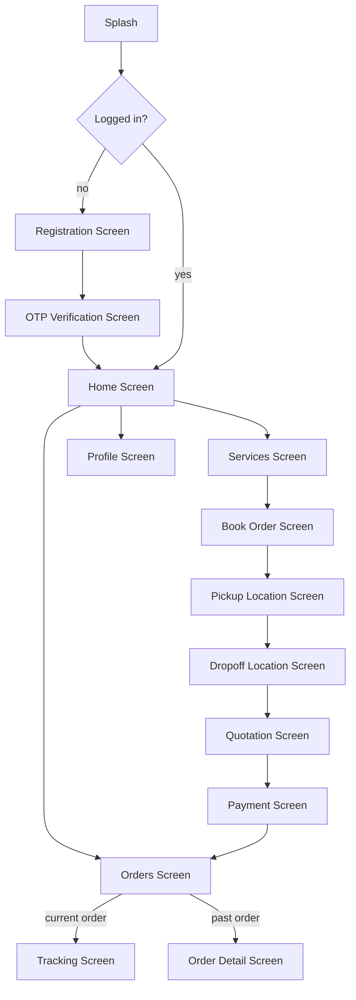

| Screen | Features (📄 SRS verbatim) |
|---|---|
| Registration / Login / OTP Verification | Phone entry, OTP entry |
| Home | Promotions and banners, quick booking option, user profile access, deals and offers |
| Services | Cargo categories, service descriptions, booking option |
| Book Order | Category selection, subcategory selection, multiple item selection, quantity and weight input |
| Pickup & Dropoff | Location input with Google Places integration |
| Quotation | Distance, estimated price, estimated time, service charges, confirm booking button |
| Orders | Current orders → Tracking Screen; previous orders → Order Detail Screen |
| Tracking | Live Google Map, driver details, vehicle details, status timeline |
| Order Detail | Full booking details, payment information, delivery details |
| Profile | User information, total bookings, edit profile, logout |
| Payment | Stripe integration, online payment, transaction confirmation |

💡 **INFERRED additional screens** required for production completeness: Forgot/Change Phone Number flow, Notification Center/Inbox, Rate Your Driver (post-completion), Support/Help Center + Contact Us, Address Book (saved pickup/dropoff addresses), Referral/Promo Code entry, Terms & Conditions / Privacy Policy viewer, Empty States for zero orders/zero notifications, Error/No-Connectivity screen.

### 13.2 Driver App — Screens & Navigation 📄 SRS §9

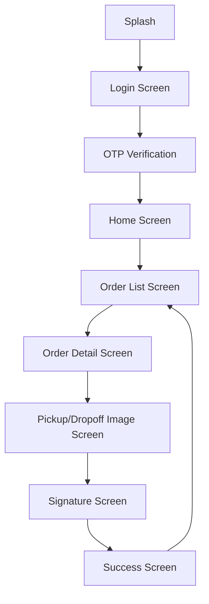

| Screen | Features (📄 SRS verbatim) |
|---|---|
| Login / OTP Verification | Phone + OTP |
| Home | Check-in slider, booking overview, driver availability status |
| Order List | Assigned orders, status labels, pickup/dropoff addresses |
| Order Detail | Customer details, navigation support, booking information, status sliders |
| Pickup/Dropoff Image Screen | Upload images, add delivery notes |
| Signature Screen | Customer signature capture |
| Success Screen | Order completion confirmation |

💡 **INFERRED additional screens**: Driver Statistics/Earnings screen, Document Upload (license/insurance) for approval, In-App Navigation handoff (deep link to Google/Apple Maps for turn-by-turn), Support/Help, Ratings received view, Offline/No-Connectivity indicator with queued-upload status.

### 13.3 Offline Considerations 💡 INFERRED

*Why this matters:* drivers frequently work in poor-signal areas (basements, rural pickups, underground parking) where the SRS's mandatory photo/signature capture must still function.

| Concern | Recommendation |
|---|---|
| Photo/signature capture with no connectivity | Store locally (device DB/file system), queue for upload, show a "pending sync" indicator, auto-retry on reconnect |
| Status update tap with no connectivity | Queue the status-change request locally; apply optimistically in UI with a "syncing" badge; resolve conflicts if the server state diverged (rare, but should be handled with a clear "refresh required" fallback) |
| Location updates | Buffer location pings locally and batch-upload when connectivity resumes, rather than dropping them |
| Customer viewing tracking with no connectivity | Show last-known state with a clear "reconnecting..." indicator rather than a blank/broken screen |

### 13.4 Permissions Required

| App | Permission | Purpose |
|---|---|---|
| Customer App | Location (foreground) | Show "near me" services, auto-fill current location as pickup |
| Customer App | Notifications | Push alerts |
| Customer App | Camera/Photos (optional) | 💡 inferred: attach photos of items when booking (helps drivers assess feasibility, Section 6.2 Custom Item recommendation) |
| Driver App | Location (background, "Always Allow") | Continuous tracking during active jobs — **background location is a sensitive, store-review-scrutinized permission** requiring a clear in-app justification screen (Apple/Google policy compliance) |
| Driver App | Camera | Photo capture at pickup/dropoff |
| Driver App | Notifications | New job alerts |
| Driver App | Storage | Temporarily cache photos/signatures before upload |

### 13.5 State Management Suggestions 💡 INFERRED

*Why inferred:* SRS specifies screens/features but not implementation architecture; this is standard mobile engineering guidance appropriate to the described feature set.

| Concern | Recommendation |
|---|---|
| Overall architecture | Flutter: `Riverpod` or `Bloc`; React Native: `Redux Toolkit`/`Zustand` — either is acceptable; prioritize consistency over dogma |
| Auth/session state | Global singleton/provider holding JWT + role + user profile, persisted to secure storage (Keychain/Keystore), rehydrated on app launch |
| Realtime/tracking state | A dedicated stream/notifier per active order subscription, torn down when the order leaves an active state or the screen unmounts |
| Offline queue (13.3) | A local persisted queue (SQLite/Hive/Isar) processed by a background sync worker |
| Form state (booking flow) | A multi-step wizard controller retaining state across steps (category → location → quote → confirm) so back-navigation doesn't lose progress |

---

## 14. Website

### 14.1 Public Pages 📄 SRS §3.3, §10

| Page | Purpose |
|---|---|
| Home | Marketing landing page, value proposition, primary CTA to book |
| About | Company story/trust-building |
| Services | Full category catalog browsing (mirrors mobile "Services Screen") |

💡 **INFERRED additional public pages**: Pricing/How It Works, FAQ, Contact/Support, City/Area coverage pages (valuable for local SEO — "man and van in [City]"), Blog/Resources (SEO content marketing), Careers (driver recruitment funnel), Terms & Conditions, Privacy Policy, Cookie Policy (legal/compliance necessity for any EU/UK-facing site collecting personal data).

### 14.2 Authentication 📄 SRS

Same OTP login/register flow as the mobile app (Section 7.1), rendered as a responsive web form. 💡 Inferred: web OTP flows typically also support **invisible reCAPTCHA** to prevent bot-driven SMS abuse, since web forms are more exposed to automated abuse than app-store-gated mobile apps.

### 14.3 Booking 📄 SRS

Full parity with the mobile booking flow (Section 7.2) — category/subcategory/item selection, Google Places location entry, quotation, confirmation. 💡 Inferred UX note: web booking flows benefit from a persistent price-summary sidebar (visible while scrolling through item selection) since desktop screens have more real estate than mobile.

### 14.4 Tracking 📄 SRS

Same live Google Map tracking as mobile (Section 7.6). 💡 Inferred: the website should also support a **shareable, unauthenticated tracking link** (e.g., `yourways.com/track/ORD-XXXX?token=...`) so a customer can share delivery status with a third party (e.g., "watch for the delivery, I'm at work") without sharing their login — this requires a scoped, single-purpose tracking token, not the full order UUID (ties back to the Section 9.5 security gap).

### 14.5 Payments 📄 SRS

Stripe-powered checkout, same as mobile (Section 7.8), using Stripe.js/Stripe Elements for PCI-compliant card collection in the browser.

### 14.6 SEO 📄 SRS §3.3, §10

> "The website will also be SEO optimized using Jasper for better search engine visibility." ... "Using Jasper: SEO optimization, Meta tags, Search engine indexing."

**Interpretation:** *Jasper* is an AI content-generation tool commonly used to produce SEO-optimized marketing copy (blog posts, service page descriptions, meta descriptions) at scale — 📄 SRS treats it as a **content production tool** feeding into the website's static/marketing pages, not a runtime dependency of the application itself. 💡 **INFERRED technical SEO requirements** beyond content generation (standard web engineering practice, not covered by an AI writing tool):

| Requirement | Why |
|---|---|
| Server-side rendering (SSR) or static generation for public pages | Search engines and social-media link previews need fully-rendered HTML; a pure client-side SPA hurts crawlability and load performance (Core Web Vitals, a Google ranking factor) |
| Semantic HTML + structured data (Schema.org `LocalBusiness`/`Service` markup) | Improves rich-result eligibility in search |
| Meta tags per page (title, description, Open Graph, Twitter Card) | Click-through rate and social sharing appearance |
| XML sitemap + `robots.txt` | Search engine discoverability/crawl control |
| Fast page load (image optimization, CDN, code splitting) | Core Web Vitals ranking factor |
| City/service-specific landing pages | Long-tail local SEO ("man and van in Manchester") — ties to the inferred public page recommendation in 14.1 |
| Canonical URLs | Avoid duplicate-content penalties if category pages are reachable via multiple URL patterns |

### 14.7 Customer Dashboard 📄 SRS (implied by "Order management")

Web equivalent of the mobile app's Orders + Profile screens: booking history, active order tracking, profile editing, payment history/receipts, saved addresses (💡 inferred).

---

## 15. Admin Dashboard

### 15.1 Dashboard (Overview) 📄 SRS §11

| Feature | Detail |
|---|---|
| Total bookings | Count, likely with a trend/comparison to prior period (💡 inferred UX) |
| Revenue analytics | Total revenue, 💡 inferred: broken down by day/week/month with a chart |
| Active deliveries | Count of orders currently `outForPickup`/`outForDropOff` (and arguably `confirmed`) |
| Driver statistics | Online driver count, total approved drivers, 💡 inferred: top performers by rating/completed orders |

🔧 **IMPLEMENTED** as `GET /api/admin/dashboard` (`admin_service.js`). 💡 **INFERRED dashboard additions**: pending-bookings-awaiting-assignment count with an "oldest pending" age indicator (operational SLA visibility — directly addresses the Section 21 missing-escalation gap), a live map widget showing all active driver pins (ties to Section 16 realtime), and a promotions performance widget (sends/redemptions for the Smart Promotion feature).

### 15.2 Booking Management 📄 SRS §11

| Capability | Detail |
|---|---|
| View bookings | List with filters (status, customer) — 🔧 IMPLEMENTED `GET /api/admin/bookings` |
| Edit bookings | 💡 Inferred scope: Admin should be able to correct data-entry errors (e.g., typo'd postcode) on behalf of a customer, but should **not** silently alter item lists post-submission without an audit trail entry |
| Assign drivers | Handled at the **order** level in the current implementation (bookings convert to orders before assignment) — 🔧 `POST /api/admin/orders/:id/assign-driver` |
| Update statuses | 🔧 `PATCH /api/admin/orders/:id/status` (should still respect the state machine, Section 8, even for admin overrides — with an explicit "override" audit flag when skipping normal sequence) |

### 15.3 Driver Management 📄 SRS §11

| Capability | Detail |
|---|---|
| Add drivers | 📄 SRS says "Admin can: Add drivers" — 🔧 current implementation has drivers **self-register**, with Admin only approving; 💡 inferred: Admin should also be able to directly create a driver account (e.g., for drivers onboarded via phone/in-person, without the driver self-registering first) |
| Activate/deactivate drivers | 🔧 IMPLEMENTED: approve / suspend / activate endpoints |
| Monitor driver performance | 💡 Inferred: ratings average, completion rate, on-time rate, cancellation rate — dashboard/report view, not just raw stats |

💡 **INFERRED additional driver management features**: document verification queue (license, insurance, vehicle registration uploads awaiting review before approval — the *actual* gate that should precede "approve," which today appears to be a single boolean flip with no documented evidence requirement), skill/specialism tagging (piano-certified, HGV-licensed — ties to Section 6 category-driver-requirement mapping), driver payout/earnings view (if commission-based).

### 15.4 Customer Management 📄 SRS §11

| Capability | Detail |
|---|---|
| View customer profiles | 🔧 IMPLEMENTED `GET /api/admin/users` |
| Track customer history | Bookings/orders by user — 🔧 achievable via `GET /api/admin/bookings?userId=`/`orders?userId=` |
| Manage support cases | ⚠️ **GAP** — no support-ticket/case model exists yet; 💡 inferred a `support_tickets` table + basic case-status workflow (open/in-progress/resolved) tied to a customer and optionally an order, is required to fulfill this literal SRS line item |

### 15.5 Pricing Management 📄 SRS §11

> "Admin can manage: Distance pricing, Weight pricing, Traffic multipliers, Service charges"

⚠️ **GAP**: none of these are currently admin-configurable — they are **hardcoded constants** in `pricing_service.js` (e.g., `35 + distanceMiles * 2.5`, manpower cost map, floor charge map). This is one of the most consequential gaps in the entire system relative to the SRS, because it means every pricing change requires a code deployment. Section 21 and the `pricing_rules` table (Section 10.5 recommendation, needs to be added) directly address this.

### 15.6 Promotions Management 📄 SRS §11

> "Admin can: Create discounts, Send promotional notifications"

⚠️ **GAP**: No `promotions` persistence or admin UI/API exists yet (Section 10.5, 11.6, 21 cover the required build-out).

### 15.7 Reports & Analytics 📄 SRS §11

> "Reports include: Revenue reports, Booking reports, Driver reports, Customer reports"

⚠️ **GAP**: Beyond the basic dashboard aggregate, no dedicated report endpoints/exports exist yet (Section 9.11, 11.12 cover the required build-out).

### 15.8 Admin Permissions (Current vs. Recommended)

| Permission | Current | Recommended (Section 4.5 roles) |
|---|---|---|
| Create other admins | Any admin, with a valid admin token | Super Admin only |
| Approve/suspend drivers | Any admin | Any admin or Dispatcher |
| Change pricing rules | N/A (not configurable) | Super Admin / Finance only |
| Issue refunds | N/A (no payments yet) | Support Agent (capped amount) / Admin (unlimited) |
| View financial reports | Any admin (via dashboard) | Finance role + Super Admin |

### 15.9 Future Enhancements 💡 INFERRED

- Role-scoped admin UI (hide pricing/financial screens from Dispatcher-tier accounts).
- Bulk actions (assign multiple orders, bulk-approve a batch of driver applications).
- Saved filter views / customizable dashboard widgets.
- Audit log viewer (surfacing the `audit_logs` table from Section 10.5) for "who changed this and when."
- In-dashboard messaging/notes thread per order (for internal ops communication, distinct from customer-facing notifications).
- Map-based dispatch view (drag driver pins onto pending orders).

---

## 16. Realtime System

### 16.1 What Must Be Realtime 📄 SRS §13

| Feature | SRS Reference |
|---|---|
| Live tracking (driver position) | "Live tracking" |
| Instant status updates | "Instant status updates" |
| Realtime notifications | "Realtime notifications" |
| Live admin monitoring | "Live admin monitoring" |

### 16.2 Supabase Realtime Architecture (Target)

```mermaid
flowchart LR
    subgraph Postgres
        WAL[Write-Ahead Log]
    end
    subgraph SupabaseRealtime["Supabase Realtime Server"]
        Decoder[Logical Replication Decoder]
        RLSFilter[RLS-aware Broadcast Filter]
    end
    subgraph Clients
        CApp[Customer App - subscribed to own order_id]
        Admin[Admin Dashboard - subscribed to all active orders]
    end

    API[Express Backend] -- writes --> Postgres
    Postgres --> WAL --> Decoder --> RLSFilter
    RLSFilter -- "order.user_id = me" --> CApp
    RLSFilter -- "admin role" --> Admin
```

### 16.3 Driver Tracking via Realtime

Every `POST /update-location` write to `drivers.current_latitude/longitude` (Section 7.6, 11.4) is picked up by the WAL and broadcast to any client subscribed to that specific driver's channel (scoped to drivers currently assigned to an *active* order the subscriber is authorized to see).

### 16.4 Status Synchronization

Every order status transition (Section 8) is broadcast the same way — this replaces the need for clients to poll `GET /api/orders/:id` repeatedly, reducing server load and giving instant UI updates (a status timeline component can react to the event directly).

### 16.5 Live Notifications vs. Push Notifications — Distinction

| | Realtime (Supabase) | Push (FCM) |
|---|---|---|
| Delivery guarantee | Only while app is open & subscribed | Delivered even if app is closed/backgrounded |
| Use case | Continuous state sync (map position, in-app status badge) | Attention-worthy discrete events (order confirmed, driver assigned) |
| Data volume | Can be high-frequency (location pings) | Low-frequency, human-readable messages |

**Recommendation:** use **both**, not one or the other — 💡 inferred, since they serve genuinely different purposes and SRS lists both "Realtime notifications" (§13) and FCM push (§6.5) as distinct requirements.

### 16.6 Current Implementation Status ⚠️ GAP

Per `FRONTEND_INTEGRATION.md`: *"Database: Supabase (Postgres). Frontend never talks to Supabase directly in the current design — only to this API."* This means **Supabase Realtime is not yet wired up to any client** — the "realtime" experience today would have to be achieved via **client-side polling** of the REST API, which does not meet the SRS's "instant status updates" / "live tracking" requirement. Wiring up Supabase Realtime channels (or an equivalent WebSocket layer) is a **major outstanding build item**, detailed further in Section 21.

---

## 17. Security

### 17.1 Authentication ⚠️ Current Gaps + 📄 SRS Target

| Aspect | SRS Target | Current State | Risk |
|---|---|---|---|
| Customer/Driver login | OTP via Firebase | Phone-number lookup only, **no OTP verification** (`FRONTEND_INTEGRATION.md`: "Not implemented yet") | **Critical** — anyone who knows/guesses a registered phone number can log in as that user with zero proof of ownership |
| JWT secret | N/A (not in SRS) | `middleware/auth.js` falls back to a **hardcoded default string** (`'your-secret-key-change-this-in-production'`) if `JWT_SECRET` env var is missing | **Critical** — if this env var is ever unset in any environment, all tokens become forgeable by anyone who reads the (public, in this very document) source code |
| Admin login | Email/password | 🔧 IMPLEMENTED, presumably bcrypt-hashed (`password_hash` column name implies this) | Should verify bcrypt cost factor ≥ 10-12 rounds |
| Token expiry | N/A | 7 days | 💡 Reasonable for mobile UX, but should pair with refresh-token rotation for better security (a stolen 7-day token is a long exposure window) |

### 17.2 Authorization / Role-Based Access Control

🔧 IMPLEMENTED at the **role** level (`requireAuth('admin')`, etc. — Section 9.1/`middleware/auth.js`). ⚠️ **Missing at the ownership level** in several places (Section 17.3).

### 17.3 API Security — Object-Level Authorization Gaps ⚠️ GAP (💡 inferred from route analysis)

| Endpoint Pattern | Gap |
|---|---|
| `GET /api/orders/user/:userId` | Should verify `req.auth.id === :userId` for role `user` (a customer could otherwise view another customer's order history by changing the URL param) |
| `GET /api/drivers/:id/orders` | Should verify `req.auth.id === :id` for role `driver` |
| `PUT /api/drivers/:id` | Allows role `user` in addition to `driver` per the route definition (`requireAuth(['driver', 'user'])`) — this looks like it may be intended for Admin-acting-as-user support tooling, but as written, **any authenticated customer could potentially edit any driver's profile** unless additional ownership logic exists in the controller. Must be verified/tightened. |
| `GET /api/orders/:id`, `/api/orders/code/:orderId` | "Optional" auth means unauthenticated requests can view full order details if they know/guess the ID — should require auth + ownership check, with a separate limited "public tracking" data shape if a shareable link feature (Section 14.4) is desired |
| `GET /api/drivers/:id` | Public (no auth) — exposes driver PII (name, phone, vehicle number) to anyone |

**This class of vulnerability is known as IDOR (Insecure Direct Object Reference) / Broken Object Level Authorization — OWASP API Security Top 10 #1.** Every endpoint taking a resource ID must verify the caller is authorized for *that specific resource*, not just that they hold *a* valid token of the right role.

### 17.4 Role-Based Access — Recommended Enforcement Pattern 💡 INFERRED

```js
// Example middleware to add: ownership-aware authorization
const requireOwnerOrAdmin = (paramName, roleField = 'id') => (req, res, next) => {
  const isAdmin = req.auth.role === 'admin';
  const isOwner = req.auth[roleField] === req.params[paramName];
  if (!isAdmin && !isOwner) {
    return errorResponse(res, 403, 'Insufficient permissions');
  }
  next();
};
```

### 17.5 Payment Security

- Never process a client-asserted "payment succeeded" flag — only trust server-verified Stripe webhook events or a direct server-side PaymentIntent status check (Section 11.7).
- Webhook endpoint must verify `Stripe-Signature` using the raw request body (many frameworks' JSON body-parsers mutate the body in a way that breaks signature verification if not configured to preserve the raw buffer — a common real-world implementation pitfall to flag for the dev team).
- PCI scope is minimized by never handling raw card numbers server-side (Stripe Elements/SDK tokenizes client-side).

### 17.6 File Uploads Security 📄 SRS §15 ("Secure file uploads")

| Concern | Recommendation |
|---|---|
| File type validation | Whitelist `image/jpeg`, `image/png`, `image/webp` — validate actual file content (magic bytes), not just the extension/MIME header (which can be spoofed) |
| File size limits | Cap at a reasonable max (💡 inferred 10MB) to prevent storage abuse/DoS |
| Malware scanning | 💡 Inferred for a production system handling user-uploaded images at scale, though lower priority for images specifically than for arbitrary file uploads |
| Access control | Private storage buckets with signed, time-limited URLs — not public-read buckets (photos may reveal home interiors) |
| Upload authorization | Only the assigned driver for an order (in `outForPickup`/`outForDropOff` state) may upload photos/signatures for that order |

### 17.7 Data Validation 📄 SRS §15

Comprehensive validation rules are detailed in Section 18; the security angle specifically is: **all input must be validated server-side regardless of client-side validation**, since client validation is a UX convenience, not a security boundary (any client can be bypassed with a direct API call).

### 17.8 Encryption 📄 SRS §15 ("Encrypted communication")

| Layer | Requirement |
|---|---|
| Transport | TLS 1.2+ (HTTPS) for all API traffic — non-negotiable, especially given JWT bearer tokens and payment flows |
| At rest | Supabase/Postgres encryption at rest (typically provided by the managed hosting provider by default) |
| Secrets | Environment variables / secrets manager, never committed to source control (⚠️ verify `.env` is git-ignored — 🔧 confirmed present in `.gitignore` per file listing) |
| Passwords | bcrypt/argon2 hashing, never plaintext or reversible encryption |

### 17.9 Audit Logging 💡 INFERRED (not in SRS, required for a system handling money and dispute-prone deliveries)

Every state-changing admin action (status override, driver approval/suspension, pricing rule change, refund issuance) should write to the `audit_logs` table (Section 10.5) with actor, before/after state, and timestamp — essential for dispute resolution ("the customer says a refund was promised — was it actually issued, by whom, when?") and for detecting internal misuse.

### 17.10 Rate Limiting 💡 INFERRED (not in SRS, required for abuse prevention)

| Endpoint Class | Recommended Limit |
|---|---|
| OTP request | e.g., 5 requests / phone number / hour (prevents SMS-pumping fraud, a well-known attack against phone-OTP systems) |
| Login attempts | e.g., 10 / IP / 15 minutes (brute-force protection) |
| Quotation/quote endpoint (public, unauthenticated) | e.g., 30 / IP / minute (prevents scraping/abuse of a free compute-costing endpoint) |
| General authenticated API | e.g., 100 / user / minute (fair-use ceiling) |

Also relevant to compliance: notification opt-out/preferences (Section 5.5, 11.6) intersect with **marketing consent regulations** (UK PECR / EU ePrivacy, GDPR) — promotional notifications should respect an explicit opt-in/opt-out state, not just be sent unconditionally to anyone with booking history.

---

## 18. Validation Rules

### 18.1 Bookings

| Field | Rule |
|---|---|
| `userId` | Required, valid UUID, must exist, must match caller's JWT identity |
| `collectionPostcode` / `deliveryPostcode` | Required, non-empty string; 💡 inferred: validate against UK postcode format `^[A-Z]{1,2}\d[A-Z\d]?\s?\d[A-Z]{2}$` (case-insensitive) or accept a Google Places `place_id` instead of free text for higher accuracy |
| `moveDate` | 💡 Inferred: must be a valid ISO-8601 date, not in the past; reasonable upper bound (e.g., not more than 12 months out) |
| `dateFlexibility` | Required, must be one of the 4 enum values exactly (case-sensitive match against DB enum) |
| `collectionPropertyType` / `deliveryPropertyType` | Required, one of 6 enum values |
| `collectionFloorLevel` / `deliveryFloorLevel` | Required, one of 5 enum values |
| `collectionLiftAccess` / `deliveryLiftAccess` | Required boolean |
| `parkingAccess` | Required, one of 5 enum values |
| `manpowerRequired` | Required, one of 4 enum values |
| `dismantlingRequired` | Required boolean |
| `packingService` | Required, one of 4 enum values |
| `insuranceValue` | Optional, numeric, ≥ 0, 💡 inferred reasonable upper bound (e.g., ≤ £1,000,000) to catch fat-finger entry errors |
| `jobNotes` | Optional, string, 💡 inferred max 1000 characters, should be sanitized against script injection if ever rendered as HTML anywhere (admin dashboard) |
| `fullName` | Required, 2–100 characters |
| `email` | Required, valid email format |
| `mobileNumber` | Required, valid phone format (E.164 recommended) |
| `acceptTerms` | Must be `true` at submission time (may be `false` while still a draft) |
| `items` | Required array, min length 1 **at submission** (may be empty while drafting); each item requires `itemName`/`category` (non-empty) and `quantity` (integer ≥ 1) |
| Item `modifiers.Estimated Weight (kg)` | 💡 Inferred: if present, must be a positive number, reasonable upper bound (e.g., ≤ 5000kg for a single item, beyond which it should route to the Industrial "quote on request" flow — Section 6.2) |
| Item `modifiers.Length/Width/Height (cm)` (Custom Item) | 💡 Inferred: positive numbers, reasonable bounds |

### 18.2 Items / Catalog (Admin CRUD, Section 9.6)

| Field | Rule |
|---|---|
| `name` | Required, unique, 2–150 characters |
| `default_weight_kg` | Optional, positive number |
| `pricing_multiplier` | Positive number, default 1.00, 💡 inferred reasonable bounds (0.5–10.0) to catch data-entry errors |
| `subcategory_ids` | At least one valid subcategory link required |

### 18.3 Locations

| Field | Rule |
|---|---|
| Pickup/Dropoff address | Non-empty; 💡 inferred should resolve to a valid lat/lng via Google Geocoding before being accepted (catches typos/unresolvable addresses at booking time rather than failing later at pricing or dispatch time) |
| Pickup ≠ Dropoff | 💡 Inferred: should warn (not necessarily block) if pickup and dropoff resolve to the identical address — likely a user error, though same-address "Man Power Only" jobs are legitimate (Section 6.2) |

### 18.4 Users

| Field | Rule |
|---|---|
| `name` | Required, 2–100 characters, 💡 inferred: reject purely numeric/symbol-only names |
| `email` | Required, valid RFC 5322 format, unique (🔧 DB constraint enforced) |
| `phone` | Required, valid E.164 format, unique (🔧 DB constraint enforced) |
| `dob` | Optional, valid past date; 💡 inferred: if collected, should enforce a minimum age (e.g., 18+) for account holders who can enter binding contracts/payments |
| `address` | Optional free text |

### 18.5 Drivers

| Field | Rule |
|---|---|
| `name`, `email`, `phone` | Same as Users |
| `licenseNumber` | Required, 💡 inferred format validation per issuing jurisdiction |
| `vehicleType` | Required, 💡 inferred should be a controlled enum/lookup (Van, Luton Van, Car Transporter, Flatbed, etc. — ties to Section 6 vehicle-requirement mapping) rather than free text, to enable reliable driver-assignment filtering |
| `vehicleNumber` | Required, 💡 inferred format validation (license plate pattern) |

### 18.6 Payments

| Field | Rule |
|---|---|
| `amount` | Must exactly match the order's `totalPrice` at PaymentIntent creation time (server-computed, never client-supplied, to prevent price tampering) |
| `currency` | Fixed to `gbp` (or platform's operating currency) — should not be client-selectable |
| Refund `amount` | Must not exceed `payment.amount - payment.refunded_amount` |

### 18.7 Uploads

| Field | Rule |
|---|---|
| Photo file | MIME type in `{image/jpeg, image/png, image/webp}`, max size (💡 inferred 10MB), magic-byte content validation |
| Minimum photo count | 💡 Inferred: at least 1 photo required per pickup/dropoff completion (enforces the SRS's proof-of-service business rule at the API level, not just the UI) |

### 18.8 Signatures

| Field | Rule |
|---|---|
| Signature payload | Must decode to a valid, non-blank image; 💡 inferred minimum "ink coverage" heuristic to reject empty/near-empty signature pads (a common real-world driver-app QA issue) |
| `signedBy` | 💡 Inferred: should capture the typed/confirmed name of the person signing (may not always be the account holder — e.g., a neighbor accepting delivery) for dispute clarity |

### 18.9 Promotions

| Field | Rule |
|---|---|
| `code` | If present, unique, alphanumeric, 💡 inferred 4–20 characters |
| `discount_type` | One of `percentage`/`fixed_amount` |
| `discount_value` | If `percentage`: 0–100; if `fixed_amount`: > 0 and 💡 inferred less than typical minimum order value (a 100% or overly large fixed discount should require extra confirmation) |
| `starts_at` / `ends_at` | `ends_at` must be after `starts_at` if both present |
| `max_redemptions` | Optional positive integer |

---

## 19. Error Handling

### 19.1 Validation Errors

**Pattern:** `400 Bad Request` with a field-level error map so clients can highlight the specific offending input, not just a generic message.

```json
{
  "success": false,
  "message": "Validation failed",
  "error": {
    "fields": {
      "email": "Invalid email format",
      "items": "At least one item is required to submit a booking"
    }
  }
}
```
💡 **INFERRED**: the current `responseHandler.js` pattern (`{ success, message, error }`) should be extended with this structured `fields` map for forms with many inputs (booking form has 20+ fields) — a flat string error message forces the client to string-match to know which field failed, which is fragile.

### 19.2 Business Errors

| Scenario | Status | Example Message |
|---|---|---|
| Editing a non-draft booking | 409 | "Only draft bookings can be edited" |
| Submitting a booking with zero items | 422 | "Add at least one item before submitting" |
| Assigning a driver who isn't approved/online | 409 | "Driver is not available for assignment" |
| Invalid status transition (Section 8.4) | 409 | "Cannot transition from pickupCompleted to confirmed" |
| Duplicate phone/email registration | 409 | "An account with this phone number already exists" |
| Completing pickup without required photo/signature | 422 | "Photo and signature are required to complete pickup" |

### 19.3 Network Errors (Client-Side Handling Guidance) 💡 INFERRED

| Scenario | Client Behavior |
|---|---|
| Request timeout | Retry with exponential backoff (max 3 attempts) for idempotent GET requests; for mutating requests, surface a clear "did this go through?" state rather than blind auto-retry (risk of duplicate submission) |
| No connectivity | Show an offline banner; queue mutating driver-app actions (Section 13.3) |
| DNS/server unreachable | Generic "can't reach YourWays right now" message, not a raw stack trace |

### 19.4 Realtime Failures

| Scenario | Handling |
|---|---|
| WebSocket disconnects | Client auto-reconnects with backoff; on reconnect, re-fetch current order state via REST to cover any missed events (never assume realtime delivery is guaranteed) |
| Subscription denied (RLS) | Should not happen in normal operation; if it does, log server-side as a potential authorization bug, and client should fall back to REST polling |

### 19.5 Payment Failures

| Scenario | Status | Handling |
|---|---|---|
| Card declined | 402 (or 400 depending on Stripe error mapping) | Show Stripe's decline reason; allow retry with a different card |
| 3D Secure required | — | Client SDK handles the authentication challenge inline (Stripe.js) |
| Webhook signature invalid | 400, request rejected | Log as a potential security event (could indicate a spoofed webhook attempt) |
| Duplicate webhook event | 200 (acknowledge, no-op) | Idempotency check via Stripe event ID prevents double-processing |

### 19.6 Location Failures

| Scenario | Handling |
|---|---|
| GPS disabled on driver device | Block "Go Online" toggle with a clear prompt to enable location; if it becomes disabled mid-job, show a persistent warning and notify Admin (tracking degraded) |
| Geocoding fails to resolve an address | Prompt the customer to select from suggestions or refine the address; fall back to postcode-centroid-level accuracy rather than blocking entirely |
| Reverse geocode fails during Smart Promotion evaluation | Skip that cycle silently (non-critical background feature — must not impact the driver's core job flow) |

### 19.7 Authentication Failures

| Scenario | Status | Message |
|---|---|---|
| Missing token | 401 | "No token provided" (🔧 already implemented verbatim in `middleware/auth.js`) |
| Expired/invalid token | 401 | "Invalid or expired token" (🔧 implemented) → client should clear stored token and redirect to login |
| Insufficient role | 403 | "Insufficient permissions" (🔧 implemented) |
| OTP verification failed (💡 once implemented) | 400 | "Incorrect code, please try again" with an attempts-remaining hint before lockout |
| Driver not yet approved | 403 | "Your account is pending admin approval" (🔧 implied by current login flow per `FRONTEND_INTEGRATION.md`) |

### 19.8 Retry Strategy Summary Table

| Failure Class | Retryable? | Strategy |
|---|---|---|
| Network timeout (idempotent GET) | ✅ | Exponential backoff, max 3 attempts |
| Network timeout (mutating POST) | ⚠️ Conditional | Only retry with an idempotency key; otherwise surface uncertainty to the user |
| 5xx server error | ✅ | Backoff retry |
| 4xx client error | ❌ | Fix the request, don't retry blindly |
| FCM invalid token | ❌ | Delete token, don't retry |
| FCM transient error | ✅ | Backoff retry |
| Stripe webhook delivery | ✅ (Stripe-managed) | Ensure idempotent processing on the receiving end |
| Google Maps quota/5xx | ✅ | Backoff retry, then fall back to heuristic (Section 11.3) |

---

## 20. Edge Cases

| # | Edge Case | Handling Strategy |
|---|---|---|
| 1 | **Driver unavailable** (no approved/online driver matches an order's requirements) | Order remains `pending`; 💡 inferred SLA timer alerts Admin after a configurable threshold (Section 21) |
| 2 | **Driver cancels after assignment** | Order reverts from `confirmed` toward a re-assignable state (💡 inferred: introduce a `driver_id = NULL`, `status` stays `confirmed`/reverts to `pending` depending on policy) — Admin is alerted to reassign; customer is notified of the delay, not left silently waiting |
| 3 | **Payment fails** | Order should not progress to `confirmed`/driver-assignable state until payment succeeds **if pre-payment is the chosen model** (Section 5.4 decision point); customer is prompted to retry payment |
| 4 | **Customer edits booking** after a quote was calculated | Recalculate and re-persist the quote; 💡 inferred: if edited after submission (no longer `draft`), editing should not be allowed via the standard update endpoint — should require a support-assisted amendment or a "cancel and rebook" flow |
| 5 | **Duplicate booking** (customer accidentally double-taps "Confirm") | 💡 Inferred: idempotency key on booking submission, or client-side debounce + server-side "was an identical booking just submitted by this user in the last N seconds" guard |
| 6 | **Network disconnect** mid-flow (booking, payment, or driver status update) | See Section 19.3/19.8 — queue-and-retry for driver actions, clear "uncertain" state messaging for customer-facing mutations |
| 7 | **Tracking unavailable** (driver GPS off, app killed, or realtime channel down) | Show last-known position with an explicit "last updated X minutes ago" timestamp rather than a silently frozen or blank map |
| 8 | **Invalid OTP** | Clear error message with attempts-remaining; lock out after N failed attempts for a cooldown period (brute-force protection, ties to Section 17.10 rate limiting) |
| 9 | **GPS disabled** on driver device | Block go-online / show a blocking prompt; if disabled mid-active-job, alert both driver (to re-enable) and Admin (tracking degraded) |
| 10 | **Incomplete delivery** (customer not present, refuses goods, wrong address discovered on arrival) | 💡 Inferred "Failed Delivery Attempt" flow: driver logs the reason with photo evidence, order enters a `deliveryFailed`/`awaitingRescheduling` sub-state (extension to Section 8's state machine) rather than being forced into `completed` or stuck indefinitely |
| 11 | **Missing signature** (customer unavailable/unwilling to sign) | Driver-attested override with mandatory written reason + photo evidence, flagged for admin review (Section 8.5) |
| 12 | **Damaged goods** discovered at delivery | Should not block reaching `completed` (the delivery did physically happen) but should trigger a `disputes` record (Section 10.5) for claims handling, with photo evidence from both pickup and dropoff for comparison |
| 13 | **Custom item under-declared** (customer lowballs weight/dimensions to reduce price) | Driver flags discrepancy on arrival; 💡 inferred on-site price adjustment workflow requiring customer re-confirmation before proceeding |
| 14 | **Two drivers accidentally assigned to the same order** (race condition in Admin UI) | Backend must enforce this at the transaction level (e.g., `UPDATE ... WHERE driver_id IS NULL` with an affected-rows check) — optimistic locking to prevent double-assignment |
| 15 | **Order requires a vehicle type the assigned driver doesn't have** (e.g., Piano job assigned to a driver without piano equipment) | 💡 Inferred: Driver Assignment Service (11.9) should filter/warn based on category-vehicle requirements (Section 6) before allowing assignment, not rely purely on Admin judgment |
| 16 | **Promotional notification sent to a customer with an active order already** | 💡 Inferred: Smart Promotion should exclude/deprioritize customers with an in-progress order (Section 5.6, 11.6) |
| 17 | **Admin cancels an order that already has a captured payment** | Must trigger the refund workflow automatically (or at least flag for manual refund) — cancellation and payment state must never silently diverge |
| 18 | **Multiple items requiring conflicting vehicle types in one booking** (e.g., a Piano + a Non-Running Vehicle in the same booking) | 💡 Inferred: system should detect and prompt the customer to split into separate bookings, since a single driver/vehicle typically cannot service both categories |
| 19 | **Timezone ambiguity** in `moveDate`/`pickupDateTime` | 💡 Inferred: always store as `TIMESTAMPTZ` (🔧 already the case in the schema) and always display in the customer's/driver's local timezone client-side |
| 20 | **Account phone number reused after a previous owner deletes their account** | 💡 Inferred: soft-delete accounts (retain history, mark inactive) rather than hard-delete, to avoid a new registrant inheriting a stranger's booking history via phone number reuse |
| 21 | **Driver goes offline mid-delivery** (app killed, phone dies) | Order remains in its current status; 💡 inferred stale-location alerting (Section 11.4) surfaces this to Admin/customer rather than the system assuming all is well |
| 22 | **Rate/pricing rule changed by Admin while a customer has an open, unsubmitted quote** | Quote should honor the price shown at calculation time for a reasonable window (💡 inferred quote expiry, e.g., 30 minutes), after which resubmission recalculates against current rules |

---

## 21. Missing Requirements

This section consolidates every gap flagged (⚠️) throughout the document into a single prioritized punch-list.

### 21.1 Missing Business Rules

| Gap | Why It Should Exist |
|---|---|
| No SLA/escalation policy for unassigned bookings | Without one, a booking can sit `pending` forever with no operational alarm — directly undermines the SRS goal of "improve logistics management" |
| No formal cancellation/refund policy (fees, notice periods) | Section 8.6/8.7 shows these are business-critical decisions currently undefined; ambiguity here creates customer disputes and revenue leakage |
| No category-specific pricing multipliers (Piano, Antique, Industrial) | Section 6 analysis shows generic weight-based pricing would badly under-price these categories, risking margin loss on the highest-value jobs |
| No mandatory insurance enforcement for high-value/specialist categories | Section 6.2 (Specialist & Antique, Piano) — currently insurance is always optional even where risk is highest |
| No driver-vehicle-category eligibility rules | Section 5.8, 20.15 — nothing stops an Admin from assigning a driver without the right equipment/license to a specialist job |
| No quote expiry policy | Section 20.22 — a quote calculated today could theoretically be honored indefinitely, exposing the business to stale pricing |

### 21.2 Missing APIs

| Gap | Section Reference |
|---|---|
| OTP request/verify (Firebase exchange) | 9.2, 12.1, 17.1 |
| Payments (create-intent, webhook, refund, history) | 9.8, 11.7 |
| Notifications (device registration, in-app history, preferences) | 9.9, 11.5 |
| Uploads/Signatures (presigned URLs, direct upload) | 9.10, 11.11 |
| Admin catalog CRUD (categories/items) | 9.6, 6.5 |
| Admin pricing-rules CRUD | 9.7, 15.5 |
| Admin promotions CRUD + send | 9.7, 11.6 |
| Reports/analytics exports | 9.11, 11.12 |
| Order tracking-specific endpoint (position + ETA + timeline in one call) | 9.5 |
| Order rating/review submission | 9.5 |
| Support ticket/case management | 15.4 |
| Admin management (Super Admin controls) | 9.7, 4.5, 17 |

### 21.3 Missing Admin Features

| Gap | Section Reference |
|---|---|
| Pricing rule configuration UI | 15.5 |
| Promotions campaign builder UI | 15.6 |
| Dedicated reports/export screens | 15.7 |
| Driver document verification queue | 15.3 |
| Support case management UI | 15.4 |
| Audit log viewer | 15.9 |
| Role-scoped UI (Dispatcher/Finance/Support views) | 4.5, 15.8 |
| Live ops map (all active drivers/orders) | 15.1, 16 |

### 21.4 Missing Database Tables

| Table | Purpose | Section |
|---|---|---|
| `payments` | Stripe transaction ledger | 10.5 |
| `tracking_logs` | Historical location breadcrumb trail | 10.5 |
| `notifications` + `device_tokens` | In-app notification history + FCM token registry | 10.5 |
| `promotions` + `promotion_sends` | Smart Promotion campaigns and delivery tracking | 10.5 |
| `booking_items` / `order_items` | Normalized item line items (currently JSONB-embedded) | 10.4, 10.5 |
| `uploaded_images` / `signatures` | Normalized proof-of-service records (currently JSONB/TEXT-embedded) | 10.4, 10.5 |
| `ratings` | Post-completion driver ratings | 10.5 |
| `disputes` | Damage/incomplete-delivery claims tracking | 10.5, 20.12 |
| `audit_logs` | Admin action audit trail | 10.5, 17.9 |
| `service_types` / `categories` / `subcategories` / `items` / `item_category_links` / `item_modifiers` | Normalized, admin-manageable catalog (replacing hardcoded `data/service_templates.js`) | 6.5, 10.5 |
| `support_tickets` 💡 | Customer support case tracking | 15.4, 21.1 |
| `pricing_rules` 💡 | Admin-configurable rate card (distance/weight/traffic/manpower/floor/parking/packing rates) replacing hardcoded constants in `pricing_service.js` | 15.5, 21.1 |

### 21.5 Missing Validations

Covered exhaustively in Section 18; highest-priority gaps: postcode/address format validation, item weight/dimension bounds, cross-field validation (`Requires Multiple Movers` should force `manpowerRequired` up), payment amount server-side authority, upload content-type/magic-byte verification.

### 21.6 Missing Notifications

| Gap | Reference |
|---|---|
| Payment received/failed notifications | 5.5, 7.5 |
| Admin SLA-breach alerts (unassigned booking, stale driver location) | 21.1 |
| Driver "arriving soon" proximity notification to customer | 💡 inferred, common in comparable apps |
| Rating request notification post-completion | 💡 inferred |
| Promotional opt-out confirmation | 17.10 compliance |

### 21.7 Missing Reports

| Gap | Reference |
|---|---|
| Revenue report reconciled against actual payments (not just order totals) | 5.7, 11.12 |
| Driver performance report (on-time rate, cancellation rate, ratings trend) | 15.3 |
| Customer LTV/retention/repeat-booking report | 5.7 |
| Promotions performance report (sends, redemptions, revenue attributed) | 11.6, 15.1 |
| Catalog/category demand report (which items/categories are booked most — informs catalog curation, Section 6.5) | 💡 inferred |

### 21.8 Missing Workflows

| Gap | Reference |
|---|---|
| Driver re-assignment after cancellation/no-show | 8.5, 20.2 |
| Failed delivery / reschedule workflow | 20.10 |
| Refund workflow tied to cancellation/dispute | 8.7, 20.17 |
| Multi-vehicle dispatch for large office/industrial jobs | 6.2 (Office, Industrial) |
| "Quote on request" workflow for Industrial Machinery (non-instant pricing) | 6.2 |
| Support ticket lifecycle | 15.4 |
| Catalog governance workflow (custom-item review → promote to structured catalog) | 6.2 (Custom Items) |

---

## 22. Suggested Improvements

### 22.1 Architecture

- Evolve from a flat MVC layout toward a **modular monolith** with clear bounded-context folders (`modules/booking/`, `modules/payments/`, `modules/notifications/`, etc.), each owning its routes/controllers/services/models — easier to reason about and eventually extract into microservices if/when justified by load, without a full rewrite.
- Introduce a lightweight **domain event bus** (in-process, e.g., `EventEmitter`-based, or a message queue like Redis Streams/RabbitMQ if distributed) so that "order status changed" triggers Notification, Realtime, and Analytics side-effects **decoupled** from the core `order_service.js` transition logic, rather than that one function growing to know about every downstream concern.

### 22.2 Performance

- Add Redis caching for the Admin dashboard aggregate queries (Section 11.13) and for the service catalog (Section 9.6, changes infrequently).
- Add database connection pooling tuning and query indexing review as order volume grows (initial indexes in Section 10.7 are a solid start).
- Move heavy reporting queries to a read replica or scheduled materialized views (Section 11.12) to avoid impacting live transactional traffic.
- Batch/debounce driver location writes (e.g., write every 5–10 seconds, not on every GPS tick) to reduce write amplification on `drivers`/`tracking_logs`.

### 22.3 Security

- Replace the hardcoded JWT secret fallback with a **startup-time hard failure** if `JWT_SECRET` is unset in production (`if (!process.env.JWT_SECRET && process.env.NODE_ENV === 'production') throw new Error(...)`) — fail loudly, not silently insecurely.
- Implement Firebase OTP verification end-to-end (Section 12.1, 17.1) before any production launch — this is the single highest-priority security item.
- Add object-level authorization checks across all `:id`/`:userId`/`:driverId` scoped routes (Section 17.3).
- Add rate limiting (Section 17.10) via `express-rate-limit` or an API gateway layer.
- Add helmet.js-style HTTP security headers (`Content-Security-Policy`, `X-Frame-Options`, etc.) to the Express app.

### 22.4 Scalability

- Introduce the normalized catalog schema (Section 10.5) to remove the code-deploy dependency for catalog changes.
- Introduce `pricing_rules` as data (Section 15.5) to remove the code-deploy dependency for pricing changes — this is a recurring theme: **business-configurable values should live in the database, not in code constants**.
- Plan for horizontal scaling of the API tier behind a load balancer (Section 25) once traffic outgrows a single instance; ensure the app is stateless (session state lives in JWT + DB, not in-process memory) to support this — 🔧 already true today, a good foundation.

### 22.5 Maintainability

- Add automated tests (Section 24) — none appear to exist in the current codebase based on the file listing; this is the biggest maintainability risk for a system this business-critical.
- Add TypeScript or JSDoc type annotations to reduce runtime type errors in a codebase with 20+ enum-like string fields prone to typos.
- Document the two-tree catalog duplication (Section 6.4) and resolve it — carrying forward duplicated data increases the maintenance burden every time an item needs updating in multiple places.

### 22.6 User Experience

- "Will it fit" pre-check for large furniture (Section 6.2, Living Room) — a common source of failed deliveries in the moving industry.
- Persistent price-summary sidebar during item selection (Section 14.3).
- Booking flow save-and-resume (drafts already support this structurally — ensure the UI surfaces "continue your booking" prominently).
- Real-time ETA countdown on the tracking screen, not just a static map pin.

### 22.7 Database

- Normalize embedded JSONB item/photo/signature data once querying/reporting needs justify the migration cost (Section 10.4) — don't over-engineer this on day one, but plan the migration path.
- Convert business-config ENUMs (manpower tiers, packing tiers) to lookup tables (Section 10.4) for easier evolution without schema migrations.

### 22.8 Realtime

- Author RLS policies and wire up direct Supabase Realtime client subscriptions (Section 16.6) to actually deliver on the SRS's "live tracking"/"instant status updates" requirements — this is currently the largest gap between the SRS's stated realtime ambitions and the implemented reality.

### 22.9 Payments

- Decide and document the payment-timing model (pre-auth vs. post-completion vs. deposit+balance — Section 5.4) before building the Payment Service, since this decision ripples through the state machine (Section 8) and refund policy (Section 8.7).
- Build the full Payment Service (Section 11.7) including webhook handling — currently entirely unimplemented despite being an explicit SRS requirement.

### 22.10 Notifications

- Implement the Notification Service persistence layer (`notifications`, `device_tokens` — Section 10.5) so notifications are auditable and support an in-app inbox, not just fire-and-forget FCM pushes.
- Add notification preference management for compliance (Section 17.10).

---

## 23. Development Roadmap

💡 **INFERRED** — the original SRS's 12-week milestone plan (Section 16 of the SRS, transcribed in Section 1 note and Section 27 Glossary) was UI-first and integration-later. Given the current codebase already has a working backend skeleton, the roadmap below **reprioritizes around closing the gaps identified in Section 21**, organized in phases rather than fixed calendar weeks (since actual velocity depends on team size).

### Phase 0 — Stabilize Foundation (current → hardened MVP)

- [ ] Implement Firebase OTP end-to-end (customer + driver) — replaces phone-lookup-only auth (Section 12.1, 17.1)
- [ ] Fix JWT secret handling (fail-fast on missing env var in production)
- [ ] Add object-level authorization checks across all scoped routes (Section 17.3)
- [ ] Replace postcode-heuristic distance with real Google Distance Matrix integration (Section 11.3, 11.8)
- [ ] Add basic automated test coverage for existing services (Section 24)

### Phase 1 — Core Commerce Completion

- [ ] Build Payment Service end-to-end (PaymentIntent, webhook, refund) + `payments` table
- [ ] Build Notification Service persistence (`notifications`, `device_tokens`) + FCM send pipeline
- [ ] Build Uploads/Signatures presigned-URL flow + `uploaded_images`/`signatures` tables
- [ ] Enforce photo/signature requirement server-side before pickup/dropoff status transitions

### Phase 2 — Realtime & Operational Visibility

- [ ] Author Supabase RLS policies; wire up direct client Realtime subscriptions for tracking + status
- [ ] Add `tracking_logs` historical breadcrumb table
- [ ] Add Admin SLA alerting for unassigned bookings / stale driver locations
- [ ] Build live ops map on Admin Dashboard

### Phase 3 — Business Configurability

- [ ] Normalize service catalog into DB tables (`service_types`, `categories`, `items`, etc.) + Admin CRUD UI/API
- [ ] Build `pricing_rules` table + Admin pricing management UI/API — remove hardcoded pricing constants
- [ ] Build Promotions module (`promotions`, `promotion_sends`) + Smart Promotion trigger engine + Admin campaign builder

### Phase 4 — Reporting & Analytics

- [ ] Build dedicated report endpoints (revenue, bookings, drivers, customers) with date-range filters and CSV export
- [ ] Reconcile revenue reporting against the `payments` ledger, not just order totals
- [ ] Add ratings/reviews (`ratings` table) and surface driver performance reporting

### Phase 5 — Mobile Apps & Website

- [ ] Customer App: full screen set (Section 13.1) including inferred additions (notification center, ratings, support)
- [ ] Driver App: full screen set (Section 13.2) including offline-queue handling (Section 13.3)
- [ ] Website: public marketing pages with SSR/SSG for SEO (Section 14.6), booking/tracking/payment parity with mobile
- [ ] Admin Dashboard: role-scoped UI reflecting Section 4.5 future roles

### Phase 6 — Compliance, Scale & Polish

- [ ] Rate limiting, audit logging, notification preference/consent management (Section 17)
- [ ] Support ticket system (Section 15.4, 21.8)
- [ ] Disputes/claims workflow (Section 10.5, 20.12)
- [ ] Load testing and performance tuning ahead of public launch (Section 24, 22.2)
- [ ] Play Store / App Store release (📄 SRS §18 original deployment goal)

---

## 24. Testing Strategy

📄 SRS §17 lists: Functional testing, UI/UX testing, API testing, Realtime testing, Payment testing, Device compatibility testing, Performance testing. 💡 **INFERRED** expansion into a concrete, layered testing strategy appropriate for this system:

### 24.1 Unit Tests

| Target | What to Test |
|---|---|
| `pricing_service.js` | Every pricing input combination (manpower tiers, floor/lift charges, packing tiers, volume discounts, VAT math) — pricing bugs directly cost money, this deserves the highest unit-test density in the codebase |
| State machine transition guards (Section 8.4) | Every allowed transition succeeds; every invalid transition is rejected |
| Validation logic (Section 18) | Boundary values (empty strings, negative numbers, out-of-range enums) for every field |
| `caseMapper.js` / `orderFormatter.js` | camelCase ↔ snake_case round-trip correctness |

### 24.2 Integration Tests

| Target | What to Test |
|---|---|
| Booking → Order conversion | A `submitted` booking correctly produces a `pending` order with all fields carried over |
| Admin assign-driver → notification pipeline | Assigning a driver correctly transitions status AND triggers the expected notification event (once Notification Service exists) |
| Payment webhook → order/payment state sync | A simulated Stripe webhook correctly updates the `payments` and order state, including duplicate-event idempotency |
| Auth middleware | Role gating and (once implemented) ownership checks reject unauthorized cross-account access attempts (Section 17.3) |

### 24.3 API Tests

- Full request/response contract testing for every endpoint in Section 9, including negative cases (missing auth, wrong role, malformed body) — the existing Postman collection (`postman/YourWays_Logistics_API.postman_collection.json`) is a good manual-testing foundation; 💡 inferred it should be converted into automated contract tests (e.g., via Postman/Newman in CI, or a supertest-based Jest suite) rather than remaining a manual-only artifact.
- Swagger/OpenAPI spec (`config/swagger.js`) should be validated against actual responses to prevent documentation drift.

### 24.4 UI Tests

- Widget/component tests for booking wizard steps (category → location → quote → confirm).
- End-to-end tests (e.g., Detox for Flutter/React Native, Playwright/Cypress for web) covering the critical happy-path: register → book → pay → track → (simulated) complete.

### 24.5 Payment Tests

- Stripe test-mode card numbers covering success, decline, 3D-Secure-required, and insufficient-funds scenarios.
- Webhook signature verification tests (valid signature accepted, tampered/invalid signature rejected).
- Refund flow tests including partial refunds and double-refund prevention.

### 24.6 Realtime Tests

- Subscribe-and-receive tests: simulate a status/location update and assert the subscribed client receives the expected event within an acceptable latency window.
- RLS policy tests: assert a customer's subscription cannot receive another customer's order events.
- Reconnection tests: simulate a dropped WebSocket and verify state reconciliation on reconnect (Section 19.4).

### 24.7 Load Testing

- Simulate concurrent booking submissions, quote calculations, and driver location updates at expected peak volume (💡 inferred targets should be set based on business projections — e.g., "500 concurrent active orders, 50 location updates/sec").
- Identify bottlenecks in the pricing engine and dashboard aggregate queries under load (Section 11.3, 11.13).
- Tools: k6, Artillery, or Locust.

### 24.8 Security Testing

- Automated dependency vulnerability scanning (`npm audit`, Snyk/Dependabot) in CI.
- Manual/automated IDOR testing across every `:id`-scoped endpoint (Section 17.3) — attempt to access another user's/driver's resources with a valid-but-wrong-owner token.
- JWT tampering tests (expired, malformed, wrong-secret-signed tokens all correctly rejected).
- Rate limit verification (Section 17.10).
- Consider a periodic third-party penetration test once the platform handles real payments/PII at scale.

### 24.9 Device Compatibility Testing 📄 SRS §17

- Test on a matrix of representative iOS and Android OS versions/screen sizes (💡 inferred: at minimum, the last 2 major OS versions on each platform, plus one older "long-tail" version if analytics show meaningful usage).
- Test background location permission behavior across OS versions (increasingly restrictive over time on both platforms).

### 24.10 Acceptance Testing

- Each SRS-derived feature (Sections 5–8) should map to a signed-off acceptance criterion before being considered "done" — 💡 inferred: maintain a traceability matrix linking SRS requirements → implemented features → test cases, so nothing from the original specification is silently dropped during development (directly supporting this document's purpose of "preserving all original requirements").

---

## 25. Deployment Architecture

### 25.1 Current Deployment (Inferred from `FRONTEND_INTEGRATION.md`)

- **Backend hosting:** Railway (Node.js host) — `https://YOUR-RAILWAY-DOMAIN.up.railway.app`
- **Database/Storage/Realtime:** Supabase (managed Postgres + Storage + Realtime)
- **No CDN/load balancer** mentioned yet — implies a single backend instance today, appropriate for MVP/pre-launch traffic levels.

### 25.2 Target Production Architecture 💡 INFERRED

```mermaid
flowchart TB
    Users((Users / Drivers / Admin)) --> DNS[DNS + TLS]
    DNS --> CDN[CDN - static assets, website]
    DNS --> LB[Load Balancer]
    LB --> API1[API Instance 1]
    LB --> API2[API Instance 2]
    LB --> APIn[API Instance N - auto-scaled]
    API1 & API2 & APIn --> Redis[(Redis - cache, rate limiting, sessions)]
    API1 & API2 & APIn --> PG[(Supabase / Managed Postgres - primary)]
    PG --> PGReplica[(Read Replica - reports/analytics)]
    API1 & API2 & APIn --> Storage[(Object Storage - photos/signatures)]
    API1 & API2 & APIn --> Queue[Message Queue - notification/promotion jobs]
    Queue --> Worker1[Background Worker - FCM sends, promotion evaluation]
    API1 & API2 & APIn -.metrics/traces.-> Observability[Monitoring: Logs, Metrics, Tracing, Alerting]
    Worker1 -.metrics.-> Observability
```

### 25.3 Component Recommendations

| Component | Recommendation |
|---|---|
| **Backend hosting** | Railway (current) is fine for early stage; for scale, consider AWS ECS/Fargate, Google Cloud Run, or Render — anything supporting horizontal auto-scaling behind a load balancer |
| **Database** | Supabase-managed Postgres (current) — supports read replicas as a paid tier feature; revisit self-managed RDS/Cloud SQL only if Supabase-specific limits are hit |
| **Storage** | Supabase Storage (current, S3-compatible) — fine long-term; ensure private buckets + signed URLs (Section 17.6) |
| **CDN** | Cloudflare or a cloud-native CDN (CloudFront/Fastly) in front of the website's static assets for global latency + DDoS mitigation |
| **Load Balancer** | Managed LB from the chosen cloud provider, or Railway's/Render's built-in routing if staying on a PaaS |
| **Monitoring** | Application Performance Monitoring (e.g., Sentry for error tracking, Datadog/New Relic for APM+metrics) — 🔧 currently only `morgan` HTTP logging + a custom `logger.js` exist; no error-tracking/alerting service is evident |
| **Logging** | Centralize logs (e.g., Logtail, Datadog Logs, or the hosting platform's built-in log aggregation) rather than relying solely on stdout/local files |
| **CI/CD** | GitHub Actions (or equivalent) running lint → test → build → deploy on merge to main, with a staging environment gate before production |

### 25.4 Environment Variables & Secrets Management

| Variable | Purpose | Current Status |
|---|---|---|
| `JWT_SECRET` | Signs/verifies auth tokens | 🔧 Present but has an insecure fallback (Section 17.1) — must be enforced as required in production |
| `SUPABASE_URL` / `SUPABASE_SECRET_KEY` | Database/storage access | 🔧 IMPLEMENTED (`config/database.js`) |
| `PORT` | HTTP server port | 🔧 IMPLEMENTED (`main.js`) |
| `STRIPE_SECRET_KEY` / `STRIPE_WEBHOOK_SECRET` | Payment processing | 💡 To be added (Section 9.8) |
| `FIREBASE_SERVICE_ACCOUNT_JSON` (or path) | OTP verification + FCM sends | 💡 To be added (Section 12.1, 12.2) |
| `GOOGLE_MAPS_SERVER_KEY` | Distance Matrix/Geocoding (server-side, IP-restricted) | 💡 To be added (Section 12.3) |
| `GOOGLE_MAPS_CLIENT_KEY` | Places Autocomplete/Maps rendering (client-side, referrer-restricted) | 💡 To be added |
| `NODE_ENV` | Environment flag (development/staging/production) | 💡 Should gate strict validation (e.g., JWT_SECRET enforcement) |

**Secrets management best practice (💡 inferred):** use the hosting platform's built-in secrets store (Railway Variables, or a dedicated secrets manager like AWS Secrets Manager/HashiCorp Vault for larger deployments) — never commit `.env` to source control (🔧 confirmed already git-ignored).

### 25.5 Backups & Disaster Recovery 💡 INFERRED (not in SRS, essential for a production financial/logistics system)

| Concern | Recommendation |
|---|---|
| Database backups | Enable Supabase's automated daily backups (and point-in-time recovery on a paid tier) — verify retention period meets business/compliance needs |
| Storage backups | Object storage should have versioning enabled where the provider supports it, to recover from accidental overwrite/deletion |
| Disaster recovery plan | Document RTO (Recovery Time Objective) / RPO (Recovery Point Objective) targets; test restore procedures periodically, not just assume backups work |
| Multi-region consideration | Not necessary at MVP scale; revisit if the business expands beyond a single country/region with latency-sensitive users |

---

## 26. Developer Guide

### 26.1 Recommended Folder Structure (Evolution of Current Layout)

The current layout (Section 3.3) is a solid starting point. 💡 **INFERRED** evolution as the codebase grows past its current size, grouping by feature/module rather than purely by technical layer:

```
src/
├── modules/
│   ├── auth/            # OTP, JWT, admin login
│   ├── users/
│   ├── drivers/
│   ├── bookings/
│   ├── orders/
│   ├── catalog/         # categories/items (Section 6.5, 10.5)
│   ├── pricing/
│   ├── payments/
│   ├── notifications/
│   ├── promotions/
│   ├── tracking/
│   └── admin/
│       (each module: routes.js, controller.js, service.js, model.js, validators.js)
├── middleware/
├── config/
├── utils/
├── jobs/                # background workers (Section 25.2 queue consumers)
└── tests/
    ├── unit/
    ├── integration/
    └── api/
```

*Why this evolution matters:* the current `routes/`, `controllers/`, `services/`, `models/` split-by-layer works well up to a handful of domains, but as Payments, Notifications, Promotions, and Catalog management (Section 21) are added, a purely layer-based structure means every new feature touches 4+ top-level folders — a feature-first structure keeps related code physically co-located, which is easier to navigate, test, and eventually extract into a separate service if needed.

### 26.2 Coding Standards 💡 INFERRED

- Consistent async/await usage (avoid mixing callback and Promise styles).
- All controllers should be thin — parse/validate request, call service, format response (🔧 already the stated pattern per `FRONTEND_INTEGRATION.md` §8).
- All business logic lives in services, never in controllers or route files.
- All database access lives in models, never inline SQL/Supabase calls in services (maintains the ability to swap/mocking the data layer for tests).
- Consistent error handling: throw typed errors from services (e.g., `class ValidationError extends Error`), catch and translate to HTTP responses at the controller layer.

### 26.3 Naming Conventions

| Layer | Convention | Example |
|---|---|---|
| Database columns | `snake_case` | `is_approved_by_admin` |
| API request/response JSON | `camelCase` | `isApprovedByAdmin` |
| Mapping | Handled centrally by `utils/caseMapper.js` (🔧 already implemented) — never manually convert case in ad-hoc locations |
| Route files | `<domain>_router.js` (🔧 current convention) |
| Enum values | Match the SRS's human-readable labels exactly where they're customer-facing (e.g., `'2 Man Team'`) — 🔧 already the current approach, which is good for direct display without a translation layer, but 💡 inferred worth reconsidering if internationalization is ever needed (translatable labels shouldn't be primary keys) |

### 26.4 Git Workflow 💡 INFERRED

- Trunk-based development with short-lived feature branches (`feature/payment-service`, `fix/booking-validation`) merged via Pull Request.
- Require at least one code review approval before merging to `main`.
- CI must pass (lint + tests) before merge is allowed.
- Use Conventional Commits (`feat:`, `fix:`, `chore:`, `docs:`) for changelog automation.
- Tag releases (`v1.1.0`, matching the API version already surfaced in the health-check endpoint `app.js` line 58).

### 26.5 Environment Setup

1. Clone repository, `npm install`.
2. Copy `.env.example` → `.env` (💡 inferred: create this template file if it doesn't exist, listing all variables from Section 25.4 with placeholder values and comments).
3. Run SQL migrations against a Supabase project (`sql/001_create_tables.sql`, `sql/002_create_admins.sql`, and the additive scripts recommended in Section 10.5).
4. `npm run dev` (or equivalent) to start `main.js` with hot-reload (e.g., via `nodemon`).
5. Visit `GET /` for health check, `GET /docs` for interactive Swagger API exploration.
6. Import `postman/YourWays_Logistics_API.postman_collection.json` for manual end-to-end testing.

### 26.6 Dependencies (🔧 as declared in `package.json`)

Core: `express`, `cors`, `body-parser`, `morgan`, `swagger-ui-express`, `jsonwebtoken`, Supabase client SDK. 💡 **Recommended additions** per the gaps in this document: `stripe` (payments), `firebase-admin` (OTP verification + FCM), `express-rate-limit` (Section 17.10), `helmet` (Section 22.3), a validation library (`zod`/`joi`/`express-validator`) to centralize the Section 18 validation rules instead of ad-hoc manual checks, and a test runner (`jest` + `supertest`).

### 26.7 Configuration

Centralize all tunable business constants (pricing rates, VAT percentage, cancellation fee policy, OTP rate limits) in a single `config/` module or (per Section 21/22) in the database `pricing_rules` table — avoid scattering magic numbers through service files as `pricing_service.js` currently does (acceptable for MVP, flagged for the Phase 3 roadmap item).

### 26.8 Logging 🔧 IMPLEMENTED (`utils/logger.js`) + 💡 INFERRED enhancements

- 🔧 Current: structured `[TAG]` prefixed logs via a custom logger, with sensitive field redaction in request logging (`app.js`) — a good foundation.
- 💡 Inferred: adopt a structured JSON logging format (not just prefixed strings) once logs are shipped to a centralized platform (Section 25.3), to enable querying/filtering by field (e.g., `orderId`, `userId`) rather than grepping text.
- 💡 Inferred: add correlation/request IDs propagated through a request's full lifecycle (assigned at the edge, included in every log line for that request) to make tracing a single request through logs feasible in a multi-instance deployment.

### 26.9 Error Handling (Code-Level Pattern) 💡 INFERRED

```js
// Recommended: typed domain errors + centralized Express error handler
class AppError extends Error {
  constructor(statusCode, message, details = null) {
    super(message);
    this.statusCode = statusCode;
    this.details = details;
  }
}

// In a service:
if (booking.status !== 'draft') {
  throw new AppError(409, 'Only draft bookings can be edited');
}

// Centralized error-handling middleware (registered last in app.js):
app.use((err, req, res, next) => {
  const statusCode = err.statusCode || 500;
  logger.error(`[ERROR] ${req.method} ${req.originalUrl}: ${err.message}`);
  res.status(statusCode).json({ success: false, message: err.message, error: err.details || undefined });
});
```
*Why recommended:* the current pattern (per `utils/responseHandler.js`) likely calls `errorResponse(res, code, message, err)` manually at each call site — a centralized error-handling middleware with typed errors reduces repetition and ensures no error path is accidentally missed (e.g., an uncaught promise rejection in a controller not wrapped in try/catch).

---

## 27. Glossary

| Term | Definition |
|---|---|
| **Admin** | Internal operations user role managing bookings, drivers, pricing, and promotions. |
| **Admin Panel / Admin Dashboard** | The web console used by Admin users to operate the platform. |
| **API (Application Programming Interface)** | The set of HTTP endpoints exposed by the backend for clients to consume. |
| **Audit Log** | An immutable record of who did what, when, to which entity — used for accountability and dispute resolution. |
| **Booking** | A customer-authored, editable draft request describing goods, locations, and service requirements, prior to being confirmed as an Order. |
| **Booking Item** | A single line item (a category/item + quantity + modifiers) within a Booking or Order. |
| **Cargo Logistics Platform** | The overall product category YourWays belongs to — software for booking/managing goods transportation. |
| **Category / Subcategory** | The hierarchical grouping of bookable items in the Service Catalog (e.g., Home > Bedroom > Beds & Mattresses). |
| **Custom Item** | A freeform, customer-described item not present in the structured catalog, captured via name/dimensions/weight/quantity. |
| **Dispatch** | The operational act of assigning a driver to a booking/order. |
| **Driver** | The platform role responsible for physically fulfilling bookings (pickup, transport, delivery). |
| **Driver Assignment** | The process (currently Admin-manual, potentially recommendation-assisted) of matching an order to a capable, available driver. |
| **Firebase Authentication** | Google's identity platform, used here for phone-number OTP verification. |
| **Firebase Cloud Messaging (FCM)** | Google's push notification delivery service, used for all lifecycle and promotional notifications. |
| **Google Distance Matrix API** | A Google Maps Platform API returning distance and traffic-aware travel time between two points — the intended (but not yet implemented) source of pricing-relevant distance data. |
| **Google Places API** | A Google Maps Platform API providing address autocomplete and place details, used in location entry fields. |
| **Handling Option** | A boolean/enum flag (Fragile Item, Requires Insurance, White Glove Delivery, etc.) attached to a booking/item that changes vehicle/driver/insurance/pricing requirements. |
| **IDOR (Insecure Direct Object Reference)** | A security vulnerability class where an authenticated user can access another user's resources by manipulating an ID in the request — a flagged gap in this system (Section 17.3). |
| **Instant Quote** | A price/ETA estimate generated automatically by the Pricing Engine without human intervention, in contrast to a "Quote on Request" workflow for complex categories (e.g., Industrial Machinery). |
| **Item** | A single, catalog-defined (or custom) unit of goods that can be added to a booking. |
| **JWT (JSON Web Token)** | The stateless, signed token format used for authenticating API requests via the `Authorization: Bearer` header. |
| **Man and Van** | A service category for flexible, lightweight, single-van moving/delivery jobs. |
| **Manpower** | The number of human movers required for a job (`1 Man`, `2 Man Team`, `3 Man Team`, `4+ Man Team`). |
| **OTP (One-Time Password)** | A short-lived numeric code sent via SMS to verify phone number ownership during login/registration. |
| **Order** | The operational, fulfillment-stage record created once a submitted Booking is confirmed/committed — has its own state machine distinct from Booking status. |
| **Order Code** | The human-readable identifier for an order (e.g., `ORD-20260722-003304-4754`), distinct from its internal UUID. |
| **Pricing Engine / Quotation Engine** | The backend service that calculates a booking's estimated cost and delivery time from its parameters. |
| **Promotion (Smart Promotion)** | A geofenced marketing feature that notifies past customers in a city a driver has just entered, offering a discount to fill idle driver capacity. |
| **Proof of Service** | The photo(s) and signature captured at pickup and dropoff, serving as evidence the job was completed as described. |
| **PCI-DSS** | Payment Card Industry Data Security Standard — compliance requirements for handling card data, largely avoided here by using Stripe's client-side tokenization. |
| **RLS (Row Level Security)** | A Postgres feature (used by Supabase) restricting which rows a given database connection/role can read or write, enforced at the database layer. |
| **Service Catalog** | The full hierarchical set of Service Types → Categories → Subcategories → Items customers can select from when booking. |
| **Service Type** | The top-level booking product (Home Move, Man and Van, Vehicle Transport, Piano Delivery, Office Move, Man Power Only, etc.). |
| **State Machine** | The formal set of allowed statuses and transitions governing a Booking's or Order's lifecycle (Section 8). |
| **Stripe** | The third-party payment processor integrated for card payments, refunds, and transaction records. |
| **Supabase** | The Backend-as-a-Service platform providing this system's managed Postgres database, file storage, and realtime (WebSocket) infrastructure. |
| **Supabase Realtime** | Supabase's WebSocket-based feature for broadcasting live database change events to subscribed clients. |
| **Traffic Multiplier** | An SRS-specified pricing input reflecting current traffic conditions' impact on estimated delivery time/cost (not yet implemented — Section 11.3). |
| **User / Customer** | The platform role that books and pays for goods transportation services. |
| **VAT (Value Added Tax)** | The UK consumption tax (20%) applied to the quotation subtotal in the Pricing Engine. |
| **Volume Discount** | A pricing reduction applied when a booking contains a sufficiently high item count (≥5 or ≥10 items in the current implementation). |
| **Webhook** | An HTTP callback sent by a third-party service (e.g., Stripe) to notify the backend of an event (e.g., payment success), used instead of polling. |
| **White Glove Delivery** | A premium handling option implying careful, full-service delivery (often including unpacking/placement) for high-value or fragile items. |

---

## 28. Final Knowledge Base

A single, section-linked, searchable index of every entity in this system. Use this as the master lookup table when navigating the full document.

### 28.1 Modules / Backend Services Index

| Module/Service | Section |
|---|---|
| Authentication Service | 11.1, 12.1, 17.1 |
| Booking Service | 5.1, 7.2, 8.2, 11.2 |
| Quotation Service / Pricing Engine | 5.2, 7.2, 11.3, 12.3 |
| Tracking Service | 5.3, 7.6, 11.4, 16 |
| Notification Service | 5.5, 7.5, 11.5, 12.2 |
| Promotion Service (Smart Promotion) | 5.6, 7.7, 11.6 |
| Payment Service | 5.4, 7.8, 11.7, 12.4 |
| Google Maps Service | 11.8, 12.3 |
| Driver Assignment Service | 5.8, 7.3, 11.9 |
| Realtime Service | 11.10, 12.5, 16 |
| Storage Service | 11.11 |
| Reporting Service | 5.7, 11.12, 15.7 |
| Analytics Service | 5.7, 11.13, 15.1 |

### 28.2 Features Index

| Feature | Section |
|---|---|
| Booking (draft quotation) | 5.1 |
| Quotation | 5.2 |
| Live Tracking | 5.3 |
| Payments | 5.4 |
| Notifications | 5.5 |
| Smart Promotion | 5.6 |
| Analytics & Reports | 5.7 |
| Driver Assignment | 5.8 |
| Driver Availability & Profile | 5.9 |
| History | 5.10 |
| Profile Management | 5.11 |
| Category/Item Catalog Browsing | 5.12 |

### 28.3 Workflows Index

| Workflow | Section |
|---|---|
| Customer Registration / OTP Verification | 7.1 |
| Cargo Booking Flow | 7.2 |
| Admin Workflow (Review & Assignment) | 7.3 |
| Driver Workflow (Pickup → Delivery) | 7.4 |
| Notifications Workflow | 7.5 |
| Live Tracking Workflow | 7.6 |
| Smart Promotion Workflow | 7.7 |
| Payments Workflow | 7.8 |
| Realtime Updates (cross-cutting) | 7.9 |

### 28.4 API Modules Index

| API Module | Section |
|---|---|
| Authentication & Users | 9.2 |
| Drivers | 9.3 |
| Bookings | 9.4 |
| Orders / Tracking | 9.5 |
| Services / Categories / Items | 9.6 |
| Admin | 9.7 |
| Payments | 9.8 |
| Notifications | 9.9 |
| Uploads & Signatures | 9.10 |
| Reports & Analytics | 9.11 |

### 28.5 Database Tables Index

| Table | Status | Section |
|---|---|---|
| `users` | 🔧 Implemented | 10.2, 10.3 |
| `drivers` | 🔧 Implemented | 10.2, 10.3 |
| `admins` | 🔧 Implemented | 10.2, 10.3 |
| `bookings` | 🔧 Implemented | 10.2, 10.3 |
| `orders` | 🔧 Implemented | 10.2, 10.3 |
| `booking_items` | 💡 Recommended | 10.4, 10.5 |
| `order_items` | 💡 Recommended | 10.4, 10.5 |
| `payments` | ⚠️ Missing | 10.5, 21.4 |
| `tracking_logs` | ⚠️ Missing | 10.5, 21.4 |
| `notifications` | ⚠️ Missing | 10.5, 21.4 |
| `device_tokens` | ⚠️ Missing | 10.5, 21.4 |
| `uploaded_images` | ⚠️ Missing (JSONB embedded today) | 10.5, 21.4 |
| `signatures` | ⚠️ Missing (TEXT embedded today) | 10.5, 21.4 |
| `promotions` | ⚠️ Missing | 10.5, 21.4 |
| `promotion_sends` | ⚠️ Missing | 10.5, 21.4 |
| `ratings` | ⚠️ Missing | 10.5, 21.4 |
| `disputes` | ⚠️ Missing | 10.5, 21.4 |
| `audit_logs` | ⚠️ Missing | 10.5, 17.9, 21.4 |
| `service_types` / `categories` / `subcategories` / `items` / `item_category_links` / `item_modifiers` | ⚠️ Missing (hardcoded catalog today) | 6.5, 10.5, 21.4 |
| `support_tickets` | 💡 Recommended | 15.4, 21.4 |
| `pricing_rules` | 💡 Recommended | 15.5, 21.4 |

### 28.6 External Integrations Index

| Integration | Section |
|---|---|
| Firebase Authentication | 12.1 |
| Firebase Cloud Messaging | 12.2 |
| Google Maps & Google Places | 12.3 |
| Stripe | 12.4 |
| Supabase Realtime | 12.5 |
| Supabase (Postgres/Storage) | 3.3, 10, 11.11 |

### 28.7 Screens Index

| Surface | Screens | Section |
|---|---|---|
| Customer App | Registration, Login, OTP Verification, Home, Services, Book Order, Pickup/Dropoff, Quotation, Orders, Tracking, Order Detail, Profile, Payment (+ inferred: Notification Center, Rate Driver, Support, Address Book) | 13.1 |
| Driver App | Login, OTP Verification, Home, Order List, Order Detail, Pickup/Dropoff Image, Signature, Success (+ inferred: Statistics/Earnings, Document Upload, Support) | 13.2 |
| Website | Home, About, Services (+ inferred: Pricing, FAQ, Contact, City pages, Blog, Careers, Legal pages), Booking, Tracking, Payment, Customer Dashboard | 14.1–14.7 |
| Admin Dashboard | Dashboard, Booking Management, Driver Management, Customer Management, Pricing Management, Promotions Management, Reports & Analytics (+ inferred: Support Cases, Audit Log, Live Ops Map) | 15.1–15.9 |

### 28.8 User Roles Index

| Role | Section |
|---|---|
| Customer / User | 4.1 |
| Driver | 4.2 |
| Admin | 4.3 |
| Super Admin (future) | 4.5 |
| Dispatcher (future) | 4.5 |
| Support Agent (future) | 4.5 |
| Finance/Accounting (future) | 4.5 |
| Business/Corporate Account (future) | 4.5 |
| Fleet Partner / Sub-contractor Admin (future) | 4.5 |
| Warehouse/Hub Operator (future) | 4.5 |

### 28.9 Booking/Order Statuses Index

| Status | Machine | Section |
|---|---|---|
| `draft` | Booking | 8.2 |
| `submitted` | Booking | 8.2 |
| `converted_to_order` | Booking | 8.2 |
| `pending` | Order | 8.2, 8.3 |
| `confirmed` | Order | 8.2, 8.3 |
| `pickupScheduled` | Order (optional) | 8.2, 8.3 |
| `outForPickup` | Order | 8.2, 8.3 |
| `pickupCompleted` | Order | 8.2, 8.3 |
| `outForDropOff` | Order | 8.2, 8.3 |
| `completed` | Order | 8.2, 8.3 |
| `cancelled` | Order | 8.2, 8.3, 8.6 |

### 28.10 Service Catalog Index (Top-Level Categories — full item hierarchy in Section 6)

| # | Top-Level Category | Subcategory Count | Section |
|---|---|---|---|
| 1 | Home (Bedroom, Living Room, Dining Room, Kitchen, Bathroom) | 13 | 6.1.1, 6.2 |
| 2 | Garden / Lawn | 2 | 6.1.2, 6.2 |
| 3 | Boxes & Packaging | 3 | 6.1.3, 6.2 |
| 4 | Office | 6 | 6.1.4, 6.2 |
| 5 | Piano Delivery | 2 | 6.1.5, 6.2 |
| 6 | Vehicle | 4 | 6.1.6, 6.2 |
| 7 | Industrial (Machinery) | 3 | 6.1.7, 6.2 |
| 8 | Man Power Only | 1 | 6.1.8, 6.2 |
| 9 | Specialist & Antique | 4 | 6.1.9, 6.2 |
| 10 | Man and Van | 3 | 6.1.10, 6.2 |
| 11 | Furniture (Tree B — Home/Office/Outdoor Furniture) | 17 | 6.1.11, 6.2 |
| 12 | Custom Item | 1 | 6.1.12, 6.2 |
| 13 | Additional Service Options (cross-cutting handling flags, not a bookable category) | 12 options | 6.1.13, 6.3 |

*Every individual subcategory and item (400+ items total) is fully enumerated in Section 6.1; duplicate/overlap findings are in Section 6.4; the recommended normalized schema is in Section 6.5 and 10.5.*

### 28.11 Business Rules Index (Selected Highlights — full detail throughout)

| Rule | Section |
|---|---|
| Only `draft` bookings are editable/deletable | 5.1, 8.2, 11.2 |
| `acceptTerms` must be true to submit | 5.1, 18.1 |
| Driver must be admin-approved before login | 4.2, 5.9, 11.1 |
| Forward-only state machine transitions | 8.4 |
| Photo + signature required before pickup/dropoff completion | 7.4, 8.4, 18.7, 18.8 |
| VAT 20% applied to quotation | 5.2, 11.3 |
| Volume discount tiers (≥5 / ≥10 items) | 5.2, 11.3 |
| Smart Promotion triggers only on driver city change | 5.6, 7.7, 11.6 |
| Only assigned driver can update their order's status/photos | 4.2, 9.3, 17.3 |
| Payment amount is always server-computed, never client-supplied | 18.6, 22.9 |

### 28.12 External Dependencies Index

| Dependency | Section |
|---|---|
| Firebase Authentication | 12.1 |
| Firebase Cloud Messaging | 12.2 |
| Google Maps Platform (Places, Distance Matrix, Directions, Geocoding) | 12.3 |
| Stripe | 12.4 |
| Supabase (Postgres, Storage, Realtime) | 12.5, 25.1 |
| Jasper (AI content/SEO tooling, website content production) | 14.6 |

### 28.13 Inferred Requirements Index (Consolidated)

See Section 21 (Missing Requirements) for the full, prioritized consolidation of every 💡 inference marked throughout this document — organized by Missing Business Rules (21.1), APIs (21.2), Admin Features (21.3), Database Tables (21.4), Validations (21.5), Notifications (21.6), Reports (21.7), and Workflows (21.8).

### 28.14 Future Enhancements Index

| Enhancement | Section |
|---|---|
| Future user roles (Super Admin, Dispatcher, Support, Finance, Corporate Account, Fleet Partner, Warehouse Operator) | 4.5 |
| Normalized, admin-manageable service catalog | 6.5, 21.4 |
| Category-specific pricing multipliers | 6.2, 21.1 |
| Driver skill/specialism tagging (piano-certified, HGV-licensed) | 6.2, 15.3 |
| "Will it fit" pre-check for large furniture | 6.2, 22.6 |
| Box-count moving estimator | 6.2 |
| Quote-on-request flow for Industrial Machinery | 6.2, 21.8 |
| Shareable, unauthenticated tracking links | 14.4 |
| Multi-vehicle dispatch for large jobs | 6.2, 21.8 |
| Full driver-assignment recommendation engine | 11.9 |
| Direct Supabase Realtime client subscriptions with RLS | 16.6, 22.8 |
| Support ticket system | 15.4, 21.8 |
| Disputes/claims workflow | 10.5, 20.12 |
| Modular monolith / domain event bus architecture | 22.1 |
| Read replicas / materialized views for reporting | 11.12, 22.2 |
| Rate limiting & audit logging | 17.9, 17.10, 22.3 |

### 28.15 Document Cross-Reference Summary

This knowledge base intentionally preserves **every explicit SRS requirement** (📄, traceable back to the original `Yourways.docx` sections 1–19) while layering in **production-grade engineering detail** (🔧 grounded in the actual current codebase, 💡 inferred and justified where the SRS was silent). A new engineering team can use:

- **Sections 1–4** to understand *why* the product exists and *who* it serves.
- **Sections 5–8** to understand *what* the product does, feature-by-feature and workflow-by-workflow.
- **Section 6** as the definitive, complete catalog reference (and its normalization roadmap).
- **Sections 9–11** as the technical contract for building/rebuilding the backend.
- **Sections 12–16** to understand every external system dependency and each client surface.
- **Sections 17–20** to build a secure, resilient, well-validated system.
- **Sections 21–23** as a prioritized backlog for closing the gap between "what exists" and "what a production launch requires."
- **Sections 24–26** as the operational and process playbook for building and running the system.
- **Sections 27–28** as a fast, searchable reference back into every other section.

**Nothing in the original `Yourways.docx` has been omitted or simplified** — every numbered section of the source document (Project Overview, Objectives, Platforms, User Roles, Goods Categories & Subcategories, Complete Workflow, Booking Status Flow, Customer/Driver App Screens, Website Features, Admin Panel Features, Database Modules, Realtime Features, Payment System, Security Features, Milestones & Timeline, Testing Strategy, Deployment, Final Deliverables) is represented above, expanded with engineering-level detail, and cross-linked for navigation.


